This is going to be a little bit different from all the other posts on this site so far...

Long story short (okay not really, it's actually that short) - I just bought about 10 set-top boxes for an equivalent of $13 (50 PLN).

Why? Because why not? Remember - *one man's e-waste is another man's e-waste*.

Let's briefly go through every item of this haul. Who knows, maybe some of them will get their dedicated posts at some point, if I feel like wanting to hack them...

## Chromecast NC2-6A5 (x2)

The first one I tested was a Chromecast - two of them, actually. I've never had one of these before, so I didn't really know what to expect.

Both seemed functional, though - they booted up just fine, showing that they couldn't connect to Wi-Fi. After a factory reset they could be configured again.

As for the model number - NC2-6A5 - apparently it's the same for both 2nd and 3rd gen Chromecasts (seriously, Google?). At least they differ visually, which is how I knew these two I got were 3rd gen.

## Xiaomi Mi TV Stick MDZ-24-AA (x2)

Similar to the Chromecast, I got two identical Mi TV sticks. These already run a full copy of Android TV, which makes them way more useful than the Chromecast.

Testing revealed that one of them was actually fully configured, along with someone's accounts (always reset your devices before throwing them away!).

The other one, however, was pretty much dead - soft-bricked, likely. When plugged into a PC it showed up as `GX-CHIP`, which is likely a flashing protocol of the Amlogic CPU these devices have.

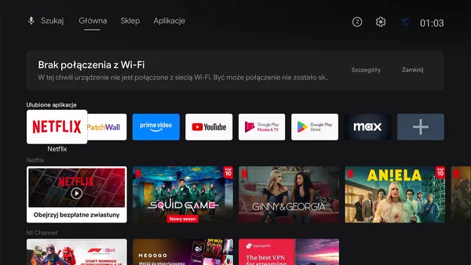

## MX

Ah, the "MX" - seriously, there's nothing else written on it, apart from the port labels.

Ports: 4x (!) USB, SD/MMC, SPDIF, AV, HDMI, Ethernet, +5V power.

The device was also kind of dead. It booted up with a glorious `ANDROIDGADGET.CO.UK` logo, and that was it.

Cracking it open revealed some of the typical 2013-ish era low-budget components. It's not too different from most of the cheap tablets of that time, maybe aside from the SoM (system on module) soldered onto the main PCB.

The likely specs are: 8 GiB NAND, 1 GiB RAM, RTL8188EU Wi-Fi, built-in USB hub.

Judging by the writings on that SoM, the CPU underneath the heatsink is... an Allwinner A13, because it's 2013 and we're making cheap electronics.

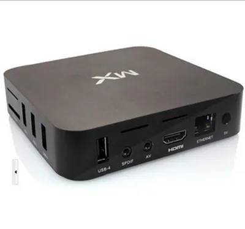

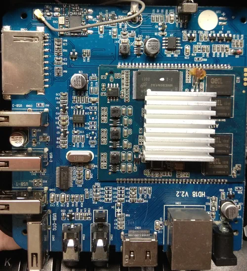

## H96 Pro+

At first I thought it was one of the clone-of-a-clone boxes - especially that it advertised having 3 GB of RAM and 32 GB storage. Imagine my surprise when CPU-Z actually detected an octa-core CPU, 2.7 GB of RAM and 25 GB of internal storage!

Digging deeper revealed the box had an Amlogic S912 CPU @ 8x 2.0 GHz - not bad at all!

As for the software - it had plenty of apps installed, including Kodi configured with lots of IPTV streaming addons. Someone must have really used this box back in 2018! Though the home screen is probably the ugliest thing I've seen in a while.

Ports: 2x USB, microSD, Ethernet, SPDIF, HDMI, AV, +5V power.

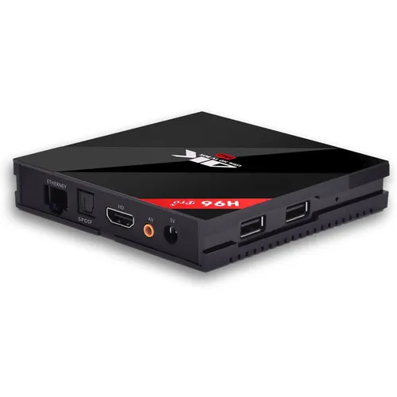
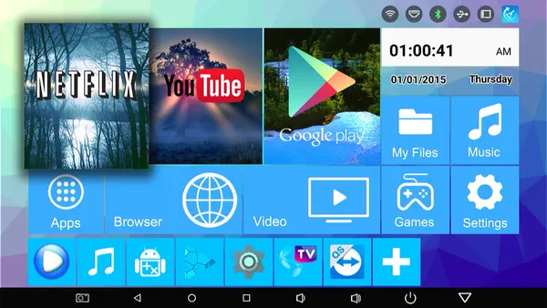

## H96 Mini

Another one of the H96 line, possibly from the same manufacturer. The label also promises 2 GB of RAM, an 16 GB storage - who knows, perhaps that's also true? This one apparently has an RK3228A CPU and Android 9.0.

Well, I couldn't even check it - the device wouldn't boot up. Similar to the "MX", it only showed a boot up image and nothing else. At the time of writing, it didn't even show that image anymore. Now, that's what I call high quality!

Ports: 2x USB, AV, Ethernet, HDMI, +5V power.

The images suggest that it also has an LED display on the front panel - certainly an interesting feature.

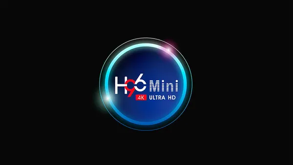

## Alfawise S95

Similar to the H96 Mini, I couldn't get this one to boot at all - nothing on the HDMI, no sign of life at all.

The Internet suggests that it has an Amlogic S905W CPU, 2 GB RAM and 16 GB storage.

Ports: 2x USB, microSD, AV, SPDIF, Ethernet, HDMI, +5V power.

I took this one apart, but forgot to take a photo. This one also has an LED display. Some labels on the PCB say "TX3", which is also one of the cheap Android boxes.

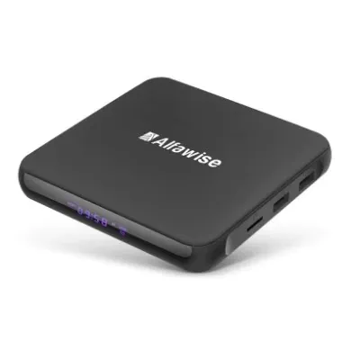

## T-Mobile Kaon KSTB6077

Now, here comes the interesting part. An IPTV box from... T-Mobile?

Well, as it turns out, as an ISP, they used to offer an internet service with access to some streaming services, such as Netflix. You could then lend this box for an additional price (paid monthly).

Given that this device has an antenna input, I kind of expected it to be a TV-only box with some custom software, but I was completely mistaken - it runs full Android TV (not standard Android with a fake TV launcher).

Apart from the ability to watch streaming apps, like Netflix or Prime Video, there is also a TV application built into the home screen, which lets you watch DVB-T channels!

The box runs Android TV 8.0, and as usual, it was loaded with streaming apps and someone's Netflix and Amazon accounts.

As for the specs, it has a Broadcom BCM7268 octa-core CPU, 2GB of DDR4 RAM, 8 GB of eMMC storage, Wi-Fi 802.11ac and Bluetooth 4.1. Pretty nice.

Ports: 1x USB, Antenna In, Ethernet, HDMI, SPDIF, +12V power.

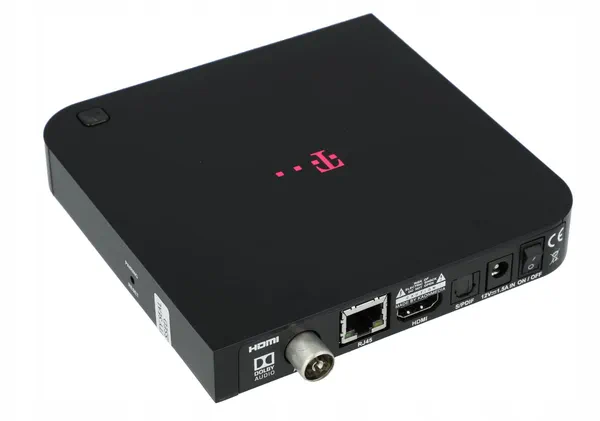
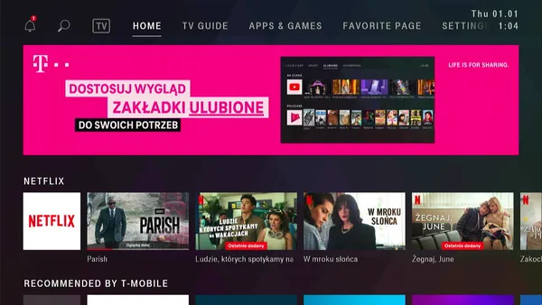

## WD TV Live

Lastly, the oldest device of them all - a WD TV Live media player. Manufactured in 2009. Yeah.

Not sure what I expected, but this turned out to be a simple media streaming box for accessing content from local media servers, as well as some streaming sites (which, obviously, don't work anymore). The UI looks pretty nice, though.

I Googled around a bit, and found that this had a Sigma Designs SMP8655 processor. A MIPS CPU, which apparently combines three different cores, because why not.

The device is known for not being truly GPL-compliant, as it runs Linux and sources were never fully available. There seems to be some custom (modified) firmware, at least - called WDLXTV.

Ports: 2x USB, HDMI, SPDIF, Ethernet, AV, YPbPr, +12V power.

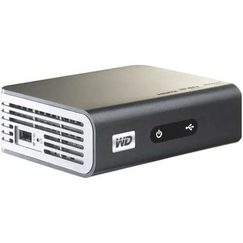
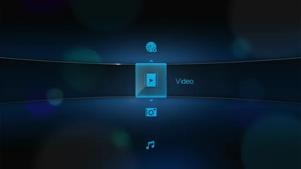

## Summary

Along with the boxes, I got 3x Xiaomi Bluetooth remotes, one Xiaomi IR remote, and two IR remotes for the cheap clone boxes.

Was it worth it? For me - sure! The cost of all that was negligible, and I will definitely have fun time messing with some of these in the future.

Am I putting Alpine Linux on them? You bet.

## Update: Feb 22, 2026

I finally got some free time to create Buildroot trees for a few of these devices. I just wanted to update this post with new details I found.

First of all, I started with the "MX", which I previously assumed had an Allwinner A13 CPU - I've had experience with A13s in the past, so I wanted to start with something familiar. That assumption turned out to be completely wrong, however - under the heatsink lies an **Amlogic AML8726-MX** CPU (*could this be why the device is named this way...?*). The boot log also revealed *a lot* of corrupted NAND pages... so I immediately put it away, as this wasn't going to be a fun time anyway.

For the next dead STB revival, I tried the "Alfawise S95". This one didn't output *anything* on the UART - just some garbage bytes in a regular interval. I also noticed that the red SPDIF light was turning on intermittently - this indicated some kind of power failure.

Checking with the multimeter revealed that my 5V power supply was going into over-current protection shutdown - so there was **most likely a short-circuit** somewhere on the motherboard. By using a thermal camera (`HIKMICRO E02`), I found that the CPU and the 1V buck regulator were getting hot quickly, only for a split second - before the power supply shuts down: *[insert thermal camera image here]*

Further testing with a multimeter on continuity mode showed only about 36 mV of voltage drop on the 1V supply line (I'm not an expert here, but the multimeter was beeping - so there was a short somewhere). This could indicate several problems - damaged CPU, damaged DC-DC regulator, or perhaps some shorted-out capacitors (probably not, since they weren't getting hot).

Using an oscilloscope finally gave me satisfying results. I was able to observe a voltage spike on the 1V line, right after the power was supplied, and just before it was being cut off. I noticed something clearly wrong - **the voltage reached 2V** every time, and this was a 1V supply line.

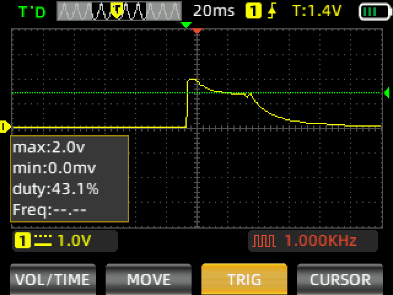

I decided to remove the suspicious regulator, which turned out really difficult, because of the massive ground planes around (my soldering iron just couldn't to heat it up, neither did the hot air gun). Plugging the box into power without the regulator no longer tripped the over-current protection! Furthermore, applying 1V externally just brought the device back to life.

And... that's as much as it could do. As it turned out, the **eMMC had some corrupted blocks**, which prevented the system from booting. By using U-Boot's `mmc read` + `usb write` commands and a quick Python script, I was able to pinpoint exactly which blocks were faulty (causing the device to hang infinitely), as well as take a full 16 GiB backup of the eMMC.

The corrupted blocks were about 128 KiB in total, within a file called `/system/lib/libamplayer.so`. I figured it probably wasn't critical for booting the OS (which wasn't booting anyway), so I used U-Boot to rewrite the corrupted blocks with random data - just to make them "valid" again.

After this operation the blocks were readable again, and the device booted up successfully:

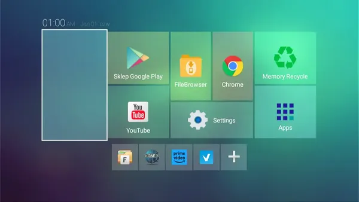

A few days later I installed a replacement DC-DC regulator - used a `SY8088`, since that's all I had with a compatible pinout. The original had an `A37k` marking, and there's exactly nothing to be found about it. With this, the box was fully functional once again.
