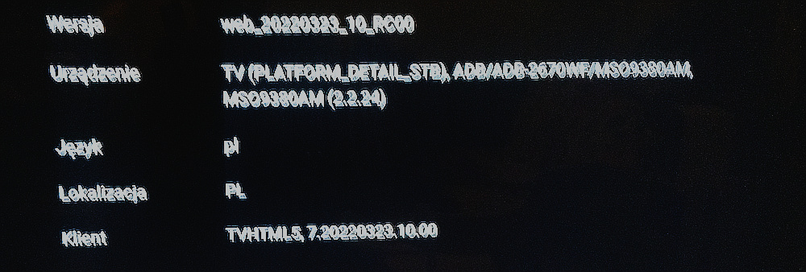
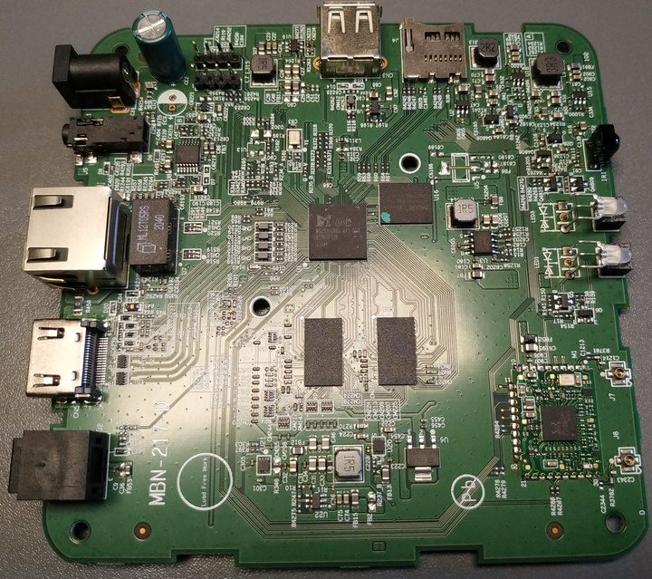
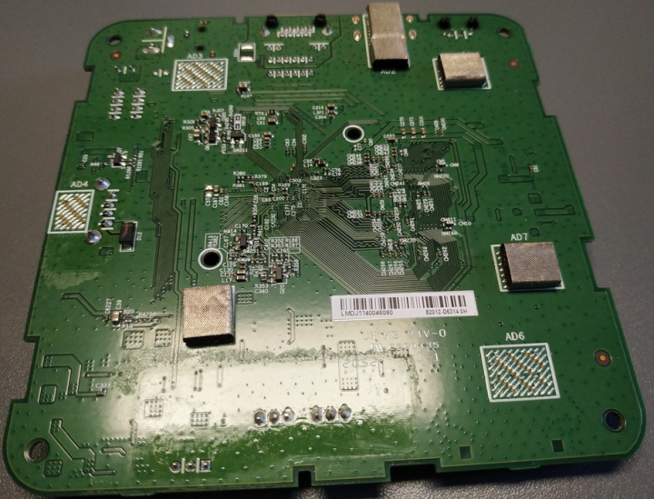
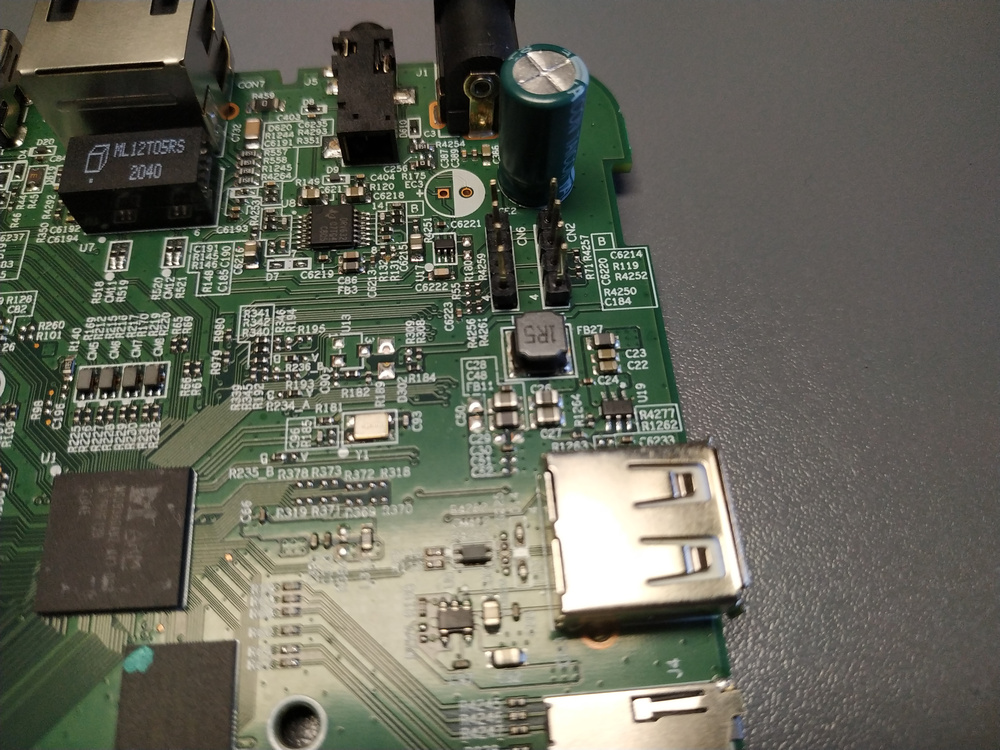
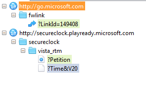
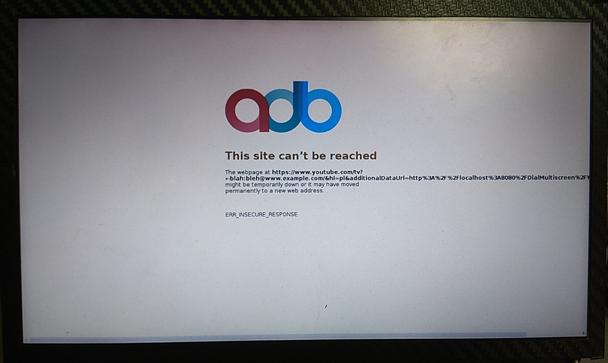

This series of posts will (hopefully) cover a reverse-engineering attempt of a set-top box from a local ISP/TV provider.

This (first) part is a backstory of things that I found out back in 2022/2023. Almost a year has passed since then and I have taken up the "project" once again, to hopefully approach things from a different angle - but more on that later.

--8<-- "../disclaimer.md.inc"

## Introduction

A certain ISP in Poland offers television services, apart from the usual cable/FTTH internet connection. For illustratory purposes, I will call it "ISPX" in this post.

I have been a customer of ISPX for many years now. The TV service used to be provided by a big and heavy tuner, possibly DVB-C or something - it was connected to coaxial cable. A few years back (circa 2018), when I upgraded to fiber connection, it was replaced with a new and shiny set-top box (STB) that offered IPTV (TV but without an antenna, connected over Wi-Fi or Ethernet).

The new UI of the device was relatively modern, and since it also had a "YouTube TV" application, it was clearly running some kind of Linux or Android operating system. Obviously, that meant I just *needed to* break into that system (at some point).

## March 2022 - Some details

The STB is made by **ADB Global**, presumably a Swiss company, that has been manufacturing the older generation cable boxes as well. The model number is ADB-2670WF.

Unsurprisingly, there is not much information about this particular device online, nothing except for a few instruction manuals.

Incidentally, I got the first hint about the hardware in the YouTube app:



Now, that was already something! A quick search revealed the exact CPU model being used - **MStar MSO9380AM**.

There wasn't really much I could find about this CPU, apart from a few OPS devices (Open Pluggable Specification), like [this one](https://vestelvisualsolutions.com/pl/products/accessories/ops150-71). Searching for `MSO9380` also revealed a few Roku devices (Premiere, Ultra) with this chip. I also found the [Rho Board](https://www.kickstarter.com/projects/928812975/rho-board/description), a Kickstarter project containing a similar MSO__9280__ chip. Interestingly, Roku provides kernel and U-Boot sources for their products, so that was a nice find for later.

## August 2022 - Acquiring the hardware

Since the STB is not really my "property" - it's **owned by the ISP** - I can't work on its hardware freely. It even has a "warranty void" seal on one of its screws, *~~which I could lift with a needle, open it up, then stick it back without anyone noticing~~*.

This meant that I couldn't disassemble it fully or solder anything inside. Thankfully, I found the exact same STB for sale online. Apparently someone cancelled their IPTV subscription and decided to sell the box (instead of returning it, like they should...).

So... *through the magic of having two of them*, I could poke inside of the just-bought STB:




Around that time, I found the [linux-chenxing](https://github.com/linux-chenxing/linux-chenxing.org) project online. It focused on various MStar and SigmaStar chips, but **didn't mention the 9380 at all**.

I started a discussion on GitHub to share and find some information about this CPU ([linux-chenxing.org#70](https://github.com/linux-chenxing/linux-chenxing.org/discussions/70)) - here is a little TL;DR:

> Hi,
> I have a set-top box (IPTV) with MSO9380AM. There seems to be totally no info about this chip, apart from it being used in some Roku streaming boxes, and a dead Kickstarter project.
>
> The board I have has two 4-pin headers and a few test points, but so far none of them wanted to give me any UART output at all. They are not labeled, so maybe they're for something else, or the UART output was somehow completely disabled.
>
> I found that Roku published the U-Boot and Linux sources:
> https://www.roku.com/ossfiles/v9.4.0/OSS-RokuPremiere_RokuUltra_2016/sources
> (apparently Premiere and Ultra were the models with MSO9380)
>
> U-Boot 2011.06, with some precompiled binaries for Roku players, in `MSTARUPGRADEBIN` format.
>
> Linux 3.10.108 with grsecurity and something called "rt". `mstar2` folder with configs, HALs, etc. In `make menuconfig` and in the configs there are a few "chip names":
>
> - `clippers`, `muji`, `kano`, `curry`, `kastor`, `monet`, `manhattan`, `maserati`, `monaco`, `maldives`, `macan`, `mustang`, `miami`, `madison`, `messi`, `einstein`, `napoli`, `kaiser`, `kris`, `kiwi`
> - also some names in `Kconfig_OBAMA`: `titania`, `triton`, `titania2`, `oberon`, `euclid`
>
> ..which doesn't really correlate to what's on linux-chenxing page.
>
> There's also something on GitHub:
> https://github.com/search?p=2&q=mso9380am&type=Code
> that would hint the chip name is `curry`.
>
> I'm totally new to that platform, and I'd like to evaluate if there's anything I can do with this box at all. In particular, I'm interested in dumping the firmware first (without desoldering the eMMC, of course).
>
> I'm wondering if these `MSTARUPGRADEBIN` files can be used to do this (run Roku's U-Boot, which will possibly output something over UART). I read somewhere that these files can be put on an SD card to be read by MStar, but I don't want it to overwrite ("upgrade") anything just yet.
>
> *[...]*
>
> I think it's not running Android, at least it doesn't mention that anywhere in the UI. The OS has a "YouTube TV" app which looks to be based on Chromium (showed a familiar error screen when I messed around with DNS spoofing).
>
> CPU markings:
>
> - `MSO9380AMZ-M43-DC3`
> - `ATTBUF12B`
> - `2104E` (date code?)
>
> Flash:
>
> - `MX30LF4G18AC-XKI` (512 MiB)
>
> RAM:
>
> - 2x `SEC 101 K4A8G16 5WB BCRC` (2 GiB total)
>
> No EEPROM chips that I'm aware of.
>
> These are the pin headers I mentioned:
> 
>
> Each has GND and 3V3 pins, so there's only 4 possible "signal" pins, although I've seen no activity so far when probing each of them with an UART adapter.

Exactly - there were two 4-pin headers on the PCB, with **totally no I/O activity on them** - bad news for finding an UART connection.

Upon closer inspection, I found that there are actually only two signals on these pins:

CN6   | CN2
------|------
3.3V  | 3.3V
GND   | unk.1
unk.2 | unk.2
unk.1 | GND

Signals in both connectors are connected via separate ~360 Ohm resistors. Why? I have no idea.

---

Leaving the hardware aside, I have performed some trivial network attacks, like DNS spoofing or TLS capturing, unfortunately with no good results. The only thing I found were the DNS requests for the STB's API:

```
api.dtv.ispx.pl
download.dtv.ispx.pl
ext.dtv.ispx.pl
sso.dtv.ispx.pl
static.dtv.ispx.pl
video-lb.dtv.ispx.pl
ws.dtv.ispx.pl
```

and that it requested some kind of clock synchronization for DRM, **over cleartext HTTP**:



The `download.dtv.ispx.pl` seemed interesting, perhaps for firmware upgrades? I've tried several obvious paths, like `/download/` or `/upgrade.bin`, to no avail.

One funny thing was, **the box was locked by the ISP** - probably due to expiration of the previous owner's subscription. It would show a dialog stating that the device is unauthorized, and wouldn't allow watching the TV channels. Then, I found out that blocking the `ext.dtv.ispx.pl` domain **made the dialog box disappear** and watching TV would work normally (though only for "non-encrypted" public channels, e.g. those not using DRM).

Since I didn't want to spend too much time on this back then, I decided to give up and take a break.

## June 2023 - Breaking in from the outside

A year has passed and I got back to the project to approach the hack from a different angle - by **desoldering the NAND chip** and dumping the firmware. I knew that was the only option to progress with this device.

Before doing that (and possibly destroying the STB in the process) I have shared some of the details with someone who knows much more about security research than I do, over at [LibreTiny Discord](https://discord.com/channels/967863521511608370/985112175918067753/1123671642409816185). We came up with a few more ideas to try before ruining the device completely.

From previous research, I knew that the device exposed a **UPnP/DIAL server** for the YouTube TV application. It was an HTTP server, running on port 8080, that advertised itself using SSDP (with UDP packets). This way, compatible smartphones or PCs could discover the YouTube app, to cast videos and control it remotely. Running a `GET` request to the UPnP endpoint of the STB yields this (response formatted for clarity):

```
HTTP/1.1 200 OK
Application-URL: http://192.168.0.8:8080/DialMultiscreen/
Content-Length: 608
Content-Type: text/xml; charset="utf-8"
Date: Sun, 29 Sep 2024 13:54:58 GMT
RealTimeInfo.dlna.org: DLNA.ORG_TLAG=*
SERVER: BH

<?xml version="1.0"?>
<root xmlns="urn:schemas-upnp-org:device-1-0">
	<specVersion>
		<major>1</major>
		<minor>0</minor>
	</specVersion>
	<device>
		<deviceType>urn:schemas-upnp-org:device:Basic:1</deviceType>
		<UDN>uuid:abcdabcd-abcd-abcd-abcd-deadbeef1234</UDN>
		<friendlyName>ISPX_DEADBEEF1234</friendlyName>
		<manufacturer>ADB</manufacturer>
		<manufacturerURL>http://www.adbglobal.com/</manufacturerURL>
		<modelDescription>BH Basic Device</modelDescription>
		<modelName>ADB-7eee-NX</modelName>
		<modelNumber>12975647 RELEASE</modelNumber>
		<serialNumber>1111-111111-1111</serialNumber>
		<serviceList></serviceList>
	</device>
</root>
```

Now, a mobile device running the YouTube app would send a `POST` to `http://192.168.0.8:8080/DialMultiscreen/YouTube` with some parameters in the request body. The data from the body would then be concatenated with `https://www.youtube.com/tv?` and opened in a (very old) Chromium-like browser. Running an (unsuccessful) TLS MITM attack on the `www.youtube.com` DNS name would make it unable to load the website, showing a familiar error screen:



Since the process was most likely spawned using something like `chromium --url="https://.../tv?additionalDataUrl=..."` I've tried several basic shell escaping characters, like `\` or `"`, to no avail - the server seems to be escaping that properly and passing everything to Chromium (even non-ASCII bytes). It would allow a maximum of 4096 characters in the `POST` request body, anything else would result in `413 Too Large`.

When the URL was too long, a horizontal scrollbar showed up (like on the photo above). The page could then be scrolled using the IR remote or a USB-connected keyboard. No modifier/function keys would perform any action, and a USB mouse wouldn't work at all.

Later, we found that the `BH` server (presumably `BlackHole`) is used on many **other ADB-made STBs** (incl. cable/satellite boxes). We found the [`CallStranger`](https://tehtris.com/en/blog/upnp-callstranger-vulnerability/) UPnP vulnerability, but I couldn't get it to work (maybe it was a mistake on my end).

I am no pentesting expert, and it seemed like I ran out of options for attacking the box in the current state.

*Here be dragons.*

## June 2023 - Breaking in from the inside

BGA soldering is easy... right..? The flash chip definitely isn't extremely small. I could easily remove the NAND from the board and solder some wires to it, of course. Then, just connect it to a NAND programmer (don't you know how cheap these are?), dump the firmware and we're done!

Nope. Not at all.

First, it's worth noting that I had pretty much nothing to lose at that point - the box couldn't even be used to watch TV anymore.

Second, I thought, that after I desolder it and dump the firmware, maybe I wouldn't have to solder it back, since the STB had a microSD card slot. Possibly that can be used to store and boot the firmware? *(as it later turned out, I was totally wrong)*.

As you might be aware, BGA NAND sockets and programmers are comically expensive - hundreds, even thousands of dollars (that works in most other currencies, too). That meant the only option was to make a DIY programmer.

I knew that I would have to solder wires to the tiny chip, the [`MX30LF4G18AC`](https://www.mxic.com.tw/Lists/Datasheet/Attachments/8462/MX30LF4G18AC,%203V,%204Gb,%20v1.4.pdf) - around 15 of them (2 for power, 8 for data, RE, WE, ALE, CLE, R/B, CE...). The BGA balls have a 0.8 mm pitch, so this would be truly challenging.

Then, I wanted to connect the wires to a Raspberry Pi Pico - it's fast and easy to work with, it also has a PIO peripheral for even faster GPIO access. Writing a NAND programmer in C shouldn't be too hard.

So... I decided to give it a try anyway.


There was no going back.

## The next part

The story continues in:

- [IPTV Reverse-Engineering - Part 2](../part-2/)
