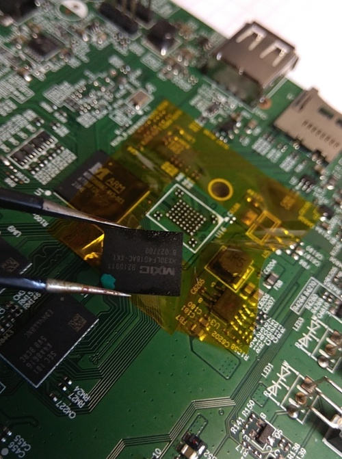
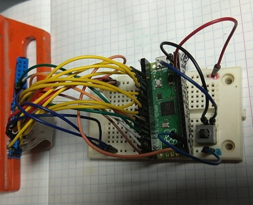
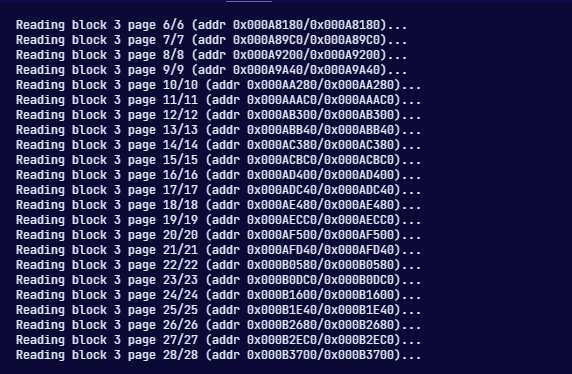

This is a continuation of [**IPTV Reverse-Engineering - Part 1**](../part-1/), right from where I left off.

And where exactly was that?

Oh, right... permanently destroying the device by lifting off the NAND flash chip.



Note that this is still a backstory. As I'm writing this, it's October 2024, but I feel like the previous discoveries from 2023 shouldn't be left out if I want the story to be complete.

I may not have good photos for many parts of this story, because I didn't ever expect wanting to publish it anywhere.

Let's recap:

- the box was running the Linux kernel with U-Boot,
- there was no datasheet for the particular MStar MSO9380 chip,
- there were two pin headers on the PCB, with no signs of life on them,
- I [**found sources of U-Boot**](https://github.com/jockyw2001/mboot) and **MStar's `mboot`** on GitHub,
- Roku provided [GPL sources](https://www.roku.com/ossfiles/v9.4.0/OSS-RokuPremiere_RokuUltra_2016/sources) of Linux and U-Boot on their website,
- I desoldered the NAND chip from the device using a hot air gun.

--8<-- "../disclaimer.md.inc"

## Building a NAND programmer

Anyway - having a raw NAND chip desoldered from the set-top-box, I needed to figure out two things:

- What am I going to connect it to? How am I going to connect it?
- How am I going to dump the firmware from the flash?

Unfortunately BGA sockets cost more than I was willing to spend on this project, so the obvious idea was... soldering it to a Raspberry Pi Pico with really tiny wires.

I started by looking at the pinout from the datasheet:


The bare minimum should be 4 Vss wires, 4 Vcc wires, 8 data signals, RE#, WE#, R/B#, CE#, WP#, ALE, CLE.

*A not-so-quick soldering session later:*


I used a ribbon from an old Enhanced-IDE cable, since the wires had a single core and were pretty thin.

For connecting to the Pi Pico, I added the female ending from the IDE cable and some male-to-male wires, since my Pi had female headers.

It sounds just as complicated as it looks. It is a mess of wires. But it was not supposed to *look pretty*, it was supposed to *work*.



*(Yes, I didn't care enough to use anything else than a breadboard. Sorry for that.)*

## Writing a NAND programmer

With the hardware part pretty much ready, it was time to write some software for the Pi Pico. My first attempt was, obviously, **reading the chip ID** and printing it over UART (or, virtual USB serial port). I just needed to understand the diagram from the datasheet:


On the Pico, I prepared a few GPIO macros, some busy loops for timing, as well as some helper functions:

<details>

<summary>Macros and some helper code</summary>

```c
#define nand_enable()  gpio_put(PIN_CE, 0)
#define nand_disable() gpio_put(PIN_CE, 1)
#define nand_cle_set() gpio_put(PIN_CLE, 1)
#define nand_cle_clr() gpio_put(PIN_CLE, 0)
#define nand_ale_set() gpio_put(PIN_ALE, 1)
#define nand_ale_clr() gpio_put(PIN_ALE, 0)
#define nand_we_set()  gpio_put(PIN_WE, 0)
#define nand_we_clr()  gpio_put(PIN_WE, 1)
#define nand_re_set()  gpio_put(PIN_RE, 0)
#define nand_re_clr()  gpio_put(PIN_RE, 1)

#define nand_pause()                                                                                                   \
	do {                                                                                                               \
		sleep_us(1);                                                                                                   \
	} while (0)
#define nand_wait()                                                                                                    \
	do {                                                                                                               \
		nand_pause();                                                                                                  \
	} while (gpio_get(PIN_RB) == 0)

void nand_dir_out(uint8_t value) {
	for (int i = 0; i < 8; i++) {
		gpio_set_dir(IO[i], GPIO_OUT);
		gpio_put(IO[i], (value >> i) & 1);
	}
}

void nand_dir_in() {
	for (int i = 0; i < 8; i++) {
		gpio_set_dir(IO[i], GPIO_IN);
	}
}

void nand_write_command(uint8_t value) {
	nand_cle_set();
	nand_we_set();
	nand_dir_out(value);
	nand_we_clr();
	nand_pause();
	nand_dir_in();
	nand_cle_clr();
}

void nand_write_address(uint8_t value) {
	nand_ale_set();
	nand_we_set();
	nand_dir_out(value);
	nand_we_clr();
	nand_pause();
	nand_dir_in();
	nand_ale_clr();
}

uint8_t nand_read() {
	nand_dir_in();
	nand_wait();
	nand_re_set();
	nand_pause();
	uint8_t value = 0;
	for (int i = 0; i < 8; i++) {
		value |= gpio_get(IO[i]) << i;
	}
	nand_re_clr();
	return value;
}
```

</details>

With this, I could try to read the chip ID:

```c
uint8_t id[5];
nand_enable();
nand_write_command(CMD_ID_READ); // 0x90
nand_write_address(0x00);
id[0] = nand_read();
id[1] = nand_read();
id[2] = nand_read();
id[3] = nand_read();
id[4] = nand_read();
nand_disable();
printf("ID1=%02x %02x %02x %02x\n", id[0], id[1], id[2], id[3]);
```

After a few attempts, it worked! *Sort of...*


The correct ID should be `c2 dc 90 95`, so the first readout was fine. After that, it seemed to drop the 2 least-significant bits. I suspected loose wires or timing issues - I haven't added any delays, I assumed the Pico was slow enough.

I was too lazy to connect a logic analyzer (*no, it's totally not that the only "logic analyzer" I had was the very same Pi Pico...*), so I just added a few 1 microsecond delays. **And it worked!**


The following day, I wrote a simple page reading snippet - it reads 2112 bytes (2048 + OOB data) from a specified address:

```c
uint32_t buf_addr = 0;
uint8_t buffer[2112];
printf("Enter 1st address: ");
scanf("%hhu", &addr[0]);
printf("\nEnter 2nd address: ");
scanf("%hhu", &addr[1]);
printf("\nEnter 3rd address: ");
scanf("%hhu", &addr[2]);
printf("\nEnter 4th address: ");
scanf("%hhu", &addr[3]);
printf("\nEnter 5th address: ");
scanf("%hhu", &addr[4]);
nand_enable();
nand_write_command(CMD_READ_1);
nand_write_address(addr[0]);
nand_write_address(addr[1]);
nand_write_address(addr[2]);
nand_write_address(addr[3]);
nand_write_address(addr[4]);
nand_write_command(CMD_READ_2);
nand_wait();
buf_addr += 2112;
nand_write_command(CMD_CACHE_READ_SEQ);
nand_wait();
for (int i = 0; i < 2112; i++) {
	buffer[i] = nand_read();
}
nand_disable();
hexdump(buffer, 2112, buf_addr);
```

With this, I was able to retrieve the first page of the NAND:

```
000000  4d 53 54 41 52 53 45 4d  49 55 4e 46 44 43 49 53  |MSTARSEMIUNFDCIS|
000010  05 c2 dc 90 95 56 00 00  00 00 00 00 00 00 00 00  |.....V..........|
000020  9a 00 00 00 40 00 00 08  40 00 00 10 00 00 00 00  |....@...@.......|
000030  02 00 14 00 0a 07 10 14  46 00 3c 00 3c 00 00 00  |........F.<.<...|
000040  4d 58 49 43 00 00 00 00  00 00 00 00 00 00 00 00  |MXIC............|
000050  4d 58 33 30 4c 46 34 47  31 38 41 43 00 00 00 00  |MX30LF4G18AC....|
000060  00 00 3c 00 0f 00 00 00  14 00 0a 07 00 00 00 00  |..<.............|
000070  00 00 00 00 00 00 00 00  00 00 00 00 00 00 00 00  |................|
000080  00 00 64 00 00 00 00 00  00 00 00 00 00 00 00 00  |..d.............|
000090  00 00 00 00 00 00 00 00  00 00 00 00 00 00 00 00  |................|
0000a0  00 00 00 00 00 00 00 00  00 00 00 00 00 00 00 00  |................|
[...]
```

...**which seemed to represent the Chip Info Structure** (CIS) - I found [a page about that](https://linux-chenxing.org/blobs/cis.html) on `linux-chenxing`.

The readouts weren't perfect at first - it was dropping some bytes at the end of each block. Sometimes it took more than 10 tries to read a single page correctly. Since it seemed to depend on the page's contents, I suspected some interference on the (relatively) very long, unshielded wires (duh!).

Then I **added a 5.6 pF capacitor** on the RE# line - Read Enable, which fetches the next byte to read, which could explain it causing dropped bytes. *It was all perfect after that.* Then I removed the capacitor, and it was still perfect. I never found out what was wrong before that.

With a serial terminal, I poked around the flash manually to find anything interesting, and at least I found strings and ARM code - that meant the **NAND flash wasn't scrambled**! I kind of expected that, since it was an SLC chip, but the fear of having to battle NAND scrambling was still somewhere in me.


*A quick Python script later...*



Of course, there were still bitflips on some of the pages - I couldn't fix that issue. I ended up reading the image a few times, then trying to eliminate the differences. It was all *painfully slow* - after even more added `delay()`s, it was **reading at a whopping 46 KiB/s**.

I was inspecting the resulting file as it was reading, and found the U-Boot banner:

```
U-Boot 2011.06-00074-g09ea5d7 (Dec 05 2018 - 11:58:03)
```

Sadly, I also noticed a lot of TEE references and some PlayReady certificates - I hoped this was for the DRM stuff, not for firmware encryption. But anyway, I continued the flash readout via UART.

**It took over 3 hours to read 512 MiB of data.**

## Exploring the firmware dump

With the complete image, I started exploring it in a hex editor. That, as well as searching for strings revealed a couple of interesting things:

- U-Boot environment variables (and the U-Boot itself)
- a **firmware upgrade file URL** (which I downloaded, obviously), 
- **no obvious signs of the Linux kernel** in its usual form,
- UBI volumes and UBIFS filesystems,
- SQLite databases for Chromium local storage,
- more certificates,
- Wi-Fi credentials and user settings,
- and funny cats. 


I was able to label the following partitions/images in the firmware - these were manually named by me:

```
00000000_cis1.bin
00020000_cis2.bin
00040000_unknown1_copy1.bin
00060000_unknown1_copy2.bin
00140000_unknown2_copy1.bin
00180000_unknown2_copy2.bin
001C0000_mboot.bin
00420000_mbootbak.bin
006A0000_ubild.bin
00840000_optee.bin
00E40000_armfw.bin
01000000_param.bin
01010000_tee.bin
01020000_loader1.bin
041A0000_loader2.bin
076E0000_splash1.bin
07B00000_splash2.bin
07F20000_download.bin
14E00000_ubi.bin
```

(the `1` and `2` bins were just byte-exact copies, possibly for backup purposes - it's a NAND after all).

- `cis` was the NAND info block, with partition offsets, block sizes etc,
- `ubild` was the uboot .env (although referred to as "bootlogo" partition; there's no logo there anyway),
- `optee` and `armfw` were probably some TEE things,
- `param` had the model name, serial number, MAC address of the box and some unknown data,
- `tee` had a .TAR file with some widevine stuff,
- `loader` was nearly 40 MiB in size, probably the kernel and ramdisk, I assumed,
- `download` seemed to have some unknown data (in a format similar to `loader`), a "high level download" string at the beginning, a copy of mboot, and was around 140 MiB in size,
- `splash` had a boot logo (in JPG format) along with some U-Boot commands that display it,
- `ubi` was spanning the rest of the NAND, which had userdata storage only.

The `loader` and `download` images were probably the most interesting. Here's a hexdump of one of them:


The blank 0x00-filled spaces in the middle suggested that it wasn't encrypted (however, it could just be an image made of several encrypted parts). The 3 bytes before the blank spaces *looked like* zlib headers, but I couldn't get a good match (from a quick "magic byte" lookups on the net).

One thing worth noting is, I have checked the `mboot` sources that I got online, and **found absolutely no mention of that image format**.

I was able to extract the UBIFS partition with something called [`ubireader`](https://github.com/onekey-sec/ubi_reader) (a Python script). Previously, I tried `nandsim` in Linux, but that didn't work - presumably because of bad blocks or other issues alike. The UBIFS only contained user data - Wi-Fi config, Widevine certificates, Chromium cookies and local storage - no binaries or applications.

I have also tried `binwalk` (it was the first thing I did) but it could only identify the UBI volumes.

## Disassembling the bootloader

It was time to disassemble the U-Boot binary. To no surprise, it turned out to be heavily modified by MStar, but thankfully some parts **matched the `mboot` sources** perfectly. I was able to find functions in IDA and name them according to the sources, which made the disassembly much more bearable.

Based on that, I wrote down all commands that were executed by the bootloader, to create a "boot flow", like this:

```
board_init_r()
	MstarSysInit()
	board_init()
	nand_init()
	main_loop()
		MstarProcess()
			[...]
			- updatemiureg
			- mversion
			- bootargs_set
			- config2env
			- wdt_enable 0
		printf("Hit any key to stop autoboot:")
		MstarToKernel()
			[...]
			- bootcheck
			- wdt_enable
			- if_boot_to_pm
			- panel_pre_init
			- unlockcmi
			- read_boot_info
			- readArmFw
			- readOptee
			- readKL
			- panel_post_init
			- bootKL
		if (argc > 1)
			MstarRunStage(3)
				- hdmi init
				- bootlogo 0 0 1 1 bootlogo.jpg
		bootcmd?
			- present -> boot
				- ubi part UBI
				- ubi read 0x20300000 KL 0x9000000
				- bootm 0x20300000
			- absent -> command console
```

And that's where things got really weird. Can you tell what loads and boots the kernel here? I couldn't, especially that the `readKL` and `bootKL` commands **didn't exist**.

Likewise, the `bootcmd` didn't make sense, because there was no UBI partition named `UBI` and there was no volume named `KL`.

The `readArmFw` and `readOptee` commands did exist, though. But what do they even do...?

```c
signed int do_read_optee()
{
  signed int result; // r0
  result = 1;
  optee_real_va_addr = 0x5EE00000;
  return result;
}
```

And that was it. Nothing seemed to locate or read the kernel from the NAND. Could the `optee_real_va_addr` be a call to some other bootloader?

Unfortunately, I never got to figure that out (at the time of writing).

## Exploring non-code parts

Among other things I found in the firmware, there were:

- API URLs of the STB's services (though just the base URLs, not very useful),
- live TV stream URLs, some of which I could play with `ffplay`, without DRM (but these were public TV channels anyway),
- working credentials for the SSO service (`user`:`user` - *yes, really*).

...and that was it, really. I kept exploring the disassembly for some more time, hoping to make sense out of it. To no avail.

So there you go - another failed attempt. Just like before, **I needed a better plan**.

## How about... modifying the NAND?

About a month later, I had *the better plan*. The idea was to design and build a PCB, to which the NAND chip would be soldered (on IDE cable wires, of course - I'm not soldering BGA packages.. just yet..). Then, more wires would connect the chip back to its original PCB - the STB with the MStar chip.

The purpose of that "adapter" PCB would be to allow reading and programming the NAND flash, *as well as* (hopefully) **booting up the STB from the chip**.

To accomplish that, I wanted to install the Raspberry Pi Pico on the board. I wanted to design it so that all three possible connections could be made - `NAND<->MStar`, `NAND<->Pico`, as well as `Pico<->MStar` (who knows, maybe I'll write an emulator someday? ~~*(probably not)*~~).

Around this idea, I designed a simple schematic and mapped it out onto a PCB:


- `JP1` was mostly for experimenting, to disable access to the NAND by pulling its CE# line high.
- `JP2` was normally supposed to be shorted - it provided the `NAND<->MStar` connection. By removing the 15-line jumper I could connect the NAND for programming by the Pico.
- `JP3` was for providing 3.3V from the Pico to the NAND. Otherwise, I could remove it and power the NAND right from the STB.
- `S1` was just a reset button for the Pico (*because they forgot to include it on the Pico's board...*).

The PCB was single-sided, so the top layer (visible in red) was supposed to be populated with jumper wires. The rectangular pads on the bottom side were where the tiny wires would connect - to the NAND and to the STB.

Having the design ready, I printed it out for etching using a toner transfer method (sending it to JLCPCB for a single piece would be pointless).

And then... I kind of never got around to etching it, at least not in that year (2023).

## The next part

Nearly one year later, in June 2024, it was time for part 3. I was about to finally build the adapter PCB, solder it all together and wait for the moment of truth - **would the device boot up** after over a year of having its NAND desoldered?

The story continues in:

- [IPTV Reverse-Engineering - Part 3](../part-3/)
