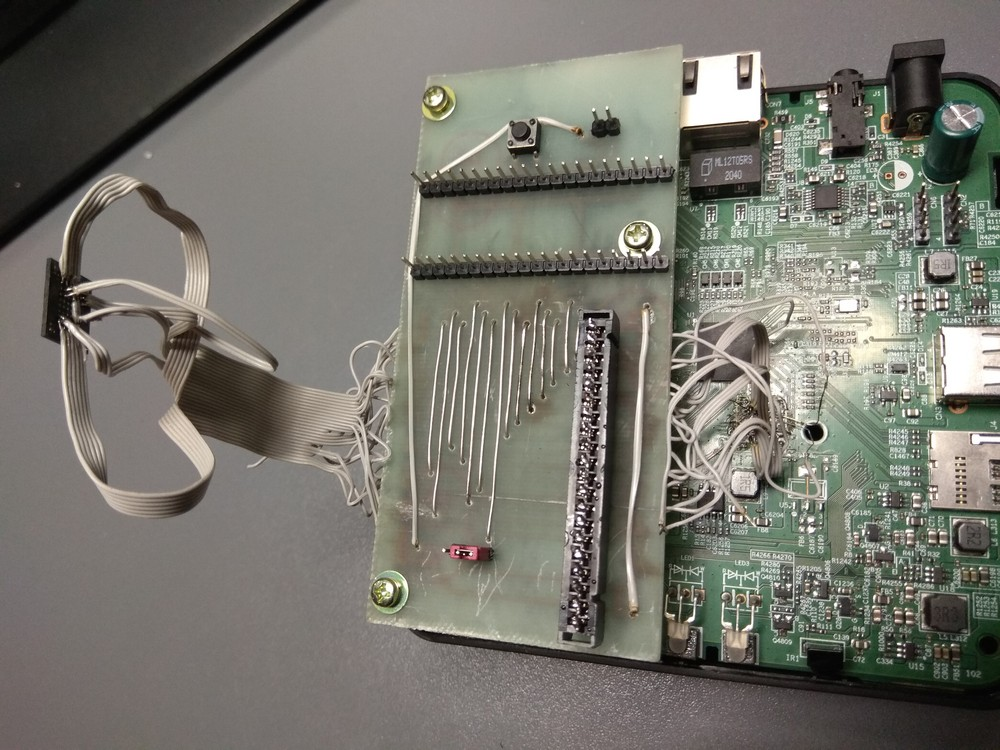
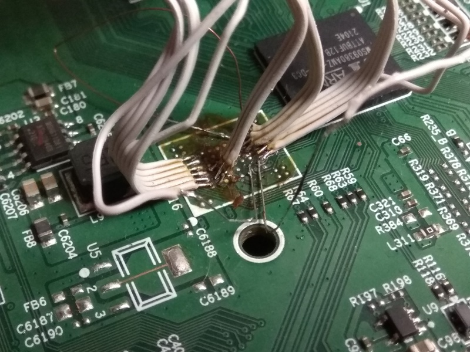
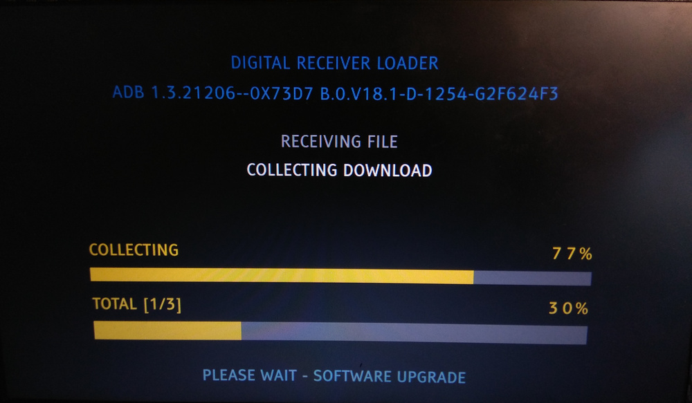
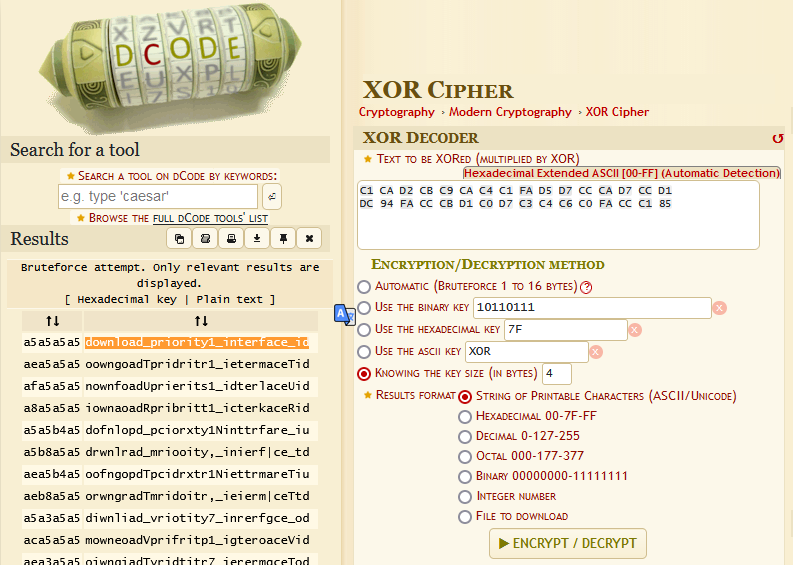
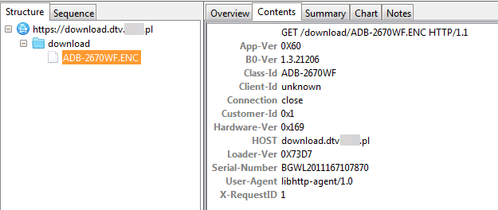

You're reading the next part of [**IPTV Reverse-Engineering - Part 2**](../part-2/).

This time, however, I'm writing this post as I'm making various attempts to break into the device. The last part ended on having the "adapter PCB" designed and printed, ready for etching with the toner transfer method.

--8<-- "../disclaimer.md"

## Testing the adapter PCB

I don't have any photos of the etching and soldering process, but I can show the finished product:



The PCB is attached to the STB with 3 screws in its original mounting holes. The NAND chip is on the left side, soldered to the adapter. The right side shows wires going from the adapter to the STB's board, right where the NAND would normally reside. There is also a Raspberry Pi Pico mounted on top.

It's not pretty - in fact, it looks horrible. But I don't care, I only need it to work.

In the process of soldering the two boards together, I ripped off 3 of the BGA NAND's pads. As you'd expect, these are critical signal connections, not just some extra Vcc lines... Thankfully, I managed to scrape off a little bit of the tiny traces on the PCB and install some (even thinner) wires. Testing for continuity with my multimeter confirmed that the bodge wires are indeed soldered properly! *(although still hanging by a thread)*



I am eager to test it out, see if the device boots up. But first, I will remove the black jumper connector - I have to make sure the NAND<->Pico connection still works fine. I connected the Pico to my computer and fired up the dumping software, that I used in 2023. Fortunately, it still reads data just fine, which means the cable connections are good.

That means it's time for the moment of truth - booting up the STB from NAND, nearly a year after desoldering it from the PCB. So, I removed the Pi Pico, connected 3.3V power to the NAND and then 12V to the STB's power jack...


**It works.** It boots up as if nothing ever happened. That means I can read AND write to the flash chip and boot the STB to see what happens - a perfect hacking setup (or is it?).

## Acquiring a good firmware dump

Knowing the device still boots up, I have to prepare the NAND writing software. But first, since the dumps were not 100% reliable (a couple of bits reading out incorrectly), I made like 20 dumps of the flash. Each of them was slightly different - I couldn't work out how to improve the reliability.

With a simple Python script I am able to combine all the dumps to get a valid one (setting each "flipped" bit to the most frequently observed value). Even though I can't possibly catch all bit read errors, it should be fine - after all, ECC will correct most bad readouts by the MStar chip - even if it's not due to interference, but an incorrect value being actually stored on the NAND.

---

From the NAND dumps I made, I can (roughly) determine the layout of the flash. This is an updated partition layout from the one I initially created in 2023.

Name     | Offset     | Info
---------|------------|------------------------------------------
cis1     | 0x00000000 | NAND Chip Information Structure
cis2     | 0x00020000 |
parm1    | 0x00040000 | 1st stage bootloader (?)
parm2    | 0x00060000 |
uboot1   | 0x00140000 | 2nd stage bootloader (?)
uboot2   | 0x00180000 |
mboot    | 0x001C0000 | U-Boot (3rd stage bootloader?)
mbootbak | 0x00420000 |
ubild    | 0x006A0000 | U-Boot environment (UBI)
optee    | 0x00840000 | OP-TEE OS
armfw    | 0x00E40000 | ARM Trusted Firmware (TF-A)
nvram    | 0x01000000 | Parameter storage (S/N, MAC, etc.)
tee      | 0x01014000 | TAR archive with TEE data
loader1  | 0x01020000 | "Loader image" (kernel + initrd?)
loader2  | 0x041A0000 |
unknown  | 0x07320000 | Unknown, short repeating pattern of bytes
splash1  | 0x076E0000 | Splash logo
splash2  | 0x07B00000 |
download | 0x07F20000 | "High level download" (OTA update?)
ubi      | 0x14E00000 | Application data storage (UBIFS)

## Testing the NAND programmer

I updated my Pi Pico NAND dumper program to support "block erase". To test if it works, I decided to erase the `ubild` partition (environment). Indeed, the pages are now erased and empty.

Surprisingly, *it doesn't brick the device*. It can still boot up just fine - U-Boot simply recreates the environment and writes it back to the NAND.

Okay, so I can now erase blocks, but how about writing data? After all, I'm not able to "guess" the correct ECC code that goes in the OOB area - will the device accept pages without ECC?

To verify that, I want to erase both of the `splash` partitions, then write them back, but without ECC. A simple interactive Python script allows me to run different NAND operations, like reading, erasing, writing and verifying.

Of course, I erased `cis1` by accident. I was able to restore it back, but even without CIS1 the device booted just fine - after all, the backup `cis2` partition is still there.

Okay, both `splash` partitions are erased... I'm booting the device now. The result is... nothing interesting - it booted up fine, just without the splash screen; the display remained blank until the GUI started up.

---

Now, can I write the `splash` partition back *without* ECC code? Let's find out:

```
Enter partition name: splash1
Enter input file name [076E0000_splash1.bin]:
Write with OOB? [Y/n] n
Are you sure? [y/N] y
[...]
Verifying page 62974 (07AFF000/07B00000) - 4.1 MiB/4.1 MiB, speed: 77 KiB/s, ETL: 0.08 sec
Verifying page 62975 (07AFF800/07B00000) - 4.1 MiB/4.1 MiB, speed: 77 KiB/s, ETL: 0.03 sec
Verification: 0 byte(s) differ
```

`splash1` partition's first page after writing:

```
00000000: 2B DA 67 00 04 00 01 E4  96 11 30 11 00 00 00 04  +.g.......0.....
00000010: AA 38 70 95 61 64 62 32  36 37 30 77 66 20 5B 30  .8p.adb2670wf [0
00000020: 30 30 30 30 31 36 39 2E  30 30 30 30 30 30 30 31  0000169.00000001
00000030: 5D 20 73 70 6C 61 73 68  20 69 6D 61 67 65 00 00  ] splash image..
00000040: 00 00 00 00 00 00 00 00  00 00 00 00 00 00 00 00  ................
00000050: 00 00 00 00 00 00 00 00  00 00 00 00 00 00 00 00  ................
00000060: 00 00 00 00 00 00 00 01  19 20 00 FF FF FF FF FF  ......... ......
00000070: FF FF FF FF FF FF FF FF  FF FF FF FF FF FF FF FF  ................
[...]
00000100: 00 01 18 20 00 01 18 1C  00 00 01 00 00 00 00 00  ... ............
00000110: AD BA DB 20 00 00 00 10  00 00 00 00 00 00 00 00  ... ............
00000120: 00 00 00 00 00 00 00 00  49 4C 44 53 00 01 17 F0  ........ILDS....
00000130: 00 00 00 01 00 00 00 02  00 00 00 00 00 00 01 E6  ................
00000140: 73 65 74 65 6E 76 20 62  6C 5F 64 66 62 5F 66 72  setenv bl_dfb_fr
00000150: 61 6D 65 62 75 66 66 65  72 5F 61 64 64 72 20 30  amebuffer_addr 0
00000160: 78 31 39 32 33 36 30 30  30 0A 73 65 74 65 6E 76  x19236000.setenv
[...]
000002D0: 78 30 30 38 46 37 30 30  30 0A 73 65 74 65 6E 76  x008F7000.setenv
000002E0: 20 62 6F 6F 74 6C 6F 67  6F 5F 67 6F 70 69 64 78   bootlogo_gopidx
000002F0: 20 33 0A 73 65 74 65 6E  76 20 72 65 73 6F 6C 75   3.setenv resolu
00000300: 74 69 6F 6E 20 38 0A 73  65 74 65 6E 76 20 63 6F  tion 8.setenv co
00000310: 6C 6F 72 66 6F 72 6D 61  74 20 32 0A 68 64 6D 69  lorformat 2.hdmi
00000320: 20 69 6E 69 74 0A 00 00  00 01 00 01 15 EA FF D8   init...........
00000330: FF E0 00 10 4A 46 49 46  00 01 02 01 00 6C 00 6C  ....JFIF.....l.l
00000340: 00 00 FF ED 00 2C 50 68  6F 74 6F 73 68 6F 70 20  .....,Photoshop
00000350: 33 2E 30 00 38 42 49 4D  03 ED 00 00 00 00 00 10  3.0.8BIM........
00000360: 00 6C 00 00 00 01 00 01  00 6C 00 00 00 01 00 01  .l.......l......
00000370: FF E1 63 E4 68 74 74 70  3A 2F 2F 6E 73 2E 61 64  ..c.http://ns.ad
00000380: 6F 62 65 2E 63 6F 6D 2F  78 61 70 2F 31 2E 30 2F  obe.com/xap/1.0/
00000390: 00 3C 3F 78 70 61 63 6B  65 74 20 62 65 67 69 6E  .<?xpacket begin
[...]
000007D0: 20 3C 2F 64 63 3A 74 69  74 6C 65 3E 0A 20 20 20   </dc:title>.
000007E0: 20 20 20 20 20 20 3C 78  6D 70 3A 43 72 65 61 74        <xmp:Creat
000007F0: 6F 72 54 6F 6F 6C 3E 41  64 6F 62 65 20 49 6C 6C  orTool>Adobe Ill
00000800: FF FF FF FF FF FF FF FF  FF FF FF FF FF FF FF FF  ................
00000810: FF FF FF FF FF FF FF FF  FF FF FF FF FF FF FF FF  ................
00000820: FF FF FF FF FF FF FF FF  FF FF FF FF FF FF FF FF  ................
00000830: FF FF FF FF FF FF FF FF  FF FF FF FF FF FF FF FF  ................
```

Notice a few things:

- a simple JPEG image (at 0x330) with some kind of headers
- U-Boot commands before the JPEG - it could be useful to modify these!
- no OOB data at 0x800 - ECC is not stored - will it still boot?

Let's disconnect the Pi Pico (I added a command to "deinitialize" the GPIOs and free the flash chip) and boot the STB.

YES! It shows the splash logo even without the ECC! That most likely means the NAND flash controller doesn't check the ECC if it's not present (or, at all?). This is finally some good news - I can now write whatever I want to the NAND without ever worrying about the ECC.

## Finding out the data format

There's just one problem - the splash image has a complicated format - some odd headers, possibly CRC values and/or signatures. I need to find out how it's encoded first.

A search of the entire NAND for `ILDS` - a magic string in the splash image that "stands out" - gave me nothing. Then I searched for the `splash1`'s offset (0x076E0000) - after all, U-Boot must know where it is, right?

Exactly! I found a partition table in the area I named `nvram`. This is how it looks like:

```
0100BC80   -- -- -- -- -- -- -- --  40 DB BA AD 0F 00 00 00  01 00 00 00 00 00 00 00  00 00 F4 00 05 E8 F6 F1
0100BCA0   E4 F7 FF FF 01 00 00 00  00 00 00 01 00 00 02 00  06 F6 E0 F7 EC E4 E9 FF  01 00 00 00 00 00 02 01
0100BCC0   00 00 18 03 07 E9 EA E4  E1 E0 F7 95 01 00 00 00  00 00 1A 04 00 00 18 03  07 E9 EA E4 E1 E0 F7 94
0100BCE0   01 00 00 00 00 00 32 07  00 00 0C 00 08 E7 F1 F7  E3 E9 E4 E2 F6 FF FF FF  01 00 00 00 00 00 3E 07
0100BD00   00 00 30 00 08 E8 E7 E7  95 C6 D0 D6 D1 FF FF FF  01 00 00 00 00 00 6E 07  00 00 42 00 07 F6 F5 E9
0100BD20   E4 F6 ED 95 01 00 00 00  00 00 B0 07 00 00 42 00  07 F6 F5 E9 E4 F6 ED 94  01 00 00 00 00 00 F2 07
0100BD40   00 00 E6 0C 06 ED E9 E6  EA E1 E0 FF 01 00 00 00  00 00 D8 14 00 00 08 00  06 E1 E8 EC EB E3 EA FF
0100BD60   01 00 00 00 00 00 E0 14  00 00 40 01 09 D6 D1 C7  C1 C4 D1 C4 C3 D6 FF FF  01 00 00 00 00 00 20 16
0100BD80   00 00 40 01 04 C6 C4 C3  D6 FF FF FF 01 00 00 00  00 00 60 17 00 00 42 01  0B C6 C0 D7 D1 CC C3 CC
0100BDA0   C6 C4 D1 C0 01 00 00 00  00 00 A2 18 00 00 04 00  0A F5 F7 EA E1 F0 E6 F1  EC EA EB FF 01 00 00 00
0100BDC0   00 00 A6 18 00 00 1A 07  07 C3 C9 C4 D6 CD C3 D6  -- -- -- -- -- -- -- --  -- -- -- -- -- -- -- --
```

The interesting part starts at 0x0100BC88 (with `40 DB BA AD` -> `ADBADB40`) and I can work out how it is built. The first value (0x0F / 15) defines the number of partitions. Then, there are partition offsets, lengths, and some other bytes in the structure (yet unknown). I wrote a simple definition using DataStruct:

```py
@dataclass
class Partition(DataStruct):
    one: int = field("I")  # always set to 1
    offset: int = field("I")  # partition offset
    length: int = field("I")  # partition length
    param_length: int = field("B")  # length of the unknown data
    param: bytes = field(lambda ctx: ctx.param_length)  # unknown data
    _1: ... = align(4)  # alignment to 4 bytes
```

and got the following results:

```
+-------------------------+------------------------+----------------------------------+
| Bounds                  | Length                 | Param                            |
+-------------------------+------------------------+----------------------------------+
| 0x00000000 - 0x00F40000 | 0x00F40000 / 15.2 MiB  | e8 f6 f1 e4 f7                   |
| 0x01000000 - 0x01020000 | 0x00020000 / 128 KiB   | f6 e0 f7 ec e4 e9                |
| 0x01020000 - 0x041A0000 | 0x03180000 / 49.5 MiB  | e9 ea e4 e1 e0 f7 95             |
| 0x041A0000 - 0x07320000 | 0x03180000 / 49.5 MiB  | e9 ea e4 e1 e0 f7 94             |
| 0x07320000 - 0x073E0000 | 0x000C0000 / 768 KiB   | e7 f1 f7 e3 e9 e4 e2 f6          |
| 0x073E0000 - 0x076E0000 | 0x00300000 / 3 MiB     | e8 e7 e7 95 c6 d0 d6 d1          |
| 0x076E0000 - 0x07B00000 | 0x00420000 / 4.1 MiB   | f6 f5 e9 e4 f6 ed 95             |
| 0x07B00000 - 0x07F20000 | 0x00420000 / 4.1 MiB   | f6 f5 e9 e4 f6 ed 94             |
| 0x07F20000 - 0x14D80000 | 0x0CE60000 / 206.4 MiB | ed e9 e6 ea e1 e0                |
| 0x14D80000 - 0x14E00000 | 0x00080000 / 512 KiB   | e1 e8 ec eb e3 ea                |
| 0x14E00000 - 0x16200000 | 0x01400000 / 20 MiB    | d6 d1 c7 c1 c4 d1 c4 c3 d6       |
| 0x16200000 - 0x17600000 | 0x01400000 / 20 MiB    | c6 c4 c3 d6                      |
| 0x17600000 - 0x18A20000 | 0x01420000 / 20.1 MiB  | c6 c0 d7 d1 cc c3 cc c6 c4 d1 c0 |
| 0x18A20000 - 0x18A60000 | 0x00040000 / 256 KiB   | f5 f7 ea e1 f0 e6 f1 ec ea eb    |
| 0x18A60000 - 0x1FC00000 | 0x071A0000 / 113.6 MiB | c3 c9 c4 d6 cd c3 d6             |
+-------------------------+------------------------+----------------------------------+
```

Most of the offsets match my original partition table perfectly! I can see that the `UBI` partition at `0x14E00000` is actually made up of *5* separate partitions. Other than this, there are not many surprises. But what does the "Param" mean?

Well, to me it looks just like the partition's name... Different lengths, repeating patterns... Notice how the `loader1` and `loader2` partitions are named `e9 ea e4 e1 e0 f7 95` and `e9 ea e4 e1 e0 f7 94` - exactly one byte differs by one.

My first guess is XOR - it looks too simple for any advanced crypto algorithm. Guess what results from XOR'ing `splash1` and `f6 f5 e9 e4 f6 ed 95`...

`85 85 85 85 85 85 a4`. Yes. The key is just 0x85. The last digit of `loader`/`splash` is wrong, though, so maybe it's not `1` and `2`.

A quick update of the DataStruct definition gives:

```
+-------------------------+------------------------+-------------+
| Bounds                  | Length                 | Name        |
+-------------------------+------------------------+-------------+
| 0x00000000 - 0x00F40000 | 0x00F40000 / 15.2 MiB  | mstar       |
| 0x01000000 - 0x01020000 | 0x00020000 / 128 KiB   | serial      |
| 0x01020000 - 0x041A0000 | 0x03180000 / 49.5 MiB  | loader\x10  |
| 0x041A0000 - 0x07320000 | 0x03180000 / 49.5 MiB  | loader\x11  |
| 0x07320000 - 0x073E0000 | 0x000C0000 / 768 KiB   | btrflags    |
| 0x073E0000 - 0x076E0000 | 0x00300000 / 3 MiB     | mbb\x10CUST |
| 0x076E0000 - 0x07B00000 | 0x00420000 / 4.1 MiB   | splash\x10  |
| 0x07B00000 - 0x07F20000 | 0x00420000 / 4.1 MiB   | splash\x11  |
| 0x07F20000 - 0x14D80000 | 0x0CE60000 / 206.4 MiB | hlcode      |
| 0x14D80000 - 0x14E00000 | 0x00080000 / 512 KiB   | dminfo      |
| 0x14E00000 - 0x16200000 | 0x01400000 / 20 MiB    | STBDATAFS   |
| 0x16200000 - 0x17600000 | 0x01400000 / 20 MiB    | CAFS        |
| 0x17600000 - 0x18A20000 | 0x01420000 / 20.1 MiB  | CERTIFICATE |
| 0x18A20000 - 0x18A60000 | 0x00040000 / 256 KiB   | production  |
| 0x18A60000 - 0x1FC00000 | 0x071A0000 / 113.6 MiB | FLASHFS     |
+-------------------------+------------------------+-------------+
```

Woah, that's a lot of weird names... I'll update my partition table, for simplicity I'll call these `loader1` and `loader2` instead of the binary bytes.

## Actually breaking something

So now I know where is what - can I change the splash image now? Sadly - no. The `splash` partition has a 256-byte chunk of data at the end - possibly a signature. Erasing it makes the device ignore the splash image. Trying to modify/corrupt the JPEG inside also makes it ignored, so there has to be a CRC somewhere too.

Let's erase some data now... Trying `optee` and `armfw` first - even with the two partitions erased, the device boots up, restoring their contents in the meantime. This means it has a copy of these two somewhere.

How about `btrflags`, the one with a repeating byte pattern?



Right! Erasing it makes the device enter the "loader" - a graphical firmware upgrade interface shows up. It then connects to my Wi-Fi to download a firmware upgrade - my device is running an older firmware version, which results in an upgrade prompt at every startup.

## Upgrading the firmware

But how does the loader know what file to download?

To check that, I booted it up normally and accepted the FW upgrade prompt. Right after pressing OK, I dumped the NAND chip again before it got a chance to update.

When comparing the firmware dump before and after accepting the upgrade, mostly two things differ:

- the `stbdatafs` partition, a file called `loader.props.v1` in the UBIFS;
- the `btrflags` - possibly what tells the loader to enter upgrade mode.

The `loader.props.v1` looks like this:

```
00000000  C1 CA D2 CB C9 CA C4 C1 FA D5 D7 CC CA D7 CC D1  |ÁÊÒËÉÊÄÁúÕ×ÌÊ×ÌÑ|
00000010  DC 94 FA CC CB D1 C0 D7 C3 C4 C6 C0 FA CC C1 85  |Ü.úÌËÑÀ×ÃÄÆÀúÌÁ.|
00000020  98 90 AF C1 CA D2 CB C9 CA C4 C1 FA D5 D7 CC CA  |..¯ÁÊÒËÉÊÄÁúÕ×ÌÊ|
00000030  D7 CC D1 DC 94 FA D5 D7 CA D1 CA C6 CA C9 FA CC  |×ÌÑÜ.úÕ×ÊÑÊÆÊÉúÌ|
00000040  C1 85 98 95 AF C1 CA D2 CB C9 CA C4 C1 FA D5 D7  |Á...¯ÁÊÒËÉÊÄÁúÕ×|
00000050  CC CA D7 CC D1 DC 94 FA D6 C9 CA D1 FA CC C1 85  |ÌÊ×ÌÑÜ.úÖÉÊÑúÌÁ.|
00000060  98 95 AF C1 CA D2 CB C9 CA C4 C1 FA D5 D7 CC CA  |..¯ÁÊÒËÉÊÄÁúÕ×ÌÊ|
00000070  D7 CC D1 DC 97 FA CC CB D1 C0 D7 C3 C4 C6 C0 FA  |×ÌÑÜ.úÌËÑÀ×ÃÄÆÀú|
00000080  CC C1 85 98 91 AF C1 CA D2 CB C9 CA C4 C1 FA D5  |ÌÁ...¯ÁÊÒËÉÊÄÁúÕ|
00000090  D7 CC CA D7 CC D1 DC 97 FA D5 D7 CA D1 CA C6 CA  |×ÌÊ×ÌÑÜ.úÕ×ÊÑÊÆÊ|
000000A0  C9 FA CC C1 85 98 93 AF C1 CA D2 CB C9 CA C4 C1  |ÉúÌÁ...¯ÁÊÒËÉÊÄÁ|
000000B0  FA D5 D7 CC CA D7 CC D1 DC 97 FA D6 C9 CA D1 FA  |úÕ×ÌÊ×ÌÑÜ.úÖÉÊÑú|
000000C0  CC C1 85 98 95 AF C1 CA D2 CB C9 CA C4 C1 FA D5  |ÌÁ...¯ÁÊÒËÉÊÄÁúÕ|
000000D0  D7 CC CA D7 CC D1 DC 96 FA CC CB D1 C0 D7 C3 C4  |×ÌÊ×ÌÑÜ.úÌËÑÀ×ÃÄ|
000000E0  C6 C0 FA CC C1 85 98 9C AF C1 CA D2 CB C9 CA C4  |ÆÀúÌÁ...¯ÁÊÒËÉÊÄ|
000000F0  C1 FA D5 D7 CC CA D7 CC D1 DC 96 FA D5 D7 CA D1  |ÁúÕ×ÌÊ×ÌÑÜ.úÕ×ÊÑ|
00000100  CA C6 CA C9 FA CC C1 85 98 93 AF C1 CA D2 CB C9  |ÊÆÊÉúÌÁ...¯ÁÊÒËÉ|
00000110  CA C4 C1 FA D5 D7 CC CA D7 CC D1 DC 96 FA D6 C9  |ÊÄÁúÕ×ÌÊ×ÌÑÜ.úÖÉ|
00000120  CA D1 FA CC C1 85 98 95 AF C1 CA D2 CB C9 CA C4  |ÊÑúÌÁ...¯ÁÊÒËÉÊÄ|
00000130  C1 FA D5 D7 CC CA D7 CC D1 DC FA C6 CA D0 CB D1  |ÁúÕ×ÌÊ×ÌÑÜúÆÊÐËÑ|
00000140  85 98 96 AF C1 CA D2 CB C9 CA C4 C1 FA D5 D7 CC  |...¯ÁÊÒËÉÊÄÁúÕ×Ì|
00000150  CA D7 CC D1 DC FA CA D7 C1 C0 D7 85 98 96 89 97  |Ê×ÌÑÜúÊ×ÁÀ×.....|
00000160  89 94 AF CC CB D1 C0 D7 C3 C4 C6 C0 FA C0 D1 CD  |..¯ÌËÑÀ×ÃÄÆÀúÀÑÍ|
00000170  C0 D7 CB C0 D1 95 FA C1 CB D6 FA 94 FA CC D5 FA  |À×ËÀÑ.úÁËÖú.úÌÕú|
00000180  C4 C1 C1 D7 C0 D6 D6 85 98 AF CC CB D1 C0 D7 C3  |ÄÁÁ×ÀÖÖ..¯ÌËÑÀ×Ã|
00000190  C4 C6 C0 FA C0 D1 CD C0 D7 CB C0 D1 95 FA C1 CB  |ÄÆÀúÀÑÍÀ×ËÀÑ.úÁË|
[...]
```

Hmm, odd patterns and all characters from a similar binary range? No, it can't be...

A quick [XOR brute force](https://www.dcode.fr/xor-cipher) reveals a key of 0xA5.



<details>

```
00000000  64 6F 77 6E 6C 6F 61 64 5F 70 72 69 6F 72 69 74  |download_priorit|
00000010  79 31 5F 69 6E 74 65 72 66 61 63 65 5F 69 64 20  |y1_interface_id |
00000020  3D 35 0A 64 6F 77 6E 6C 6F 61 64 5F 70 72 69 6F  |=5.download_prio|
00000030  72 69 74 79 31 5F 70 72 6F 74 6F 63 6F 6C 5F 69  |rity1_protocol_i|
00000040  64 20 3D 30 0A 64 6F 77 6E 6C 6F 61 64 5F 70 72  |d =0.download_pr|
00000050  69 6F 72 69 74 79 31 5F 73 6C 6F 74 5F 69 64 20  |iority1_slot_id |
00000060  3D 30 0A 64 6F 77 6E 6C 6F 61 64 5F 70 72 69 6F  |=0.download_prio|
00000070  72 69 74 79 32 5F 69 6E 74 65 72 66 61 63 65 5F  |rity2_interface_|
00000080  69 64 20 3D 34 0A 64 6F 77 6E 6C 6F 61 64 5F 70  |id =4.download_p|
00000090  72 69 6F 72 69 74 79 32 5F 70 72 6F 74 6F 63 6F  |riority2_protoco|
000000A0  6C 5F 69 64 20 3D 36 0A 64 6F 77 6E 6C 6F 61 64  |l_id =6.download|
000000B0  5F 70 72 69 6F 72 69 74 79 32 5F 73 6C 6F 74 5F  |_priority2_slot_|
000000C0  69 64 20 3D 30 0A 64 6F 77 6E 6C 6F 61 64 5F 70  |id =0.download_p|
000000D0  72 69 6F 72 69 74 79 33 5F 69 6E 74 65 72 66 61  |riority3_interfa|
000000E0  63 65 5F 69 64 20 3D 39 0A 64 6F 77 6E 6C 6F 61  |ce_id =9.downloa|
000000F0  64 5F 70 72 69 6F 72 69 74 79 33 5F 70 72 6F 74  |d_priority3_prot|
00000100  6F 63 6F 6C 5F 69 64 20 3D 36 0A 64 6F 77 6E 6C  |ocol_id =6.downl|
00000110  6F 61 64 5F 70 72 69 6F 72 69 74 79 33 5F 73 6C  |oad_priority3_sl|
00000120  6F 74 5F 69 64 20 3D 30 0A 64 6F 77 6E 6C 6F 61  |ot_id =0.downloa|
00000130  64 5F 70 72 69 6F 72 69 74 79 5F 63 6F 75 6E 74  |d_priority_count|
00000140  20 3D 33 0A 64 6F 77 6E 6C 6F 61 64 5F 70 72 69  | =3.download_pri|
00000150  6F 72 69 74 79 5F 6F 72 64 65 72 20 3D 33 2C 32  |ority_order =3,2|
00000160  2C 31 0A 69 6E 74 65 72 66 61 63 65 5F 65 74 68  |,1.interface_eth|
00000170  65 72 6E 65 74 30 5F 64 6E 73 5F 31 5F 69 70 5F  |ernet0_dns_1_ip_|
00000180  61 64 64 72 65 73 73 20 3D 0A 69 6E 74 65 72 66  |address =.interf|
00000190  61 63 65 5F 65 74 68 65 72 6E 65 74 30 5F 64 6E  |ace_ethernet0_dn|
```

</details>

Right! That makes me realize - the partition table's key was also 0xA5, not 0x85. The mistake made the names lowercase and messed up the `splash\x01` names. Here's the correct partition table:

```
+-------------------------+------------------------+-------------+
| Bounds                  | Length                 | Name        |
+-------------------------+------------------------+-------------+
| 0x00000000 - 0x00F40000 | 0x00F40000 / 15.2 MiB  | MSTAR       |
| 0x01000000 - 0x01020000 | 0x00020000 / 128 KiB   | SERIAL      |
| 0x01020000 - 0x041A0000 | 0x03180000 / 49.5 MiB  | LOADER0     |
| 0x041A0000 - 0x07320000 | 0x03180000 / 49.5 MiB  | LOADER1     |
| 0x07320000 - 0x073E0000 | 0x000C0000 / 768 KiB   | BTRFLAGS    |
| 0x073E0000 - 0x076E0000 | 0x00300000 / 3 MiB     | MBB0cust    |
| 0x076E0000 - 0x07B00000 | 0x00420000 / 4.1 MiB   | SPLASH0     |
| 0x07B00000 - 0x07F20000 | 0x00420000 / 4.1 MiB   | SPLASH1     |
| 0x07F20000 - 0x14D80000 | 0x0CE60000 / 206.4 MiB | HLCODE      |
| 0x14D80000 - 0x14E00000 | 0x00080000 / 512 KiB   | DMINFO      |
| 0x14E00000 - 0x16200000 | 0x01400000 / 20 MiB    | stbdatafs   |
| 0x16200000 - 0x17600000 | 0x01400000 / 20 MiB    | cafs        |
| 0x17600000 - 0x18A20000 | 0x01420000 / 20.1 MiB  | certificate |
| 0x18A20000 - 0x18A60000 | 0x00040000 / 256 KiB   | PRODUCTION  |
| 0x18A60000 - 0x1FC00000 | 0x071A0000 / 113.6 MiB | flashfs     |
+-------------------------+------------------------+-------------+
```

Much better. Back to the `loader.props.v1` - it contains the Wi-Fi SSID/password, IP configuration and the firmware download URL - the same one that I was able to extract from UBIFS a year ago.

Let's upgrade the firmware now. Only one more thing - I want to sniff/capture the network traffic of the STB, just for fun. Who knows, maybe there will be some unencrypted traffic (aside from the `go.microsoft.com` "secure" clock sync).

## Capturing the network traffic

For this, I will use a [work-in-progress rewrite of Tuya Cloudcutter](https://github.com/tuya-cloudcutter/cloudcutter-universal/tree/master/cloudcutter/modules) - a Python module that can create a Wi-Fi access point, start a DHCP & DNS server, spoof DNS requests and run an HTTP(S) server. Since most of the STB's traffic runs over HTTPS, I need to redirect it to the destination server.

I ended up adding another module - a simple TCP proxy. It can transparently proxy any HTTP/HTTPS traffic (without altering/decrypting it) to any external (or local) IP address. It extracts the destination hostname from the TLS handshake packet. **I can also attach an external HTTPS proxy** (which I did). It won't let me see HTTPS decrypted traffic, but at least it will nicely show which hosts are requested.

Okay, all is set up - the AP is running, Wireshark sniffing, Charles Proxy recording - starting the firmware upgrade.



Erm, okay, why do I see the full request path in Charles? Oh, right, I forgot to disable SSL proxying...

*Wait, what? The loader doesn't verify SSL certificates?* Uhh, okay, sure...

Yeah, as it turns out, the loader doesn't care about SSL certificate validity - it can even be self signed. There's more - the STB's GUI also doesn't validate certificates in some cases - namely, to the `video-lb` domain and the `sso` domain (yes, the one used for authentication).

This lets me sniff (and modify!) the Bearer access tokens used to authenticate to the API. As a result, I can authenticate the old, unauthorized device using my actual (ISP-owned) STB's token. Cool, but not very useful.

The firmware upgrade succeeded, but I didn't notice any changes in the UI.

## Back to breaking stuff

Sure, let's erase some more. `stbdatafs` holds the `loader.props.v1`, erasing it makes the FW upgrade impossible (no Wi-Fi credentials, no upgrade URL). It gets rewritten after reconnecting the STB to Wi-Fi (requires a manual reconfiguration, though). `hlcode` probably holds the application GUI - erasing it jumps back to the loader and performs a firmware upgrade. I haven't tried erasing the entire `flashfs`, as I doubt it would give any useful results.

At this point I started wondering again - how the heck does it run the loader? Is that started by the `optee`? How is the `optee` started, then? It's encrypted, so what decrypts it? *How* is it encrypted? What boot stages are there?

## U-Boot environment

Let's find out if I can mess with U-Boot's environment to make it do something else. Here's how it looks right now:

```
51OnRam=0
BootlogoFile=bootlogo.jpg
E_LX_MEM2_ADR=0x25200000
E_LX_MEM2_LEN=0x10100000
E_LX_MEM3_ADR=0x44E00000
E_LX_MEM3_LEN=0x3B100000
E_LX_MEM_ADR=0x00200000
E_LX_MEM_LEN=0x0C800000
E_MMAP_ID_HW_AES_BUF_ADR=0x3B700000
E_MMAP_ID_HW_AES_BUF_LEN=0x000C0000
E_MMAP_ID_XC1_MAIN_FB_ADR=0x24108400
E_MMAP_ID_XC1_MAIN_FB_LEN=0x008F7000
GOP_SET_MUX=0:3:0:2
MIU0_GROUP_PRIORITY=1:0:2:3
MIU0_GROUP_SELMIU=0000:0000:0000:0000:0000:0000
MIU1_GROUP_PRIORITY=1:0:2:3
MIU1_GROUP_SELMIU=7200:6678:0000:00A8:3000:C3CF
MS_MEM=LX_MEM=0x0C800000 EMAC_MEM=0x00100000 DRAM_LEN=0x80000000 LX_MEM2=0x45200000,0x10100000 LX_MEM3=0x64E00000,0x3B100000 coherent_pool=1536K
MstarUpgrade_complete=0
UARTOnOff=on
baudrate=115200
bl_dfb_framebuffer_addr=0x19236000
bl_jpd_inter_addr=0x16EC6000
bl_jpd_inter_size=0x00630000
bl_jpd_read_addr=0x16E76000
bl_jpd_read_size=0x00050000
bl_jpd_write_addr=0x174F6000
bl_jpd_write_size=0x003FC000
bootargs=console=ttyS0,115200 LX_MEM=0x0C800000 EMAC_MEM=0x00100000 DRAM_LEN=0x80000000 LX_MEM2=0x45200000,0x10100000 LX_MEM3=0x64E00000,0x3B100000 coherent_pool=1536K mtdparts=edb64M-nand:2432k@1792k(MBOOT),2560k(MBOOTBAK),1664k(UBILD),6144k(OPTEE),1024k(ARMFW) CORE_DUMP_PATH=/application/core_dump.%%p.%E.gz cma=0xAC00000 CMA0=ion_vdec_heap,miu=0,hid=19,sz=0x7c00000 CMA1=ion_vdec_mfe,miu=0,hid=20,sz=0x3000000 FLASH_TYPE=NAND SDIO_CONFIG=1 tee_mode=optee MW_FLOW=enable
bootcmd=ubi part UBI;ubi read 0x20300000 KL 0x9000000; bootm 0x20300000;
bootdelay=1
bootlogo_gopidx=3
bootscript=echo Running bootscript from mmc${mmcdev} ...; source ${loadaddr}
burnmode_poweron=false
colorformat=2
console=ttyS2,115200n8
dc_poweroff=0
factory_poweron_mode=direct
info_exchange=ubifile
loadaddr=0x82000000
loadbootscript=fatload mmc ${mmcdev} ${loadaddr} boot.scr
loaduimage=fatload mmc ${mmcdev} ${loadaddr} uImage
macaddr=C4:77:AF:2C:65:F1
mmcargs=setenv bootargs console=${console} vram=${vram} root=${mmcroot} rootfstype=${mmcrootfstype}
mmcboot=echo Booting from mmc${mmcdev} ...; run mmcargs; bootm ${loadaddr}
mmcdev=0
mmcroot=/dev/mmcblk0p2 rw
mmcrootfstype=ext3 rootwait
mtddevname=MBOOT
mtddevnum=0
mtdids=nand0=edb64M-nand
mtdparts=mtdparts=edb64M-nand:2432k@1792k(MBOOT),2560k(MBOOTBAK),1664k(UBILD),6144k(OPTEE),1024k(ARMFW)
osd_language=English
partition=nand0,0
resolution=8
stderr=serial
stdin=serial
stdout=serial
ubispeedup=UBI
upgrade_mode=null
usbtty=cdc_acm
ve_buffer_addr=0x24108000
ve_buffer_size=0x00000400
verify=y
vram=16M
```

It's worth noting that some vars (like `MS_MEM` or `bootargs`) have changed during the FW upgrade process but eventually were set back to the original values.

Also, this environment is recreated even after wiping the `ubild` partition, which means that every value seen here has to be written somewhere else. Yet, I was unable to find some of them, e.g. `CORE_DUMP_PATH`. Here's the environment right after recreating - more values get added during a subsequent bootup.

<details>

```
51OnRam=0
MstarUpgrade_complete=0
UARTOnOff=on
baudrate=115200
bootargs=BOOTLOGO_IN_MBOOT ENV_VAR_OFFSET=0x7C000 ENV_VAR_SIZE=0x10000 ENV=NAND SECURITY=OFF
bootcmd=if mmc rescan ${mmcdev}; then if run loadbootscript; then run bootscript; else if run loaduimage; then run mmcboot; fi; fi; fi
bootdelay=0
bootscript=echo Running bootscript from mmc${mmcdev} ...; source ${loadaddr}
burnmode_poweron=false
console=ttyS2,115200n8
dc_poweroff=0
factory_poweron_mode=direct
info_exchange=ubifile
loadaddr=0x82000000
loadbootscript=fatload mmc ${mmcdev} ${loadaddr} boot.scr
loaduimage=fatload mmc ${mmcdev} ${loadaddr} uImage
mmcargs=setenv bootargs console=${console} vram=${vram} root=${mmcroot} rootfstype=${mmcrootfstype}
mmcboot=echo Booting from mmc${mmcdev} ...; run mmcargs; bootm ${loadaddr}
mmcdev=0
mmcroot=/dev/mmcblk0p2 rw
mmcrootfstype=ext3 rootwait
mtddevname=MBOOT
mtddevnum=0
mtdids=nand0=edb64M-nand
mtdparts=mtdparts=edb64M-nand:2432k@1792k(MBOOT),2560k(MBOOTBAK),1664k(UBILD),6144k(OPTEE),1024k(ARMFW)
osd_language=English
partition=nand0,0
stderr=serial
stdin=serial
stdout=serial
ubispeedup=UBI
upgrade_mode=null
usbtty=cdc_acm
vram=16M
```

</details>

And here's the environment that is stored in the `mboot` binary:

<details>

```
bootcmd=if mmc rescan ${mmcdev}; then if run loadbootscript; then run bootscript; else if run loaduimage; then run mmcboot; fi; fi; fi
bootdelay=0
baudrate=115200
loadaddr=0x82000000
console=ttyS2,115200n8
usbtty=cdc_acm
vram=16M
mmcdev=0
mmcroot=/dev/mmcblk0p2 rw
mmcrootfstype=ext3 rootwait
mmcargs=setenv bootargs console=${console} vram=${vram} root=${mmcroot} rootfstype=${mmcrootfstype}
loadbootscript=fatload mmc ${mmcdev} ${loadaddr} boot.scr
bootscript=echo Running bootscript from mmc${mmcdev} ...; source ${loadaddr}
loaduimage=fatload mmc ${mmcdev} ${loadaddr} uImage
mmcboot=echo Booting from mmc${mmcdev} ...; run mmcargs; bootm ${loadaddr}
ubispeedup=UBI
osd_language=English
```

</details>

So now, I'm diving into the U-Boot source code and disassembly (again) to find something, that will hopefully let me run U-Boot commands after modyfing the environment. It's not as simple as changing `bootcmd` - as it's not even used during the boot process.

And I found something - it seems like the `custar` command (which reads an `MstarUpgrade.bin` file from USB) doesn't check any signatures or encryption of the binary - seems like the perfect candidate?

Well, it only runs if the `upgrade_mode` in the environment is set to `usb`. Unfortunately, no matter what I try, I cannot get my modifed UBI environment to actually persist in the NAND. The bootloader seems to overwrite it with the defaults and ignore what is in the NAND. Why use environment at all, if it's always ignored anyway...?

## Erasing even more

Since I can't really make progress with the U-Boot, I want to try erasing everything that I can. Here's what I could find out:

Partition           | Behavior
--------------------|---------------------------------------------------------------
`parm1`+`parm2`     | No boot at all; also doesn't boot without ECC
`uboot1`+`uboot2`   | No boot at all; also doesn't boot without ECC
`mboot`+`mbootbak`  | No boot, only two white LEDs; also doesn't boot without ECC
`ubild`             | Recreated by U-Boot (also: content seems to be ignored?)
`optee`             | Rewritten back, even without loader, needs `hlcode`
`armfw`             | Rewritten back, even without loader, needs `hlcode`
`serial`            | No video, device bootlooping (*)
`loader1`+`loader2` | Not rewritten - device still boots
`btrflags`          | Enters loader, upgrades firmware (with a version check)
`splash1`+`splash2` | No splash screen, no video output in loader (probably)
`hlcode`            | Enters loader, forces a firmware download (no version check)
`stbdatafs`         | Makes loader unable to download new firmware (has Wi-Fi creds)

Oddly - the device can still boot with all of `optee`, `armfw`, `loader1` and `loader2` erased (it will restore the first two from somewhere, presumably `hlcode`). When `hlcode` is also cleared, it enters a quick bootloop; no splash image is then observed.

(*) The `serial` partition with everything erased, except for the partition table, will allow the device to boot. It will, however, show an HDCP error message.

## Understanding the loader image format

Lastly, I want to take a closer look at the `loader`/`hlcode` images (their structure looks nearly identical). In 2023, I only managed to write a barely-working extractor, but couldn't understand the full structure.

Here are the relevant DataStruct classes:

<details>

```py
@dataclass
@datastruct(endianness=BIG, padding_pattern=b"\x00")
class AdbFirmwareBoot(DataStruct):
    @dataclass
    @datastruct(endianness=BIG, padding_pattern=b"\x00")
    class Image(DataStruct):
        offset: int = tell()
        unk1: int = field("I")
        type: int = field("I")
        unk2: int = field("I")
        size1: int = field("I")
        unk3: int = field("I")
        size2: int = field("I")
        # data: bytes = field(lambda ctx: ctx.size2)
        _1: ... = skip(lambda ctx: ctx.size2)
        _2: ... = align(4)

    size1: int = field("I")
    unk1: int = field("I")
    param_size: int = field("I")
    param_data: bytes = field(lambda ctx: ctx.param_size)
    image_count: int = field("I")
    images: list[Image] = repeat(lambda ctx: ctx.image_count)(subfield())
    unk2: int = field("I")
    unk3: int = field("I")
    magic2: bytes = field(4)
    unk4: bytes = field(512)

@dataclass
@datastruct(endianness=BIG, padding_pattern=b"\x00")
class AdbFirmwareIlds(DataStruct):
    @dataclass
    @datastruct(endianness=BIG, padding_pattern=b"\x00")
    class Image(DataStruct):
        offset: int = tell()
        index: int = field("I")
        size1: int = field("I")
        _1: ... = skip(lambda ctx: ctx.size1)

    size1: int = field("I")
    unk1: int = field("I")
    image_count: int = field("I")
    images: list[Image] = repeat(lambda ctx: ctx.image_count)(subfield())
    unk2: int = field("I")
    magic2: bytes = field(4)
    unk3: bytes = field(256)

@dataclass
@datastruct(endianness=BIG, padding_pattern=b"\x00")
class AdbFirmwareImage(DataStruct):
    unk1: bytes = field(5)
    version: int = field("H")
    unk2: bytes = field(8)
    type: int = field("B")
    unk3: bytes = field(4)
    text: str = text(0x4C)
    unk4: int = field("I")
    unk5: int = field("H")
    size1: int = field("I")
    unk6: int = field("B")
    _1: ... = align(0x100)
    size2: int = field("I")
    size3: int = field("I")
    unk7: int = field("I")
    unk8: int = field("I")
    magic1: bytes = field(4)
    unk9: int = field("I")
    _2: ... = padding(16)
    magic2: bytes = field(4)
    data: Any = switch(lambda ctx: ctx.magic2)(
        {
            b"BOOT": (AdbFirmwareBoot, subfield()),
            b"ILDS": (AdbFirmwareIlds, subfield()),
        }
    )
```

</details>

As it turned out, the `splash` image also had a similar format, at least in its first layer. There are a lot of unknown fields, but in general, one can notice that the binaries are split into sub-images.

The `loader` image with unknown fields stripped out, for brevity:

```
AdbFirmwareImage(version=29655,
                 type=3,
                 text='adb2670wf [00000169.00000001] loader image',
                 size1=39874672,
                 size2=39874416,
                 size3=39874412,
                 magic1=b'\xad\xba\xdb ',
                 magic2=b'BOOT',
                 data=AdbFirmwareBoot(size1=39874360,
                                      param_size=56,
                                      param_data=...,
                                      image_count=9,
                                      images=[Image(offset=372,
                                                    type=2,
                                                    size1=232,
                                                    size2=232),
                                              Image(offset=628,
                                                    type=2,
                                                    size1=188,
                                                    size2=188),
                                              Image(offset=840,
                                                    type=2,
                                                    size1=981280,
                                                    size2=981280),
                                              Image(offset=982144,
                                                    type=2,
                                                    size1=38051364,
                                                    size2=38051364),
                                              Image(offset=39033532,
                                                    type=2,
                                                    size1=57004,
                                                    size2=57004),
                                              Image(offset=39090560,
                                                    type=2,
                                                    size1=1644,
                                                    size2=1644),
                                              Image(offset=39092228,
                                                    type=2,
                                                    size1=3824,
                                                    size2=3824),
                                              Image(offset=39096076,
                                                    type=6,
                                                    size1=252,
                                                    size2=227),
                                              Image(offset=39096328,
                                                    type=6,
                                                    size1=2264052,
                                                    size2=778298)],
                                      magic2=b'.END'))
```

After decoding all three binaries, I have the following info:

```
+------------+--------------+
| Image      | Size         |
+------------+--------------+
| **LOADER** |              |
| 1          | 232 B        |
| 2          | 188 B        |
| 3          | 981,280 B    |
| 4          | 38,051,364 B |
| 5          | 57,004 B     |
| 6          | 1,644 B      |
| 7          | 3,824 B      |
| 8          | 227 B        |
| 9          | 778,298 B    |
| **HLCODE** |              |
| 1          | 232 B        |
| 2          | 90,206,204 B |
| 3          | 252 B        |
| 4          | 2,263,996 B  |
| **SPLASH** |              |
| 1          | 486 B        |
| 2          | 71,146 B     |
+------------+--------------+
```

Oh, and by the way, this is the entropy of `loader` and `hlcode`...


The sharp drop is just the end of the image (where it becomes all 0xFF). The `hlcode`, however, has some actual non-encrypted data by the end - a full copy of `mboot`.

This does not look good.

## To be continued

I don't want to keep these posts too long. Also, I will be focusing on some other things (as I've mostly ran out of ideas now), so I will probably get back to this topic in a few months.

Come back for part 4 :)
