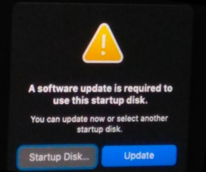
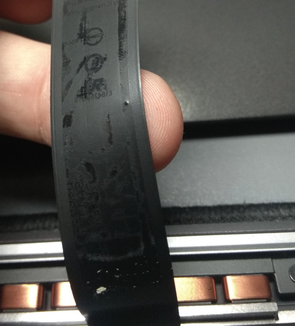
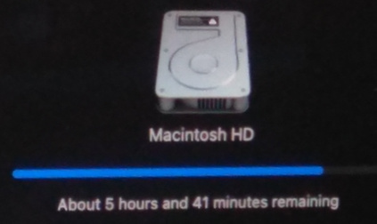
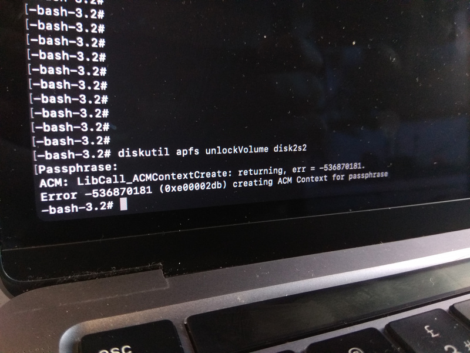
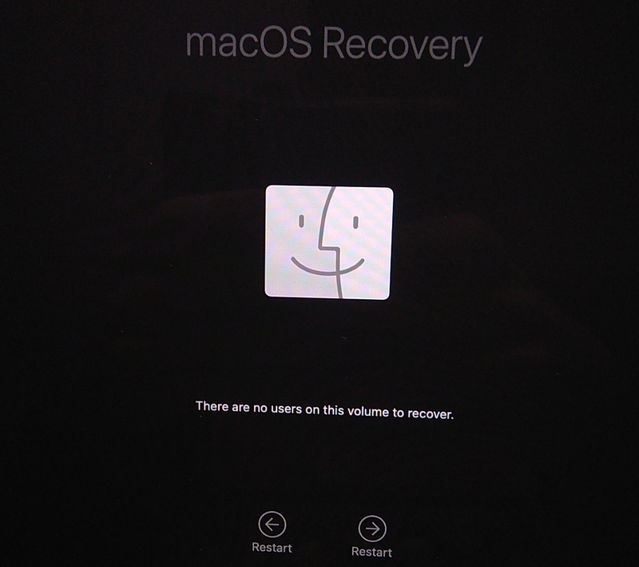
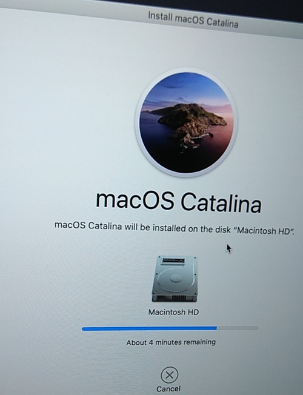

A 2020 MacBook Pro 13" with a damaged TrackPad flex cable - seems simple enough to fix, right?

It is, unless an Apple service center tries to update macOS, and wants to charge half the price of a new
MacBook to repair it.

This is a story how a simple hardware fix, that should have taken 30 minutes, took more like 30 hours to perform.

## Diagnosing the MacBook

When I first got the laptop, it would boot up just to show this image:


Plugging in an external mouse (and keyboard) made it continue the booting process. Normally it should boot up macOS,
but a recent update (from Monterey to Sonoma) performed by the Apple service center somehow corrupted the OS:



That's all I could get. Pressing "Update" seemed to do *something* which took about 10 minutes, just to reboot to show
the same error dialog.

## Fixing the TrackPad

Trying to start the macOS Recovery using ++command+r++ (or using any other
[startup combinations](https://support.apple.com/en-us/102603)) was extremely tricky with the external keyboard.
Most of the times it just wouldn't work. Natually, the first step was to actually fix the TrackPad.

As we all know, MacBooks are very user-friendly, so they gracefully disable the keyboard when just the TrackPad fails,
leaving you with basically no option to control the computer.

Disassembling the MacBook revealed that the TrackPad flex ribbon was punctured... *by a grain of sand*. Removing the
flex to probe it revealed that one of the signal pins was shorted to ground.



Thankfully, replacing the ribbon fixed both the TrackPad and the keyboard. Just make sure to buy a matching part,
with the same part number - it's not enough for it to *look* the same as the original (learned this the hard way).

## macOS Recovery

I'm not going to describe everything that I did to find out everything I needed to fix it... but there were 4 different
macOS versions in play here:

- Sonoma (14.x) - latest version (at the time), from Internet Recovery with ++option+command+r++
- Big Sur (11.x) - installed on the recovery partition, booting instead of the main OS with the update prompt (as well
as by using ++command+r++)
- Catalina (10.15) - seems to be the factory-installed version in this MacBook, booting from Internet Recovery
with ++shift+option+command+r++
- Monterey (12.x) - the one before updating to Sonoma (when the laptop was still booting fine).

By the way: checking the `/private/var/log/install.log` file and grepping with
`cat install.log | grep "starting download of" | grep "macOS"` showed me the upgrade history.

The only way to start the Recovery Assistant at the time was by startup combinations, which means I could access
Catalina, Big Sur and Sonoma installers. Obviously, I started by backing up all user files using the Terminal.

Interestingly, Catalina always asked for Apple ID login first, while the newer versions only wanted a local
user password (and the FileVault disk encryption password, obviously). The newer versions would also start with the
"software update required" pop-up, but that could be closed by pressing `Startup Disk...` and then quitting the
`Startup Disk` application.

None of these installers could help though. When trying to reinstall macOS, Catalina and Big Sur would show
a small popover above the target installation disk:

```
The operation could not be completed (com.apple.BuildInfo.preflight.error error 21.)
```

Next I tried Sonoma. And... it worked:



So I waited. Fortunately it finished only about an hour later. The computer rebooted to finish the installation, and...


Yeah, no dice. The installed OS was basically unrecoverable.

Since Monterey was the last version booting on this MacBook, I created a Monterey bootable USB. For this I needed
a working macOS with App Store, so I could only use my 3-year-old Hackintosh with Mojave (10.14).

Since Mojave was long-unsupported, I couldn't even download Monterey from the App Store. Instead, I found a direct
`.pkg` download link on some website. Then, I formatted an external USB hard drive using Disk Utility,
named it `install`, and ran [the following command](https://support.apple.com/en-us/101578):

```
sudo /Applications/Install\ macOS\ Monterey.app/Contents/Resources/createinstallmedia --volume /Volumes/install
```

The bootable installer copied with no issues. However, trying to install it on the broken MacBook resulted in the same
Preflight error 21 as before.

## The Hard Way

The MacBook had an APFS Container with two Volumes - `Macintosh HD` (System) and `Macintosh HD - Data` (User Data).
Since they are separate volumes, can one just erase the System volume and reinstall macOS to that?

Yes, and no.

- Yes - because this is how I restored the MacBook without ever having to erase user data.
- No - because it wasn't as simple as it looked.

Opened up Disk Utility (in the Big Sur recovery, but that's irrelevant here). Erased the System volume - it told me
that the volume was part of a "Volume Group". I chose to delete just the volume, not the entire group. Disk Utility
created a new one, but it was no longer a "System" volume - just a normal APFS volume. Since it was of no use, I deleted
the new one.

I verified that I could still mount the Data volume just fine, after entering the FileVault password. Earlier, I learned
that the `diskutil` command offers much more than the Disk Utility app.
[Here's a man page](https://ss64.com/mac/diskutil.html).

I knew I had to create an APFS **System** volume and add it to the Volume Group, right next to `Macintosh HD - Data`.
Two commands seemed relevant - `diskutil apfs addVolume` and `diskutil apfs changeVolumeRole`.

```bash
# Tried this to create a volume in the same group as Data (disk2s2) - failed with an error.
diskutil apfs addVolume /dev/disk2 APFS "Macintosh HD" -groupWith disk2s2
# This created a standalone volume as disk2s1
diskutil apfs addVolume /dev/disk2 APFS "Macintosh HD"
# Tried this to assign a System role - failed with a different error
diskutil apfs changeVolumeRole disk2s1 S

# Finally, the combined command created a System volume in the same group!
diskutil apfs addVolume /dev/disk2 APFS "Macintosh HD" -groupWith disk2s2 -role S
```

Great, I had an APFS System Volume in the same group as the Data Volume. But... I couldn't mount/unlock neither of them
anymore! Entering the password would just say it's incorrect. `diskutil` also wouldn't allow unlocking it.



With that, all the user data was lost... *until I removed the new System volume*. Yes, removing the volume made
it possible to mount the Data volume again.

There was something going on with a missing "Crypto Disk User", which probably got deleted along with the original
System volume. What worked in the end was **decrypting the Data volume** - no passwords meant no mounting problems!

Having a decrypted Data volume (which, thankfully, was really quick thanks to the T2 chip), I could create the System
volume again and mount both volumes with no issues!

Off to macOS installation! Now, *something* told me to reboot the computer and start the Monterey installer instead.
That might have been a bad decision...



From now on, that was all I could do. "Restart" or "Restart". Later, I found the "Erase Mac" option too, but I didn't
want to erase the User Data - yes, I had a backup, but this would still mean setting up the Mac from scratch.

Sonoma, Big Sur, Monterey installers - they would all just show this message. No "Recovery Utilities", no Terminal,
no Disk Utility. I lost all possible access to the computer and the disk.

Heck, I even tried booting Windows and Linux, which didn't work because of the T2 chip security settings. As a side
note, the "Single user mode" (++command+s++) didn't work either (it would show verbose logs and boot to the same
"no users" message).

And then I remembered, that the Catalina installer always acted a bit different than the other installers.
Pressed ++shift+option+command+r++, connected to my Wi-Fi, let it boot, and... I got an Apple ID login prompt!

Great, so at least some user info was still left on the drive. Entering the Apple ID password showed the "no users"
dialog again... but wait, there was an additional option. The right "Restart" arrow said "Exit to Recovery Utilities"
instead - success! I had access to the Terminal and Disk Utility again.

Once again, I verified that both volumes (Data & System) could be mounted, without a password this time.



TL;DR: reinstalling Catalina didn't work, it said the Mac needed some kind of upgrade, which I couldn't perform.

Since I still had Terminal access, I connected the bootable Monterey installer, and ran it from within the Catalina
recovery. To my surprise, the installation started without any Preflight errors.

About 45 minutes and a couple of reboots later... **the MacBook booted up as if nothing has ever happened**. Really - it
looked nearly miraculous - all windows opened up right as they were left before the TrackPad broke down.

## Making it usable again

It's time to upgrade! After all, Sonoma is going to have be installed sooner or later. This time I took a Time Machine
backup, so that if the same update bootloop happens again, I'm not going to have to go through all that pain anymore.

From now on, everything went flawlessly. The latest macOS version installed without any issues and the laptop was ready to be used again.
