Sometimes I feel bad about buying a (relatively) expensive device, just to disassemble and modify it right after unboxing.

But I've had this cheap digital microscope for about two months now, so I think it's ready to get *slightly* upgraded. I use it for soldering small components, inspecting the solder joints and tracing the PCB signals sometimes. It's not as good as an optical microscope, but it really is a gamechanger when you compare it to a magnifying glass.

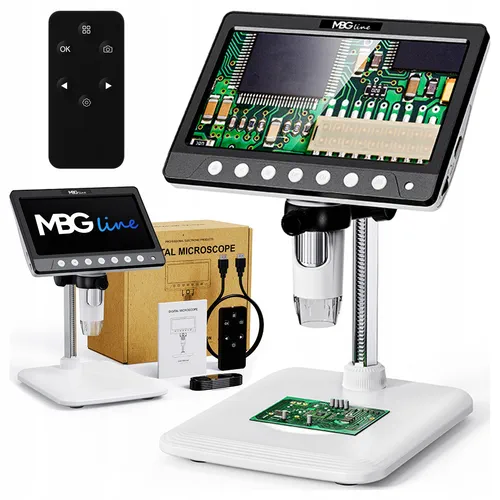

## What is it and what can it do?

I got this device for an equivalent of a little over $50, and it's pretty cool what you can get for that price. First - it's a microscope with a built-in 7" display. The screen has a shockingly high resolution (at least it *looks* good; in reality it's still 800x480).

It can take pictures, videos, and magnify up to 1200x... okay, *probably not*, but it's seriously enough for soldering. It's got a built-in 2000 mAh battery, an LED light to illuminate the viewed surfaces and a manual focus control knob.

In terms of ports and expansions, there's a microSD slot to store photos, USB-C to transfer those photos and use it as a PC camera, and HDMI that outputs video directly from the LCD.

Okay, so what *can't* it do?

You can't *simultaneously* view the built-in LCD and USB camera or HDMI. And that's quite a limitation - you can't, for example, benefit from the (almost) lag-free LCD and record/stream the video on the PC at the same time.

This alone implies it was time to check if the microscope can be modded to allow that.

## Taking a look inside

The internals were guarded by 6 screws - 2 for the camera module and 4 for the back cover itself.

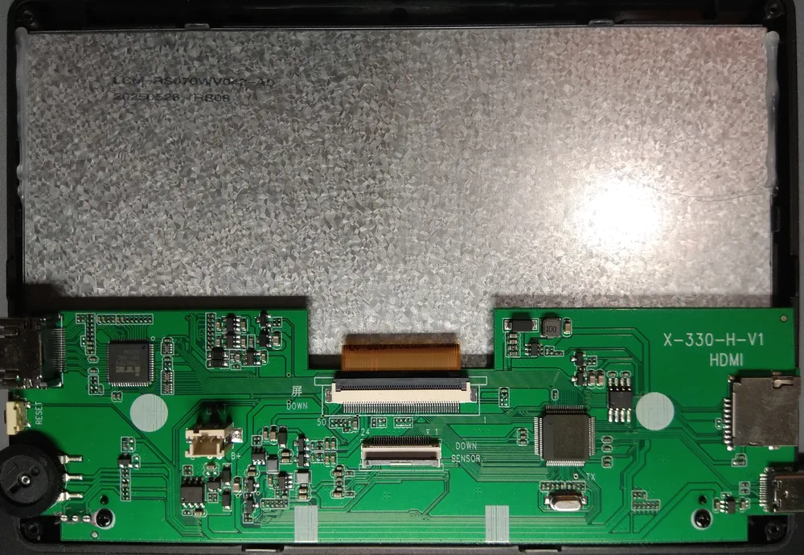

Opening it up revealed a pretty simple circuit board, with the notable components being the main CPU, LCD and camera FPC connectors, a battery connector and a HDMI transmitter chip.

The CPU controlling the entire device was <code>&nbsp;&nbsp;&nbsp;&nbsp;</code>. It's easy to find a datasheet online that lets you know exactly what architecture it's based on.

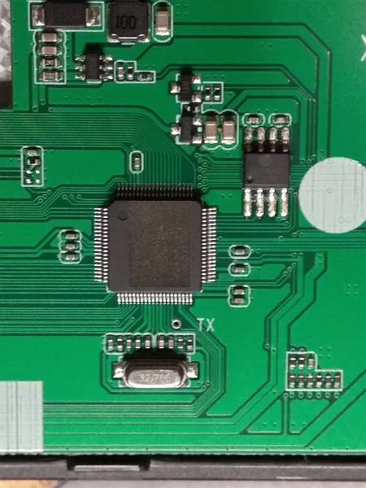
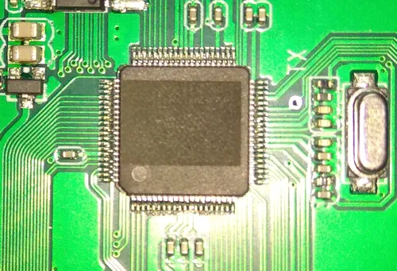

...right?

Anyway... there's an `IT66122FN` HDMI transmitter chip, which just takes the raw parallel RGB signals and converts them to HDMI. The same signals are directly connected to the internal LCD. Yet, as soon as I connect an HDMI cable, the screen goes black.

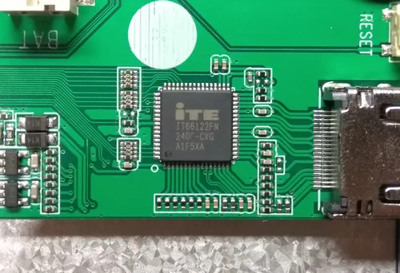

The back side of that PCB has some labelled test points, too:

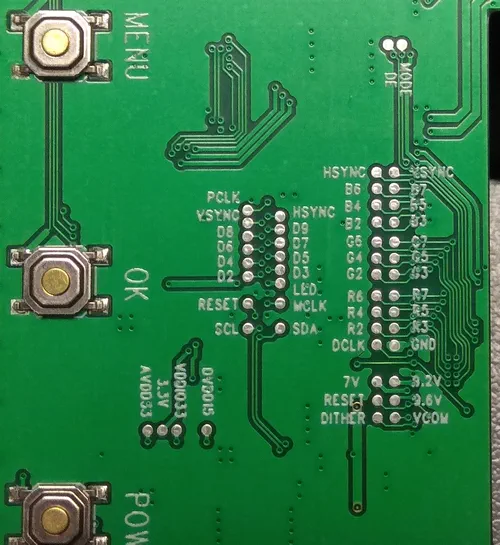

*I'll leave the CPU story for another post...*

## The HDMI transmitter

The `IT66122FN` chip has an easily available datasheet (for real, this time). In this particular configuration, it takes parallel RGB video signals and converts them into TMDS (HDMI). It's controlled by the main CPU using I²C.

To understand the wiring, I took the pinout and overlayed it on top of the photo shown before.

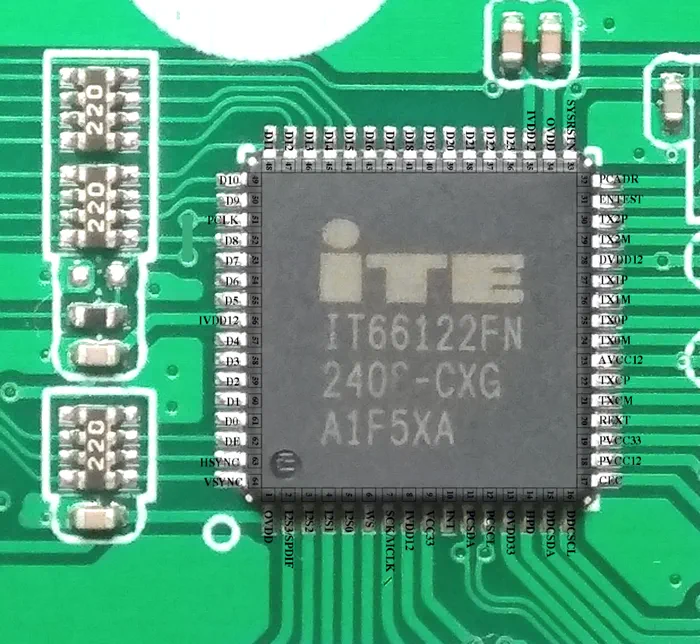

The `TX##` pins are HDMI signals, the `PCSDA` and `PCSCL` is the CPU's I²C interface, the `HSYNC`/`VSYNC`/`PCLK`/`D#` signals are the RGB input, and... oh boy, **it only uses 8 of them**!

It turned out that either the video is transmitted using only 8-bit color, or the signals are switched to something other than RGB when HDMI is detected. The LCD was clearly just parallel RGB (or DPI), not DSI, LVDS or anything else.

The chip's datasheet mentioned supporting `8/10/12-bit YCbCr 4:2:2` format, so perhaps it **switches the color space** on HDMI?

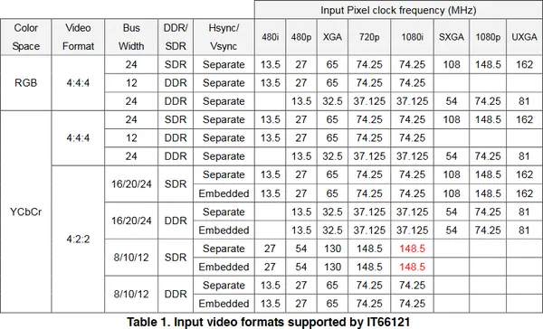

If that was the case, then it would be almost impossible to implement the mod I wanted. Reading the datasheet further confirmed my suspicion - the only used pins were `HSYNC`, `VSYNC`, `DE`, `PCLK` and `D8..D15` - this matched the `YCbCr 4:2:2 8-bit` mode.

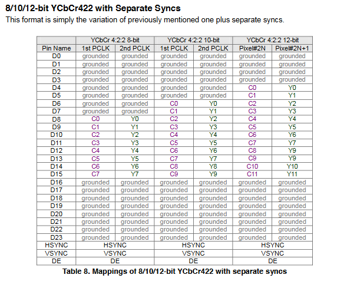

These video modes are **totally incompatible**. There is just no way for the LCD to display YCbCr video.

The only possible way to implement this mod would be to physically rewire the HDMI transmitter to take RGB inputs straight from the LCD, reconfigure its I²C initialization sequence, and disconnect it from the CPU so that it doesn't turn the screen off. That could end up being pretty destructive, and even if it worked, *it would be a massive challenge*.

## So what now?

So I decided to give it a try anyway.

I thought to myself, even if this ends up not working at all, I could *probably* revert this modification completely. And honestly, I don't see why *wouldn't* it work - the only thing that comes to mind is the 800x480 resolution, which is non-standard, in HDMI terms.

Logically, the first thing I did was soldering a Pi Pico-based logic analyzer to the `SDA` and `SCL` test pads. This allowed me to capture (*part of*) the (*very, very long*) initialization sequence. Instead of showing the entire trace, which is just boring when zoomed out, here's a close-up view on the `System Status` register readout, which indicates whether HDMI is connected (in this case, it's not):

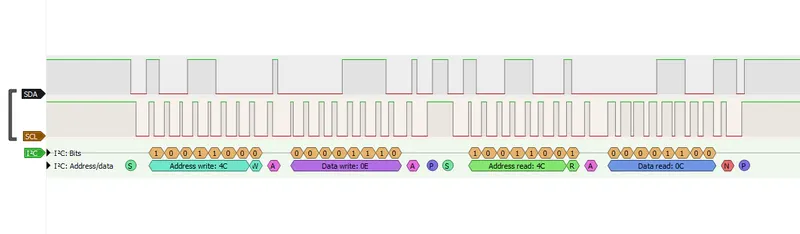

By the way - the register specification of the `IT66122` was not available, but there was a similar chip called `IT66121`, which is more popular (even has a driver in mainline Linux!). I was using the `IT66121 Programming Guide` for the rest of my experiments.

I made several captures during different moments of the initialization sequence - it was just too long to be captured by my Pi Pico in its entirety. Hopefully this would prove to be enough to initialize the HDMI chip *without* the main CPU.

## Initializing HDMI manually

Next, I wanted to try controlling the transmitter from the Pi Pico, instead of just sniffing the signals. This meant I had to do the inevitable - *disconnect the HDMI transmitter* from the original CPU, by *cutting two traces* on the PCB... but at least I could still easily rewire them if this didn't work out.

I wrote a simple C program using the `pico-sdk`, which just received "read" or "write" commands over UART, and forwarded the data over I²C. Using a matching Python program on the PC side, I was able to read and write the `IT66122`'s registers freely.

By following the Programming Guide, as well as the PulseView traces, I could see exactly what was happening. The CPU first powered up some peripherals inside the transmitter, and then... *started reading the EDID*, which is what made the initialization sequence so long. In my Python program, I could replicate the EDID readout algorithm and got this result:

```
00000000: 00 FF FF FF FF FF FF 00  21 57 36 18 BD E9 02 00  ........!W6.....
00000010: 25 1D 01 03 80 35 1D 78  22 EE 91 A3 54 4C 99 26  %....5.x"...TL.&
00000020: 0F 50 54 21 0F 00 81 00  81 40 81 80 90 40 95 00  .PT!.....@...@..
00000030: 01 01 A9 40 B3 00 01 1D  00 72 51 D0 1E 20 6E 28  ...@.....rQ.. n(
00000040: 55 00 0F 48 42 00 00 1E  0E 1F 00 80 51 00 1E 30  U..HB.......Q..0
00000050: 40 80 37 00 0F 48 42 00  00 1C 00 00 00 10 00 00  @.7..HB.........
00000060: 00 00 00 00 00 00 00 00  00 00 00 00 00 00 00 FC  ................
00000070: 00 4D 41 43 52 4F 53 49  4C 49 43 4F 4E 0A 01 19  .MACROSILICON...
00000080: 02 03 34 F1 52 02 11 13  84 1F 10 03 12 06 15 07  ..4.R...........
00000090: 16 05 14 5E 5F 63 64 23  09 7F 07 83 01 00 00 6E  ...^_cd#.......n
000000A0: 03 0C 00 10 00 00 3C 20  00 80 01 02 03 04 E5 0E  ......< ........
000000B0: 61 60 65 66 66 21 50 B0  51 00 1B 30 40 70 36 00  a`eff!P.Q..0@p6.
000000C0: 0F 48 42 00 00 1E 66 21  56 AA 51 00 1E 30 46 8F  .HB...f!V.Q..0F.
000000D0: 33 00 0F 48 42 00 00 1E  8C 0A D0 8A 20 E0 2D 10  3..HB....... .-.
000000E0: 10 3E 96 00 10 09 00 00  00 18 00 00 00 00 00 00  .>..............
000000F0: 00 00 00 00 00 00 00 00  00 00 00 00 00 00 00 B2  ................
```

Looks perfectly valid - this is the EDID of my chinese ~~HDMI~~ *HDTV* capture card. And... that's about as far as I got with the captures from my logic analyzer; because of the long EDID readout, **it didn't capture anything else**.

To be able to replicate the initialization sequence I needed a *complete* capture, done with a real I²C sniffer, not just a logic analyzer. Having a Pi Pico and its PIO peripheral, I thought to myself, it shouldn't be too out of reach, even if I had to write one from scratch.

But first, I started looking for existing solutions - surely someone must have created a DIY I²C sniffer in the past, *right*? Indeed - there were several choices, mainly for Arduino and ESP32, one for STM32, and even one for the RP2040, though only supporting 400 kHz readouts.

The microscope's I²C ran at 100 kHz, which meant even an Arduino could possibly keep up with the speed - except that there was *a lot* of data being transmitted - the sniffer, whatever it ends up being, needed to transfer all the transactions to a PC, without missing any bytes.

The STM32 project in particular caught my attention - [`kongr45gpen/i2c-sniffer`](https://github.com/kongr45gpen/i2c-sniffer). It runs on a cheap "Blue Pill" board (which I happen to own), and uses a baud rate of whopping **3,000,000 bps**.

First, I tried flashing the attached ELF file directly to my board, but it didn't start - possibly because mine had an `STM32F103C6T6`, not an `...C8T6` chip. Thankfully, it also supported PlatformIO, so compilation was straightforward (I only had to add a missing `stdio.h` include).

Since I was already recompiling the firmware, I modified it to remove the ANSI color codes, to make the output slightly less human-readable (and thus requiring less bitrate to transfer).

## Understanding the initialization sequence

To get the main CPU to talk with the `IT66122` again, I had to reconnect the previously-cut `SDA` and `SCL` signals - I used some magnet wire to connect both ends. Thankfully, the HDMI output **still worked** just fine, so I haven't broken anything (*yet*).

Firing up the STM32 gave me very promising results - here's a partial view on the output:

```
[4cWA00A][4cRA54N][4cWA01A][4cRA49N][4cWA02A][4cRA22N][4cWA02A][4cRA22N][4cWA0fA]
[4cRA08N][4cWA0fA08A][4cWA62A][4cRA88N][4cWA62A80A][4cWA64A][4cRA94N][4cWA64A90A]
[4cWA04A][4cRA1cN][4cWA04A3cA][4cWA04A][4cRA1cN][4cWA04A1dA][4cWA0fA][4cRA08N]
[4cWA0fA08A][4cWAd1A][4cRA04N][4cWAd1A08A][4cWA65A][4cRA80N][4cWA65A80A][4cWA71A]
[4cRA08N][4cWA71A1cA][4cWA8dA9cA][4cWA0fA][4cRA08N][4cWA0fA08A][4cWAf8Ac3A][4cWAf8Aa5A]
[4cWA20A][4cRA08N][4cWA20A88A][4cWA37A][4cRA02N][4cWA37A02A][4cWA20A][4cRA88N]
[4cWA20A08A][4cWAf8AffA][4cWA5dA][4cRA94N][4cWA5dA95A][4cWA59A][4cRA00N][4cWA59A40A]
[4cWAe1A][4cRA41N][4cWAe1A41A][4cWA05A][4cRA60N][4cWA05A60A][4cWA09Ac8A][4cWA0aAf8A]
[4cWA0bAd7A][4cWA0cAffA][4cWA0dAffA][4cWA0eA][4cRA0cN][4cWA0eA0fA][4cWA0cA00A]
[4cWA0dA00A][4cWA0eA][4cRA0eN][4cWA0eA0cA][4cWA0eA][4cRA0cN][4cWA0eA0cA][4cWA09A]
[4cRAc8N][4cWA09Ac8A][4cWA20A][4cRA08N][4cWA20A08A][4cWA72A00A][4cWA70A00A][4cWA72A02A]
[4cWA73A00A][4cWA74A80A][4cWA75A00A][4cWA76Ab8A][4cWA77A05A][4cWA78Ab4A][4cWA79A01A]
[4cWA7aA93A][4cWA7bA00A][4cWA7cA49A][4cWA7dA3cA][4cWA7eA18A][4cWA7fA04A][4cWA80A9fA]
[4cWA81A3fA][4cWA82Ad9A][4cWA83A3cA][4cWA84A10A][4cWA85A3fA][4cWA86A18A][4cWA87A04A]
[4cWA88A][4cRA03N][4cWA88A03A][4cWA04A][4cRA1dN][4cWA04A15A][4cWAc0A][4cRA00N][4cWAc0A01A]
[4cWAc1A][4cRA81N][4cWAc1A83A][4cWAc6A][4cRA00N][4cWAc6A03A][4cWA0fA][4cRA08N][4cWA0fA09A]
[4cWA58A10A][4cWA59A08A][4cWA5aA00A][4cWA5bA00A][4cWA5cA00A][4cWA5dA57A][4cWA5eA00A]
[4cWA5fA00A][4cWA60A00A][4cWA61A00A][4cWA62A00A][4cWA63A00A][4cWA64A00A][4cWA65A00A]
[4cWA0fA][4cRA09N][4cWA0fA08A][4cWAcdA][4cRA00N][4cWAcdA03A][4cWA0fA][4cRA08N]
```

It's *really* difficult to read - but again, the point was to make it transfer data **as quickly as possible**. And it did - there wasn't even a single error message about the buffer overflowing. Using a few RegEx patterns it was pretty easy to transform it into something more friendly:

```
<- W F8 = C3
<- W F8 = A5
-> R 20 = 08
<- W 20 = 88
-> R 37 = 02
<- W 37 = 02
-> R 20 = 88
<- W 20 = 08
<- W F8 = FF
-> R 5D = 94
<- W 5D = 95
-> R 59 = 00
<- W 59 = 40
-> R E1 = 41
<- W E1 = 41
-> R 05 = 60
<- W 05 = 60
<- W 09 = C8
<- W 0A = F8
<- W 0B = D7
```

Every transaction pretty much boiled down to two operations - reading or writing registers. Reading involved an I²C write (of the register address) and an I²C read (of the value). Similarly, setting a register value consisted of two sequential write operations (address, then value).

Having a complete transaction log, I proceeded to try understanding everything that was happening - using the *Programming Guide* as a main reference. I won't post all of the boring details, so here's roughly what the driver does:

1. Power up all peripherals, configure interrupts.
2. Configure video mode and Color Space Conversion (CSC).
3. Set up the AVI InfoFrame packet.
4. Set up the Audio InfoFrame packet.
5. Configure audio format.
6. Power on the Analog Front End (AFE).
7. Read the EDID data.
8. (Re)configure the CSC and other video parameters.
9. Set up the AVI/AUD InfoFrame packets again.
10. Disable A/V mute.
11. Finally, continuously check the HPD (Hot Plug Detection) state, and periodically read out all registers.

Seems mostly logical - except the periodic register dump, perhaps. Why do that every few seconds? No idea.

Next, I renamed all the registers I could find - some from the Programming Guide, some from mainline Linux, and some from Rockchip RK3188 BSP kernel sources - I found those too, and they contained a **vendor driver** for the `IT66121`. The renamed sequence was much more readable:

```
<- W INPUT_CSC(72) = 02
<- W CSC_YOFF(73) = 00
<- W CSC_COFF(74) = 80
<- W CSC_RGBOFF(75) = 00
<- W CSC_MTX11_L(76) = B8
<- W CSC_MTX11_H(77) = 05
<- W CSC_MTX12_L(78) = B4
<- W CSC_MTX12_H(79) = 01
```

About the BSP driver - I focused on that for some more time, and it turned out to be just what I needed. Thanks to that driver, I was able to map **99% of the captured I²C signals** to the exact C source code function calls! Apparently, the mysterious CPU used vendor drivers to interface with the HDMI transmitter. *Who would have thought!?*

Even the register initialization tables were a 100% match from the source code. This let me understand *exactly what was being sent*, and why. Translating the above description gives approximately the following algorithm, from a high-level perspective:

1. `it66121_initial()`
    - check device ID
    - `InitHDMITX()` - send initialization tables
2. `it66121_poll_status()`
    - `CheckHDMITX()` - check HPD status
    - system calls `insert()` if changed to present
    - system calls `remove()` if changed to absent
3. `it66121_insert()`
    - `HDMITX_PowerOn()` - send power on table
4. `it66121_read_edid()`
    - `getHDMITX_EDIDBytes()` - read all EDID data
5. `it66121_config_video()`
    - `HDMITX_EnableVideoOutput()`
    - `hdmitx_SetAVIInfoFrame()`
    - `hdmitx_SetAudioInfoFrame()`
    - `HDMITX_EnableAudioOutput()`
    - `setHDMITX_AVMute(false)`
6. loop forever, while video is active:
    - `CheckHDMITX()`
    - `getHDMITX_LinkStatus()`
    - `setHDMITX_AVMute(false)`
    - `DumpHDMITXReg()` - periodically, not every loop
7. `it66121_remove()`
    - `HDMITX_DisableVideoOutput()`
    - `HDMITX_PowerDown()` - send power down table

## Initializing the transmitter

To make sure I got everything right, I put the above functions into my Python code, that interfaced with the simple Pi Pico USB-I²C bridge I used earlier. As a reminder - the CPU's I²C line was currently **disconnected** again from the HDMI transmitter, meaning it couldn't initialize it properly.

After a little bit of fiddling with setting all registers the right way, I got it working! The **Python code could fully initialize the `IT66122`**, and the HDMI output was now functioning just like without any modifications - I could see the correct picture.

This meant I could also **change** the initialization parameters - for example, switch the input mode to RGB and disable YUV->RGB color space conversion. This produced the following image - as expected:

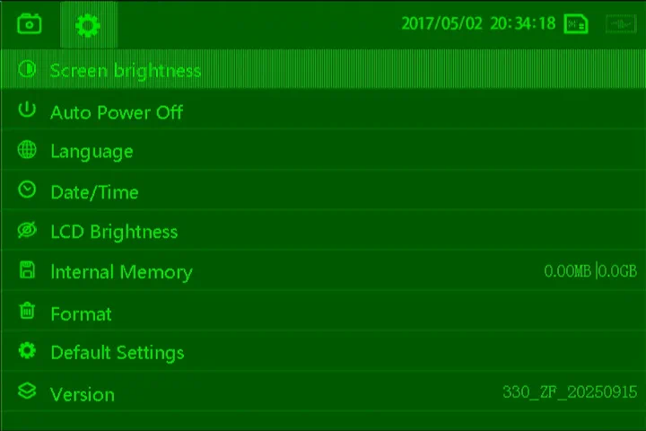

Why exactly was a *green-tinted* screen expected? If you take a look at the `IT66122` pinout mapping on the PCB, you can notice that the only connected pins are `D8..D15`. In a typical RGB or BGR format, this corresponds to the green channel.

Okay then, but why does the image has some *odd vertical stripes*? The answer can be found in the `IT66122`'s datasheet - in `YCbCr` mode at 8 bits, the **clock is doubled** to send luminance (Y) and chrominance (C) signals in an alternating fashion.

When the input format is correctly configured as YUV, the chip can deal with the doubled clock - however, when setting it as RGB (which doesn't correspond to the *actual* input format), the doubled clock just means the horizontal resolution is 2x higer.

I was even able to verify that this was the case - hooking the HDMI up to my PC monitor allowed me to check the **detected signal resolution**:

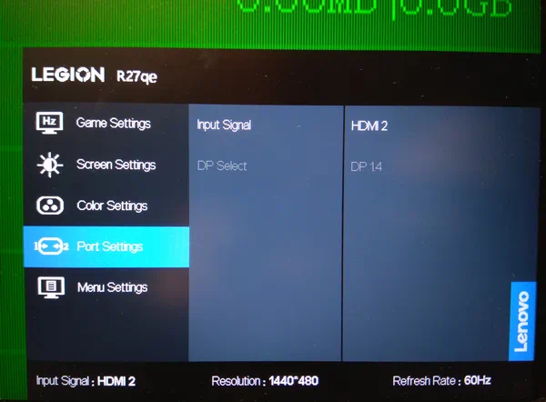

Just as expected - **1440x480**, given that the original resolution was 720x480. If you've been paying attention, you might remember the LCD resolution was 800x480, and that I was wondering if HDMI could accept it. This last test most likely confirmed that it could - maybe it's just me, but 1440x480 seems a lot more non-standard.

There was just one problem with all this, and it may already be obvious from the above descriptions - if the CPU was *disconnected* from HDMI, why was its output format still YCbCr and the resolution 720x480?

As it turns out, the CPU didn't really care about the HPD status received from the `IT66122`. Instead, it was directly connected to a `HPD` signal within the HDMI connector itself - pin 19. That's how it detected a plugged-in cable, and decided to turn off the LCD.

What was even worse - it seemed to cut off the 3.3V and 1.2V power supplies of the HDMI transmitter, as soon as the cable wasn't connected. Since I couldn't really reprogram the CPU just yet, I had to cut the HPD connection and somehow restore the power input.

## Manually controlling power

To find out how the `IT66122` is powered down and how the HPD signal is delivered to CPU, I needed to understand how the circuit worked. And what better way to understand it than to reverse-engineer the entire routing of the HDMI part?

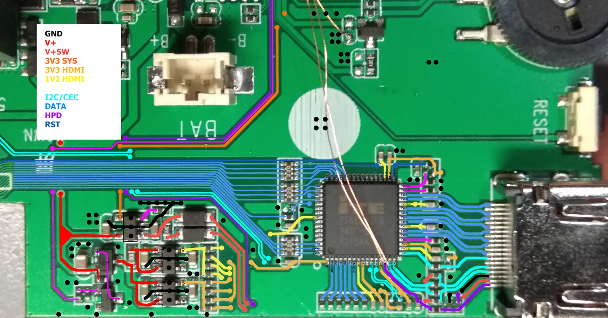

I was even able to trace down the part numbers of those ICs on the left. Here's how it all works:

- HPD goes through a resistor to the main CPU (purple trace),
- CPU enables power (pink trace), which turns on an NPN transistor, which then enables a P-channel MOSFET,
- the MOSFET forwards `V+` (red trace), which is battery or USB voltage (whichever's higher), onto two LDO regulators (likely `TX6211B`) and a voltage switch (`MT9700`),
- the LDOs produce 3.3V (orange trace) and 1.2V (yellow trace), which go to each of the `IT66122`'s supply pins, through separate resistors,
- the switch passes `V+` onto `V+SW`, which feeds the HDMI's 5V rail and DDC pull-up resistors,
- finally, there's also a reset line, connected directly to the CPU somehow.

To make the modification possible, the circuit needed two changes:

- removing a resistor (near the port) to cut HPD from the CPU,
- removing a resistor (near the NPN) to control the power supply manually.

Unsurprisingly - **this worked just fine**. I removed the two resistors, enabled the NPN transistor externally, and the HDMI chip got powered on. The built-in LCD also displayed picture, even after plugging in an HDMI cable.

After sending the initialization sequence and setting input mode to RGB, I got... *a red image on the HDMI!?*

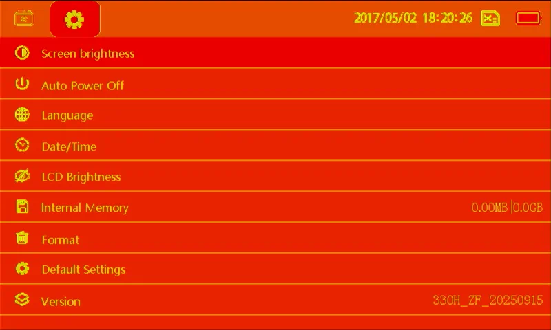

Why exactly was this unexpected? Just like before, the only connected pins were `D8..D15`, which corresponded to the green channel **only**. There's just no way to interpret this input signal as anything even remotely close to red.

To check if the input mode was really RGB, I tried connecting a 3.3V signal to various data inputs - for example, connecting to `D7` added more blue to the image, but connecting to `D16..D24` **made no difference at all**. It's almost as if they were completely ignored for some reason.

In the datasheet I found an example of pin assignments in 12-bit RGB mode - one that used Double Data Rate (DDR), meaning the data was sampled at both clock edges. This mode only used data pins `D0..D11`, which *could* explain why any higher bits were ignored. However, in the initialization sequence, the register bit controlling DDR operation was always disabled. Furthermore, enabling it just made the image shrink horizontally (to 400x480 resolution).

It was already late this day, so after several hours of troubleshooting, I turned it all off and left it for the night.

But then I thought to myself - *why* exactly was the screen red? Sure, it might have a red tint, but why the red background? Even a black-colored background (RGB 0,0,0) was displayed as red! *Could it be that the `D16..D24` pins controlling the red channel assumed a HIGH state because they were floating?*

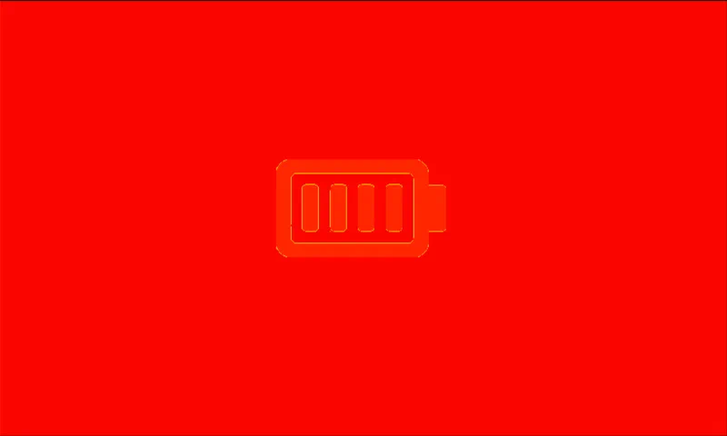

## After wasting hours on troubleshooting...

The next day I immediately wanted to test my theory - could the red channel simply be **fully enabled when floating**? Could bringing one of the inputs to GND get rid of the red color?

I powered the microscope on, connected the Pi Pico, attached the HDMI capture card, and fired up the initialization sequence. **What I saw on the capture was completely unexpected**.

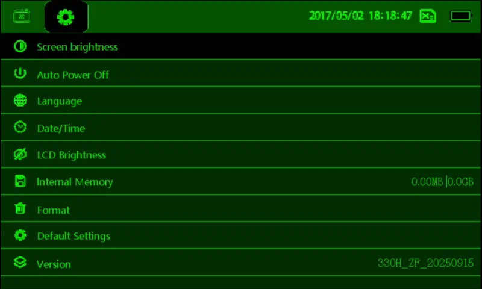

A perfectly valid-looking green-tinted image. Black backgrounds being truly black, dark backgrounds being dark green, and white text being light green. This just fixed itself overnight. I didn't change the initialization sequence, color formats, pin assignments... everything was the same. The only difference was *time* - the device was left **completely unplugged for several hours**.

And then:

<video src="video-changing.mp4" muted controls width="100%"></video>

I didn't even touch it. It just changed to red on its own. This was the perfect confirmation that **floating pins were the issue** all along. As expected, connecting one of the upper data pins to GND made the appropriate bit of the red channel disappear.

To reiterate: I had a **working initialiation sequence**, full **control over the power** supply and a confirmation of the **RGB mode support**. The next thing to do was probably the hardest one - wire up all 18 data bits, from the LCD straight into the HDMI transmitter.

I started by mapping the existing HDMI-LCD connections (which were used in YUV mode before). Here's a table showing all connections on an unmodified board:

```
+-----+----------+----------+
| LCD | Signal   | HDMI     |
|-----|----------|----------|
| 12  | B7       | -        |
| 13  | B6       | -        |
| 14  | B5       | -        |
| 15  | B4       | -        |
| 16  | B3       | -        |
| 17  | B2       | -        |
| 18  | B1 (GND) | -        |
| 19  | B0 (GND) | -        |
| 20  | G7       | D11 (G3) |
| 21  | G6       | D10 (G2) |
| 22  | G5       | D9 (G1)  |
| 23  | G4       | D8 (G0)  |
| 24  | G3       | -        |
| 25  | G2       | -        |
| 26  | G1 (GND) | -        |
| 27  | G0 (GND) | -        |
| 28  | R7       | -        |
| 29  | R6       | -        |
| 30  | R5       | D15 (G7) |
| 31  | R4       | D14 (G6) |
| 32  | R3       | D13 (G5) |
| 33  | R2       | D12 (G4) |
| 34  | R1 (GND) | -        |
| 35  | R0 (GND) | -        |
+-----+----------+----------+
```

I was kind of hoping that at least some of the Green channels would overlap, but clearly that wasn't the case. This just meant I had to remove the 4x resistor packs, and rewire all 18 bits.

The entire rewiring process **took me more than 5 hours**. This was really painful due to how tiny the magnet wire was - fixing even the tiniest mistake (such as a solder bridge between two pins) usually started a chain reaction of desoldering all of the neighboring pins.

Later, I also had to actually *create* solder bridges - the HDMI transmitter accepted 24-bit video, while the CPU only outputs 18-bit signals (and drives the LCD this way). To reduce any possible artifacts, I bridged together the 3 lowest bits of each color (`R0..R2`, `G0..G2`, `B0..B2`).

## Testing and fixing

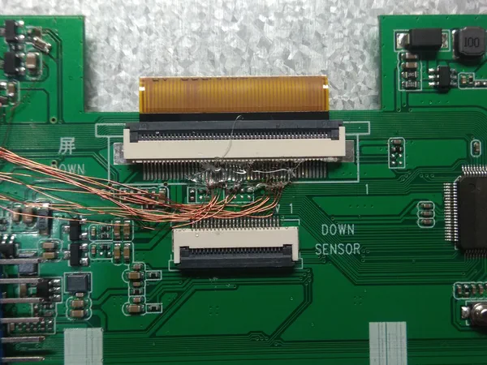

After connecting all 18 color bits using tiny wires, I powered on the microscope and ran the I²C initialization sequence. I unfortunately don't have a photo to show here, but **it worked on first try**!

While I had this working, I rewrote the `IT66121` driver using mainline Linux's code, instead of the BSP code. This made the entire sequence *way shorter and cleaner*.

There was however something odd with the picture - perhaps the best way of describing it is displaying some test color bars - the microscope has a photo browser, after all:


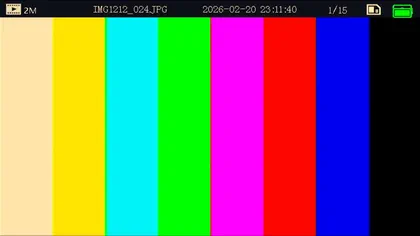

I think the difference is obvious - the captured image was *just too yellow*. For some reason, all colors of the test pattern were correct, except white (`#FFFFFF`) and yellow (`#FFFF00`).

Oddly, the effect was only visible *after the device booted* - meaning the splash logo was looking good, but the shutdown logo wasn't. Both images were definitely identical on the real LCD - but here's a direct comparison of the HDMI captures:


Long story short - I tried troubleshooting that, by changing various registers, color conversions, etc. - but wasn't able to fix it "cleanly".

In the end, I resorted to **using the CSC** (Color Space Conversion) peripheral to add some more Green & Blue channel, whenever the Red channel was being used. It's not perfect, but it made the result *much more tolerable*.

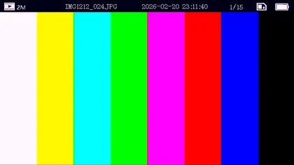

Better, isn't it?

## Finishing touches

Lastly, I needed to convert the Python I²C driver code to C and put it on a microcontroller. I chose an old ATmega8L, because that's what I had at hand. I soldered it onto an old [SparkFun OpenLog](https://www.sparkfun.com/sparkfun-openlog.html) board - it was just collecting dust, since the original CPU was dead *for some reason*.

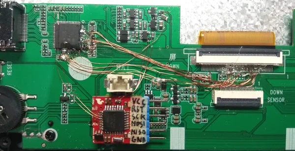

Forgive me for the hot glue... I wanted to keep the wires secure in place, and that just seemed like the easiest solution.

After assembling everything back together, it all still worked just fine - so here's the finished product, **displaying on LCD and over HDMI simultaneously**:

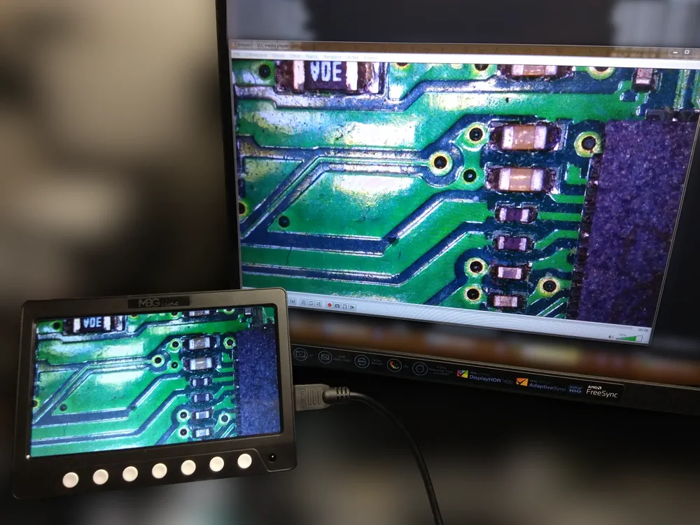

As for the unlabelled and mysterious CPU... who knows, maybe I'll come back to it someday.
