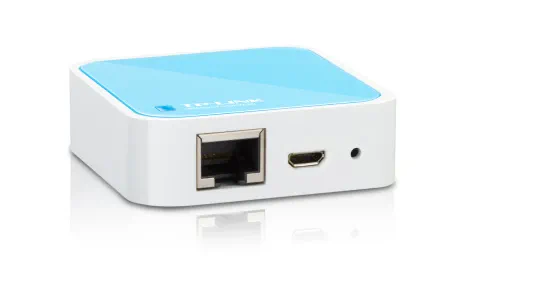
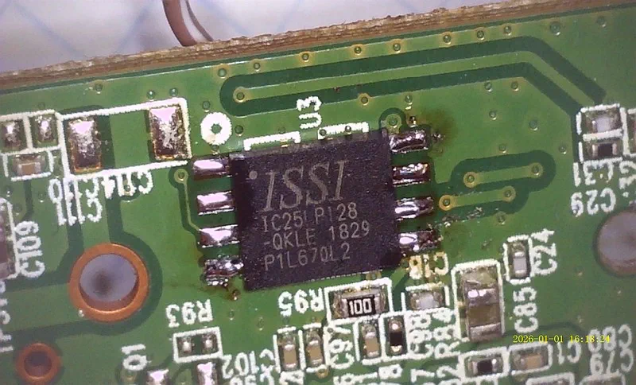
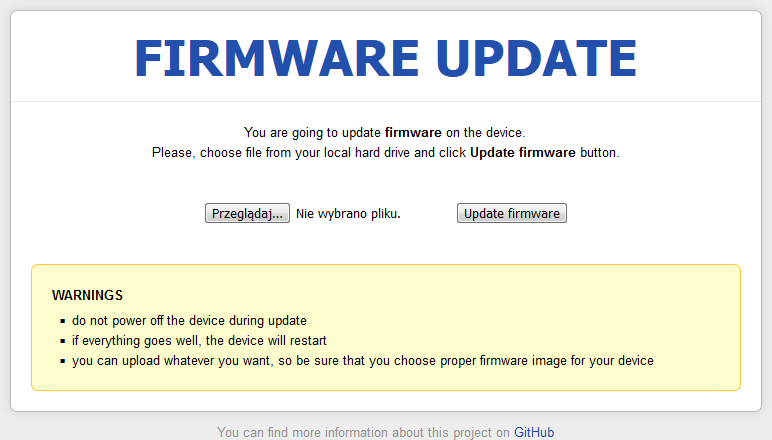
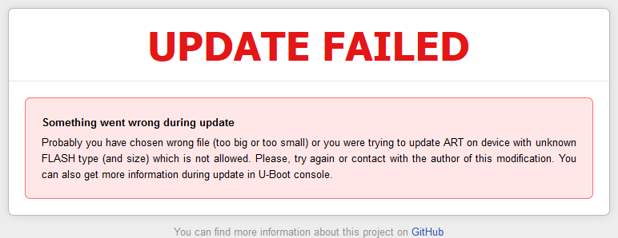
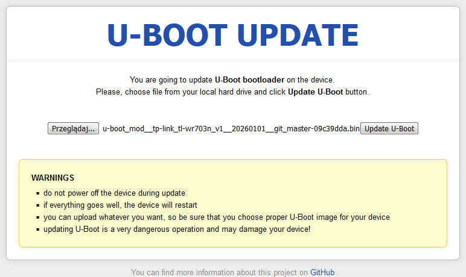
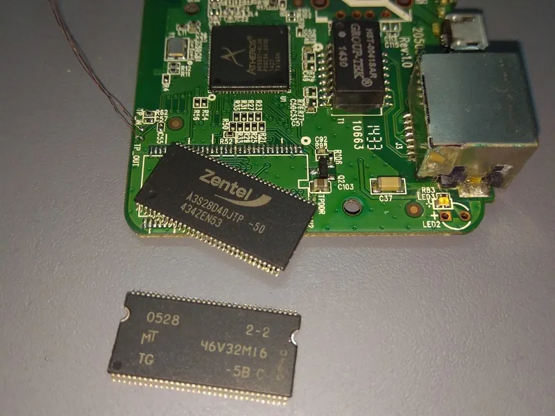
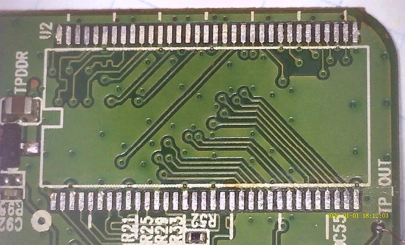
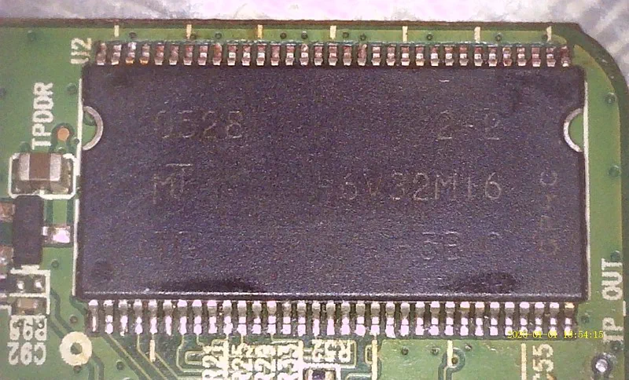
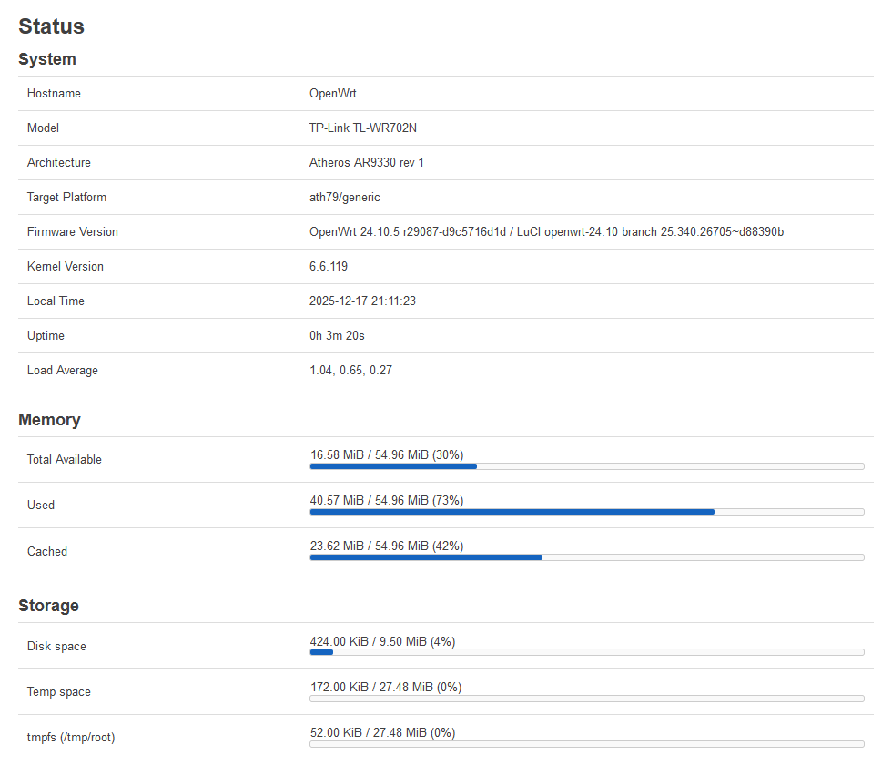
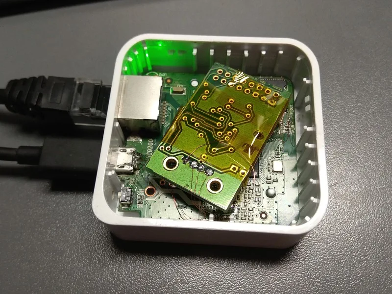

A couple of years ago I bought a tiny router for like $1:



The **TP-LINK TL-WR702N** - it features a single 10/100 Mbps Ethernet port, microUSB for power, and... *that's about it*. However, with the right software, it can still be useful in many scenarios.

The stock firmware from TP-LINK is... well, basic, it allows to configure the router as a Wi-Fi AP or a client (which then connects the Ethernet port to a Wi-Fi network), and has a few other usual options.

So I figured - *why not try installing OpenWrt on that thing*?

## OpenWrt support

Now, here's the general problem - this device has only **2 MiB of flash and 16 MiB of DDR RAM**. That's not enough to run OpenWrt, even if you use an ancient version.

There are several similar TP-LINK routers, namely the **TL-WR703N** (same case and PCB, twice the flash/RAM, extra USB) and the **TL-WR710N** (two Ethernet ports, 8 MiB flash, 32 MiB RAM). These two models used to be supported in previous versions of OpenWrt, but support was dropped a few years ago due to insufficient memory resources.

Thankfully, the TL-WR703N page contains some instructions about **modding the device** to add more flash and RAM. This allows to increase the storage to 16 MiB, as well as having at most 64 MiB of RAM - now, that's already *plenty*!

I decided to give this a try with my TL-WR702N. Since the devices are no longer supported, there are no prebuilt OpenWrt images, and there are no exact steps for building one - I'll have to figure it out myself.

## Building firmware

The [OpenWrt Wiki](https://openwrt.org/docs/guide-developer/toolchain/use-buildsystem) outlines the build process pretty nicely - the toolchain is based on Buildroot, which should make it easy.

Having cloned the OpenWrt repo, I ran the feed update scripts (whatever they do...).

```sh
mkdir -p /work/openwrt && cd /work/openwrt
git clone https://github.com/openwrt/openwrt.git
cd openwrt
git checkout v24.10.5
./scripts/feeds update -a
./scripts/feeds install -a
```

The TL-WR702N has an Atheros AR9331 CPU, which is based on the `ath79` architecture, so I downloaded the default config used for that target:

```sh
wget https://mirror-03.infra.openwrt.org/releases/24.10.5/targets/ath79/generic/config.buildinfo
mv config.buildinfo .config
make menuconfig
```

To my surprise, the latest release **still supported the `TP-Link TL-WR710N v2.1` profile**, which just wasn't enabled by default. Even better, digging through the device trees revealed a `ar9331_tplink_tl-wr703n.dts` file for the TL-WR703N!

First, I created a new device profile based on the existing one:

```sh
tee >> target/linux/ath79/image/generic-tp-link.mk <<EOF
define Device/tplink_tl-wr702n
  \$(Device/tplink-16mlzma)
  SOC := ar9331
  DEVICE_MODEL := TL-WR702N
  DEVICE_VARIANT := v1
  DEVICE_PACKAGES := kmod-usb-chipidea2 kmod-usb-ledtrig-usbport
  TPLINK_HWID := 0x07020001
  SUPPORTED_DEVICES += tl-wr702n
  DEFAULT := n
endef
TARGET_DEVICES += tplink_tl-wr702n
EOF
```

Then, I proceeded to create a copy of the device tree. Since I used the `16mlzma` configuration (as I'll be installing a 16 MiB flash chip), I also needed to create a **new device tree** with an updated flash layout.

```sh
cd target/linux/ath79/dts/
cp ar9331_tplink_tl-wr703n_tl-mr10u.dtsi ar9331_tplink_tl-wr702n-16m.dtsi
sed -i s/0x3d0000/0xfd0000/g ar9331_tplink_tl-wr702n-16m.dtsi
sed -i s/0x3f0000/0xff0000/g ar9331_tplink_tl-wr702n-16m.dtsi
sed -i s/@3f0000/@ff0000/g ar9331_tplink_tl-wr702n-16m.dtsi

cp ar9331_tplink_tl-wr703n.dts ar9331_tplink_tl-wr702n.dts
sed -i s/WR703/WR702/g ar9331_tplink_tl-wr702n.dts
sed -i s/tplink,tl-wr703n/tplink,tl-wr702n/g ar9331_tplink_tl-wr702n.dts
sed -i s/tl-wr703n_tl-mr10u.dtsi/tl-wr702n-16m.dtsi/g ar9331_tplink_tl-wr702n.dts
```

And finally, I proceeded to build the firmware image:

```sh
export FORCE_UNSAFE_CONFIGURE=1 # I was running as 'root' in a Docker container
make -j12 defconfig download clean world
```

## Dumping stock firmware

As a safety measure, I wired up a USB-TTL adapter to the device's **UART test points**, and captured a boot log of the original firmware. It runs vxWorks - not Linux. Here's the an excerpt of the log:

<details>

```


         ________  ________             __      __  ____   _  __   ___
        |________||   ___  |           |  |    |  ||    \ | ||  | /  /
           |  |   |  |___| |   __ __   |  |    |  ||     \| ||  |/  /
           |  |   |   _____|  |__ __|  |  |___ |  || |\     ||      \
           |__|   |__|                 |______||__||_| \____||__|\___\


                            Software Platform for MIPS
Creation date: Aug 24 2011, 18:58:10 (chenyunchuan@tp-link.net)
Copyright(C) 2001-2010 by TP-LINK TECHNOLOGIES CO., LTD.
CPU: AR9330: AP121 Board
CPU freq: 400 MHZ
SDRAM size: 8 MB
ipaddr:192.168.1.1
serverip:192.168.1.100
file:vxWorks.img

`L/
Attaching interface lo0... done
Rx clbufs 768 each of size 1756
eth_rx_netpool_init: allocated, pDmaBuf=0x80637910, buffend = 80782514
ATHRS26: resetting s26
ATHRS26: s26 reset done
eth_rx_netpool_init: done already!
Attached IPv4 interface to mirror unit 0
Press Ctrl+C to stop auto-boot...
 0
auto-booting...
Uncompressing...done
Starting at 0x80001000...

Attaching interface lo0... done
Rx clbufs 768 each of size 1756
eth_rx_netpool_init: allocated, pDmaBuf=0x80e20960, buffend = 80f6b564
ATHRS26: resetting s26
ATHRS26: s26 reset done
eth_rx_netpool_init: done already!
Attached IPv4 interface to mirror unit 0
usrAppInitEx: 137: GPIO_OE = c00081d
usrAppInitEx: 138: CP0 CONFIG = 80208483
usrAppInitEx: 139: CP0 CONFIG1 = 9ee3519e

-->starting wireless...
APCFG task id 80c5e450
sysWlanInit ...
Create WLAN event task tWLANEventTask
Create mem partion 0x80c3fc20 for size 73728
Boostrap clock 25MHz
ar9300RadioAttach: Need analog access recipe!!
Restoring Cal data from Flash
ant_div_control1 = 0x9
ath_get_caps[4303] rx chainmask mismatch actual 1 sc_chainmak 0
ath_get_caps[4278] tx chainmask mismatch actual 1 sc_chainmak 0
Create OS_MESGQ Successfully at 0x80c14c60
osifp->queue_head = 0x80c14f60
ag7240MemInit: allocated, dmabuf=0x80b4e2c0, buffend = 80c071c4
Entering Task Loop
Entering WLAN event Task Loop
sending message 80b2f540,24
TDDP: Now listening client request.
tddp is running.
wmosSemMCreate() pMud->mudDataSem:-2135960768


                            Software Platform for MIPS
  Copyright(C) 2001-2010 by TP-LINK TECHNOLOGIES CO., LTD.
  Creation date: Mar 14 2013, 11:00:05
# Starting WLAN !!!!
AP_STARTMODE=repeater-ind
AP_ENABLE=1
ATH_COUNTRYCODE=840
wlan_vap_create : enter. devhandle=0x803c6430, opmode=IEEE80211_M_HOSTAP, flags=0x1
wlan_vap_create : exit. devhandle=0x803c6430, opmode=IEEE80211_M_HOSTAP, flags=0x1.
osif_ioctl_create_vap: vap 0x80ffe960 vap->iv_unit 0
ieee80211_end_load: load done
ath0 end flag = 0x00028802
default
default
default
IEE80211-FREQ IOCTL vap 0x80ffe960 0,0,0
AP_CHMODE=11NGHT40PLUS

WLAN IOCTL AP_CHMODE=11NGHT40PLUS=11NGHT20=11NGHT40PLUS=1003
IEE80211-MODE IOCTL 1,11NGHT40PLUS,13
set mode 11,-2130709148,6
set mode retv 0
[...]
```

</details>

Interrupting the boot process reveals a pretty limited bootloader:

```
Press Ctrl+C to stop auto-boot...
Stop auto-boot...
#
#
# help
command         description
-------------------------------
?               print all commands
flash           flash [read | write | erase | modify] offset dataAddr len
go              start application at address 'addr':go [addr]
help            print all commands
md              memory display, limited 16KB:md start_addr len
mm              memory modify:mm addr value
printenv        print environment variables
reboot          reboot the systerm
setenv          [ipaddr | ipmask | serverip | file | delay]
tftp            tftp [host] [get | put] [source] [destination] [-d]
update          update [boot | vxWorks] [host] [image]
ping            ping host
```

I'm not really sure if that's even U-Boot or something else, but that shouldn't matter - as long as it can boot the OpenWrt image, it should be fine.

To replace the flash chip with a 16 MiB one, I first removed the old one using a hot air gun. Since it contains the bootloader, MAC address and Wi-Fi calibration data, I also needed to dump its contents, using something like the CH341A adapter.

That's when I found the first issue - **the bootloader wasn't U-Boot** - which meant it didn't support booting into OpenWrt at all.

## Flashing a bootloader

Thankfully, the OpenWrt Wiki didn't fail me here either - as it turned out, there was a ready-to-use [U-Boot 1.1.4 modification by @pepe2k](https://github.com/pepe2k/u-boot_mod). Among other things, it adds a **web-based console** for upgrading the firmware on-the-fly, and it supports flash chips larger than the stock ones.

The particular flash chip I wanted to use (ISSI 25LP128, salvaged from a dead laptop) wasn't on the list of supported devices, but since it supported **SFDP** (Serial Flash Discoverable Parameter), I figured the bootloader should recognize it properly anyway.

Having a bootloader image - one of the prebuilt releases (`uboot_for_tp-link_tl-wr703n.bin`) - I flashed the new chip and soldered it into the router.



After plugging it in, this is what I saw on UART:

```
*********************************************
*   U-Boot 1.1.4  (Nov 19 2014, 09:43:51)   *
*********************************************

AP121 (AR9331) U-Boot for TL-WR703N

DRAM:   32 MB DDR 16-bit
FLASH:  Unknown type (using only 4 MB)

Please, send request to add support
for your FLASH - JEDEC ID: 0x9D6018

CLOCKS: 400/400/200/33 MHz (CPU/RAM/AHB/SPI)

## Error: MAC is invalid, using fixed!

LED on during eth initialization...

## Error: MAC address in FLASH is invalid, using fixed!
## Error: MAC address in FLASH is invalid, using fixed!
Hit any key to stop autobooting:  0

uboot>
```

Worked just fine! The bootloader *didn't detect the flash chip*, however, so flashing the ART partition (Wi-Fi calibration) probably wasn't possible (since it resides at the end of the flash memory). Still, I *should* be able to flash it later on, from within OpenWrt. The RAM size was also wrong - at this point the device still only had 16 MiB.

## Flashing OpenWrt

Armed with a working installation of U-Boot, I started the built-in web server, which should allow to flash the entire OpenWrt firmware (which has *just finished compiling*... after a few hours). After connecting it to my local Ethernet network, I could even see the flashing UI.

```
uboot> setenv ipaddr 192.168.0.100
uboot> httpd
Ethernet mode (duplex/speed): 1/100 Mbps
HTTP server is starting at IP: 192.168.0.100
HTTP server is ready!

Request for: /index.html
Request for: /style.css
Request for: /
```



The build generated three different files, and I wasn't sure which one to choose - though flashing the wrong one shouldn't damage anything anyway:

```
openwrt-24.10.5-ath79-generic-tplink_tl-wr702n-initramfs-kernel.bin          6,280,318 B
openwrt-24.10.5-ath79-generic-tplink_tl-wr702n-squashfs-factory.bin         16,252,928 B
openwrt-24.10.5-ath79-generic-tplink_tl-wr702n-squashfs-sysupgrade.bin       6,619,953 B
```

The `factory` image was pretty close to 16 MiB (0xF80000), so I tried that first.



*No dice.* The U-Boot console was clear enough - `Upload file size: 16252928 bytes; ## Error: file too big!` - flashing anything above 4 MiB was not possible, as the chip's real size was still unknown. I needed a new build of the bootloader, with support for the chip's JEDEC ID.

## Building a bootloader

The [U-Boot modification by @pepe2k](https://github.com/pepe2k/u-boot_mod#building-on-linux) was pretty well documented, so building turned out to be really easy - just a few commands:

```sh
cd /work/openwrt/

wget https://archive.openwrt.org/releases/17.01.0/targets/ar71xx/generic/lede-sdk-17.01.0-ar71xx-generic_gcc-5.4.0_musl-1.1.16.Linux-x86_64.tar.xz
tar -xavf lede-sdk-17.01.0-ar71xx-generic_gcc-5.4.0_musl-1.1.16.Linux-x86_64.tar.xz

export TOOLCHAIN_DIR=/work/openwrt/lede-sdk-17.01.0-ar71xx-generic_gcc-5.4.0_musl-1.1.16.Linux-x86_64/staging_dir/toolchain-mips_24kc_gcc-5.4.0_musl-1.1.16
export PATH=$TOOLCHAIN_DIR/bin:$PATH

git clone https://github.com/pepe2k/u-boot_mod
cd u-boot_mod/
make tp-link_tl-wr703n_v1
```

For some reason, the build process created a **~70 KiB image**, instead of the sub-64 KiB size the prebuilt image had. It also assumed that the maximum size was 123 KiB, which I guess was fine - that would be 0x1EC00 bytes, and the MAC address supposedly is at 0x1FC00, so it should all fit.



Well, not quite - I got a similar size error:

```
Upload file size: 125952 bytes
## Error: wrong file size, should be: 65536 bytes!
```

The old 64K bootloader didn't allow flashing anything larger. Browsing through the GitHub repo, I noticed that the prebuilt release was from 2014, while the `master` branch included commits all the way to 2017! This also explained why the flash detection didn't work - it was simply introduced later on.

By using `make tp-link_tl-wr703n_v1 IMG_SIZE=64` I could see the image was **about ~5 KiB too large**.

```log
root@buildhost:/work/openwrt/u-boot_mod# make tp-link_tl-wr703n_v1 IMG_SIZE=64
Removing configuration...
Preparing configuration for target: tp-link_tl-wr703n_v1

  Device vendor/model:  TP-Link TL-WR703N v1
  Custom recovery web:  no
  Image size limit:     64 KB
  Default FLASH size:   4 MB
  GPIO reset button:    11
  Button active low:    n/a
  LZMA compression:     yes
  RAM-loadable only:    no

Preparing web server files...

[...]

Building lzma host utility...

Compressing U-Boot image lzma_host...
Preparing LZMA compressed U-Boot image u-boot.lzimg...
    Image Name: U-Boot 1.1.4-09c39dda-clean
       Created: Thu Jan  1 14:27:48 2026
    Image Type: MIPS Linux Firmware (lzma compressed)
     Data Size: 58397 Bytes = 57.03 kB = 0.06 MB
  Load Address: 0x80010000
   Entry Point: 0x80010000

Merging bootstrap.bin with u-boot.lzimg...
    Bootstrap size: 11784 Bytes
   LZMA image size: 58461 Bytes
  Total image size: 70245 Bytes

Copying compiled image...
Checking size of the image...

  ======================
  IMAGE SIZE IS TOO BIG!
  ======================

make: *** [Makefile:227: tp-link_tl-wr703n_v1] Error 1
```

To trim the size down, I disabled some commands that weren't necessary - in `u-boot/include/configs/qca9k_common.h`:

```
//#define CONFIG_NETCONSOLE    1
//#define CONFIG_CMD_DATE
//#define CONFIG_CMD_GPIO
//#define CONFIG_CMD_IMI
//#define CONFIG_CMD_MEMORY
//#define CONFIG_CMD_SNTP
```

And that did the trick - the next build was **65,246 bytes**, which just about fit in the required 64K. For some reason, the output file was still 123 KiB in size, so I ended up modifying the main `Makefile` with `@$(call build,64,1)`.

## Testing custom U-Boot

Before writing the newly-compiled bootloader to flash (*and possibly bricking the device completely, requiring removal of the flash chip...*) I wanted to test if it still worked. Fortunately, the `IMG_RAM=1` option, when passed to `make`, built U-Boot in a way so that it could be booted over TFTP.

Using [tftpd64](https://pjo2.github.io/tftpd64/) I started a TFTP server on my PC (192.168.0.120) and pointed it to the `u-boot_mod__tp-link_tl-wr703n_v1__20260101__git_master-09c39dda__RAM-LOAD-ONLY.bin` file.

The file downloaded quickly, and using `go` I was able to start the new bootloader!

```sh
uboot> setenv serverip 192.168.0.120
uboot> setenv ipaddr 192.168.0.100
uboot> tftpboot 0x80100000
Ethernet mode (duplex/speed): 1/100 Mbps

TFTP from IP: 192.168.0.120
      Our IP: 192.168.0.100
    Filename: 'firmware.bin'
Load address: 0x80100000
       Using: eth0

     Loading: #############################

TFTP transfer complete!

Bytes transferred: 147244 (0x23f2c)
uboot> go 0x80100000
***************************************
*                                     *
*             RAM VERSION             *
*                                     *
***************************************
*     U-Boot 1.1.4-09c39dda-dirty     *
*          Build: 2026-01-01          *
***************************************

** Warning: SPI NOR FLASH in bank #1 is
   unknown, JEDEC ID: 0x9D6018

   Information provided in SFDP:
   - FLASH size: 16 MB
   - erase sector size: 64 kB
   - erase sector command: 0xD8

** Warning: bad env CRC, using default,
   use 'saveenv' to save it in FLASH

  BOARD: TP-Link TL-WR703N v1
    SOC: AR9330 rev. 1
    CPU: MIPS 24Kc
    RAM: 15 MB DDR1 16-bit CL3-3-3-8
  FLASH: 16 MB Unknown unknown model
    MAC: XX:XX:XX:XX:XX:XX
 CLOCKS: CPU/RAM/AHB/SPI/REF
         400/400/200/ 33/ 25 MHz

Hit any key to stop booting:  0

u-boot>
```

With this, I could use the web UI again to write the new 64K bootloader to flash:

```
uboot> httpd
HTTP server is starting at IP: 192.168.0.55
HTTP server is ready!

Request for: /uboot.html
Request for: /style.css
Data will be downloaded at 0x80800000 in RAM
Upgrade type: U-Boot
Upload file size: 65536 bytes
Loading: #######################################
         #######

HTTP upload is done! Upgrading...

****************************
*     U-BOOT UPGRADING     *
* DO NOT POWER OFF DEVICE! *
****************************

Executing: erase 0x9F000000 +0x10000; cp.b 0x80800000 0x9F000000 0x10000

Erase FLASH from 0x9F000000 to 0x9F00FFFF in bank #1
Erasing: #

Erased sectors: 1

Copying to FLASH...
Writting at address: 0x9F000000

Done!

HTTP ugrade is done! Rebooting...

***************************************
*     U-Boot 1.1.4-09c39dda-dirty     *
*          Build: 2026-01-01          *
***************************************

[...]

Hit any key to stop booting:  0

u-boot>
```

This time it worked flawlessly!

## Flashing new firmware (again)

I started the web UI again to **write the `sysupgrade` image** (since it was pretty much the same as `factory`, just without ~10 MiB of padding, which wouldn't fit in the RAM...). This time it didn't complain about size being too large (since the 16 MiB flash was detected properly), but **still failed** to write:

```
****************************
*    FIRMWARE UPGRADING    *
* DO NOT POWER OFF DEVICE! *
****************************

Executing: erase 0x9F020000 +0x650331; cp.b 0x80800000 0x9F020000 0x650331

Erase FLASH from 0x9F020000 to 0x9F67FFFF in bank #1
Erasing: #######################################
         #######################################
         ########################

Erased sectors: 102

## Error: unknown command 'cp.b' - try 'help'

## Error: HTTP ugrade failed!
```

Turns out that by disabling `CONFIG_CMD_MEMORY` I removed **one of the required commands** for web upgrade... okay then, I restored that flag to normal and disabled `CONFIG_CMD_LOADB` and `CONFIG_CMD_RSTBYWDT` instead, to make it still fit in the required 64K.

Having verified that the new build worked (using TFTP and RAM-boot), I rebooted back to the on-flash bootloader (`master` branch, new build, without `CONFIG_CMD_MEMORY`).

After launching the web UI again to flash the new bootloader... **I ended up erasing it completely from flash.**

```
Data will be downloaded at 0x80800000 in RAM
Upgrade type: U-Boot
Upload file size: 65536 bytes
Loading: #######################################
         #######

HTTP upload is done! Upgrading...

****************************
*     U-BOOT UPGRADING     *
* DO NOT POWER OFF DEVICE! *
****************************

Executing: erase 0x9F000000 +0x10000; cp.b 0x80800000 0x9F000000 0x10000

Erase FLASH from 0x9F000000 to 0x9F00FFFF in bank #1
Erasing: #

Erased sectors: 1

## Error: unknown command 'cp.b' - try 'help'

## Error: HTTP ugrade failed!
```

It **erased the bootloader** from flash, then **failed to copy the new one** because of missing `cp.b` command. The device was still running, but any attempt to reboot it would just brick it *permanently*.

I had to choose my steps carefully - and thankfully it was possible to bring it out of life support:

```
u-boot> setenv serverip 192.168.0.120
u-boot> setenv ipaddr 192.168.0.100
u-boot> tftpboot 0x80100000
[...]
Bytes transferred: 142932 (0x22e54)
u-boot> go 0x80100000
## Starting application at 0x80100000...
[...]
u-boot> help
cp         - memory copy
[...]
```

Phew, the `cp.b` command was there. Since U-Boot was running at 0x80100000, I figured the 0x80800000 address was safe to write to. Using `tftpboot` I got a copy of U-Boot for flashing, erased the partition, and wrote it:

```
u-boot> setenv serverip 192.168.0.120
u-boot> setenv ipaddr 192.168.0.100
u-boot> tftpboot 0x80800000 flash.bin
Ethernet mode (duplex/speed): 1/100 Mbps

TFTP from IP: 192.168.0.120
      Our IP: 192.168.0.100
    Filename: flash.bin
       Using: eth0
Load address: 0x80800000

     Loading: #############

TFTP transfer complete!

Bytes transferred: 65536 (0x10000)
u-boot> md.b 0x80800000
80800000: 10 00 00 FF 00 00 00 00 10 00 00 FD 00 00 00 00    ................
80800010: 10 00 01 75 00 00 00 00 10 00 01 73 00 00 00 00    ...u.......s....
80800020: 10 00 01 71 00 00 00 00 10 00 01 6F 00 00 00 00    ...q.......o....
80800030: 10 00 01 6D 00 00 00 00 10 00 01 6B 00 00 00 00    ...m.......k....
u-boot> erase 0x9F000000 +0x10000
Erase FLASH from 0x9F000000 to 0x9F00FFFF in bank #1
Erasing: #

Erased sectors: 1

u-boot> cp.b 0x80800000 0x9F000000 0x10000
Copying to FLASH...
Writing at address: 0x9F000000

Done!

u-boot> md.b 0x9F000000 0x1000
9F000000: 10 00 00 FF 00 00 00 00 10 00 00 FD 00 00 00 00    ................
9F000010: 10 00 01 75 00 00 00 00 10 00 01 73 00 00 00 00    ...u.......s....
9F000020: 10 00 01 71 00 00 00 00 10 00 01 6F 00 00 00 00    ...q.......o....
9F000030: 10 00 01 6D 00 00 00 00 10 00 01 6B 00 00 00 00    ...m.......k....
u-boot>
```

After verifying that the *entire* on-flash image was correct, I simply rebooted the device - fortunately it wasn't bricked. Flashing the `sysupgrade` image again worked this time, and **booted right into Linux**:

```
***************************************
*     U-Boot 1.1.4-09c39dda-dirty     *
*          Build: 2026-01-01          *
***************************************

** Warning: SPI NOR FLASH in bank #1 is
   unknown, JEDEC ID: 0x9D6018

   Information provided in SFDP:
   - FLASH size: 16 MB
   - erase sector size: 64 kB
   - erase sector command: 0xD8

** Warning: bad env CRC, using default,
   use 'saveenv' to save it in FLASH

  BOARD: TP-Link TL-WR703N v1
    SOC: AR9330 rev. 1
    CPU: MIPS 24Kc
    RAM: 16 MB DDR1 16-bit CL3-3-3-8
  FLASH: 16 MB Unknown unknown model
    MAC: XX:XX:XX:XX:XX:XX
 CLOCKS: CPU/RAM/AHB/SPI/REF
         400/400/200/ 25/ 25 MHz

Hit any key to stop booting:  0

Booting image from 0x9F020000...

   Vendor/image name:    OpenWrt r29087-d9c5716d1d
   Hardware ID:          0x7020001
   Whole image size:     15.5 MB (16252928 bytes)
   Kernel size:          2.5 MB (2609931 bytes)
   Rootfs size:          3.8 MB (3997932 bytes)
   Kernel load address:  0x80060000
   Kernel entry point:   0x80060000

   Header CRC...  skipped
   Data CRC...    skipped

Uncompressing Kernel... OK!
Starting kernel...

[    0.000000] Linux version 6.6.119 (builder@buildhost) (mips-openwrt-linux-musl-gcc (OpenWrt GCC 13.3.0 r29087-d9c5716d1d) 13.3.0, GNU ld (GNU Binutils) 2.42) #0 Wed Dec 17 21:08:22 2025
[    0.000000] printk: bootconsole [early0] enabled
[    0.000000] CPU0 revision is: 00019374 (MIPS 24Kc)
[    0.000000] MIPS: machine is TP-Link TL-WR702N
[    0.000000] SoC: Atheros AR9330 rev 1
[...]
[    2.691012] init: Console is alive
[    2.693584] init: - watchdog -
[    6.729057] kmodloader: loading kernel modules from /etc/modules-boot.d/*
[    7.018353] usbcore: registered new interface driver usbfs
[    7.022621] usbcore: registered new interface driver hub
[    7.027953] usbcore: registered new device driver usb
[    7.348197] gpio_button_hotplug: loading out-of-tree module taints kernel.
[    7.794011] ci_hdrc ci_hdrc.0: EHCI Host Controller
[    7.797536] ci_hdrc ci_hdrc.0: new USB bus registered, assigned bus number 1
[    7.828830] ci_hdrc ci_hdrc.0: USB 2.0 started, EHCI 1.00
[    7.834483] hub 1-0:1.0: USB hub found
[    7.838420] hub 1-0:1.0: 1 port detected
[    7.850687] kmodloader: done loading kernel modules from /etc/modules-boot.d/*
[    8.158423] init: - preinit -
```

...and then it just got stuck there. No console, no network connectivity, nothing was happening.

Occasionally I saw something like `strings: standard output: Broken pipe`, which could indicate lack of RAM - after all, it was still running with just 16 MiB. After about 10 minutes, it was clear enough:

```
[  662.943304] init invoked oom-killer: gfp_mask=0x140cca(GFP_HIGHUSER_MOVABLE|__GFP_COMP), order=0, oom_score_adj=0
[  662.952217] CPU: 0 PID: 1 Comm: init Tainted: G           O       6.6.119 #0
[...]
[  663.253050] oom-kill:constraint=CONSTRAINT_NONE,nodemask=(null),global_oom,task_memcg=/,task=board_detect,pid=443,uid=0
[  663.263831] Out of memory: Killed process 443 (board_detect) total-vm:1704kB, anon-rss:352kB, file-rss:4kB, shmem-rss:0kB, UID:0 pgtables:20kB oom_score_adj:0
```

## Upgrading the RAM

For the RAM upgrade, I chose an **MT46V32M16TG-5B** chip, which supposedly had 64 MiB of memory at 400 MHz. I removed it from an old GOODRAM GR400D64L3/512 module, which had 8 of these chips.



Cleaning up with a solder wick gave me a pretty satisfying footprint, onto which I then soldered the new RAM chip.




**I call that a success** - it worked perfectly on the first boot!

```
***************************************
*     U-Boot 1.1.4-09c39dda-dirty     *
*          Build: 2026-01-01          *
***************************************
[...]
  BOARD: TP-Link TL-WR703N v1
    SOC: AR9330 rev. 1
    CPU: MIPS 24Kc
    RAM: 64 MB DDR1 16-bit CL3-3-3-8
  FLASH: 16 MB Unknown unknown model
[...]
Uncompressing Kernel... OK!
Starting kernel...

[    0.000000] Linux version 6.6.119 (builder@buildhost) (mips-openwrt-linux-musl-gcc (OpenWrt GCC 13.3.0 r29087-d9c5716d1d) 13.3.0, GNU ld (GNU Binutils) 2.42) #0 Wed Dec 17 21:08:22 2025
[...]

BusyBox v1.36.1 (2025-12-17 21:08:22 UTC) built-in shell (ash)

  _______                     ________        __
 |       |.-----.-----.-----.|  |  |  |.----.|  |_
 |   -   ||  _  |  -__|     ||  |  |  ||   _||   _|
 |_______||   __|_____|__|__||________||__|  |____|
          |__| W I R E L E S S   F R E E D O M
 -----------------------------------------------------
 OpenWrt 24.10.5, r29087-d9c5716d1d
 -----------------------------------------------------
=== WARNING! =====================================
There is no root password defined on this device!
Use the "passwd" command to set up a new password
in order to prevent unauthorized SSH logins.
--------------------------------------------------
root@(none):~#
```

After running `udhcpc -i br-lan` (since the router was plugged into my LAN) I could log into the LuCI web panel:



One thing that didn't work was installing **packages, which require kernel modules**. Apparently my kernel was built from a different revision (commit hash), and the dependencies were pinned to the particular version using a "virtual" kernel package. Since the Linux release (6.6.119) was the same, I just replaced the package with OpenWrt's official one ([`kernel_6.6.119~35ef4dd36891d37023436baa842fa311-r1_mips_24kc.ipk`](https://downloads.openwrt.org/releases/24.10.5/targets/ath79/generic/packages/)) as a workaround.

## The finished device

As a bonus, I added an **FT232BL-based USB-TTL bridge** inside the router's enclosure - for easy access to the UART console. In fact, I wasn't the first one with such an idea - people do *all kinds of crazy things* with these tiny routers - just see [TL-WR703N on OpenWrt Wiki](https://openwrt.org/toh/tp-link/tl-wr703n#diy_projects).

Side note: to get working Wi-Fi, I also had to flash the ART partition (last 64K of the flash) using U-Boot's web UI. After this final step, the device was fully functional.


