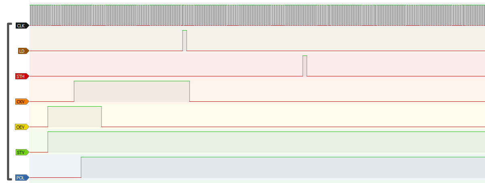

This is a story of how *not* to play with LCD screens, and how seemingly simple problems can turn into one of the most complicated projects I've done.

I had an old portable DVD player (`LG DP281B` - circa 2008) that I've bought around 7 years ago, and converted to a "retro gaming console" powered by a Raspberry Pi Zero (and a RetroPie-like OS). I bought this device for around $10, which is quite a bargain as for its 800x480, 8-inch rotatable LCD screen, a couple of headphone jacks, an USB port, and - most importantly - being powered by a rechargeable battery (that still works!).

Having an AV-input jack, connecting the Raspberry Pi was relatively easy, and removing the DVD laser mechanism gave me enough space to mount it inside, along with an USB hub. This solution, however, had two major disadvantages - needing to manually switch to the AV-input after each power-on, and poor picture quality over composite video.

With this, I wanted to try out connecting the LCD directly to the minicomputer. The LCD panel used is an `AT080TN03` from Innolux. As both can talk digital-RGB (parallel), I figured this wouldn't be too complicated.

I proceeded to configure the DPI output in `/boot/usercfg.txt`, and to connect the LCD to the Pi... wait, but how?

## Connecting the LCD

A quick look at [Parallel Display Interface](https://www.raspberrypi.com/documentation/computers/raspberry-pi.html#parallel-display-interface-dpi) and [pinout.xyz](https://pinout.xyz/pinout/dpi) gave me a hint of the necessary GPIO pins to use. It simply uses 5 major signals: clock, H-Sync, V-Sync, Display-Enable, and the RGB color data itself.

Another quick look at [AT080TN03 Datasheet](https://www.beyondinfinite.com/lcd/Library/Innolux/AT080TN03.pdf) tells me the necessary signals... `POL`, `STVD`, `OEV`, `CKV`, `DCLK`...? What is this, why are there two clock signals, and how is it compatible with the Pi? (it wasn't, as it later turned out)

Anyway... H-Sync is horizontal, so I connected it to `STHL`. I figured that the `R/L` and `U/D` pins control whether `STHR/L` and `STVU/D` are used. V-Sync goes to `STVU`, `CLK` goes to... `DCLK`, I presume, ... and `DEN` must go to `OEV` (Output enable).

Moved on to configuring Linux. Surprisingly, the "new" way of configuring DPI (as presented in [`Using a DPI Display on the Raspberry Pi` whitepaper](https://pip.raspberrypi.com/categories/685-whitepapers-app-notes/documents/RP-003471-WP/Using-a-DPI-display.pdf)) didn't work for me at all - I've checked the GPIO modes using [`raspi-gpio`](https://github.com/RPi-Distro/raspi-gpio) and they were all INPUTs. Instead, I've used the old way described in the docs (and in various other places in the internet) and the GPIOs were now correctly on ALT2.

Of course, there was nothing on the LCD (apart from a few random lines from interference or randomly interpreted data). What a surprise.

## No, really, what is an LCD?

And so the search began. How to drive a DPI LCD on Raspberry Pi, that doesn't use H/V-Sync? What kind of LCD even is that? Why some use H/V-Sync and some use these weird signals?

After browsing through dozens LCD datasheets, a bunch of DVD player schematics, I was starting to see the difference. Searching for `tft lcd stvu stvd` finally gave me the answer, in a [`MI-CON-N2` datasheet document](https://www.es.co.th/Schemetic/PDF/MI-CON-N2.PDF) - `1.1 Use the TTL signal of LCD with 40pin to drive the LCD with double 30pin without TCON`. Without `TCON` - that's what my LCD is missing, and what the Pi expects to talk to.

This panel is probably the most barebones form of LCD screen possible - a raw interface to the pixel matrix, and some LED backlight.

## What is a TCON and how do I get one?

*For clarity, I'll call the H/V-Sync signals `DPI` and the `STVD`/`CKV`/`OEV` etc. signals `TCON`.*

`TCON` stands for `Timing Controller` - which, presumably, is a chip that generates required timing parameters to serve the LCD properly.

Since the `MI-CON-N2` board can somehow, magically "convert" `DPI` signals to `TCON` signals (and is apparently based on an ARM processor - see page 4), it must be possible to do on the Pi... right?

Soon after that, I found that there are integrated chips to do just that! The `HX8802` (analog RGB), `HX8817` (YUV input) and `HX8819` (digital RGB), to name a few. The latter seems like a perfect fit, except for its (very, very limited) availability.

Nevertheless, the `HX8819` (and various other LCD datasheets) gave me a pretty good understanding of what's going on in the `TCON` signals.

## Actually connecting the LCD

*I'll call the `STVD`/`STVU` signals just `STV`, since only one can be used, depending on `U/D` signal. Same for `STH`.*

Since I already had all the pins soldered and connected to the Pi, I wanted to drive the LCD manually, using the GPIOs. I decided to write a C program for that. Obviously, I knew that a software driver would be unbelievably slow, but I didn't care about performance for simple tests.

At first, I tried following various "timing diagrams" from the datasheets, but they seemed to deny each other, presenting different incomplete views of the waveform... somehow I just couldn't understand it.

Then, I took a closer look at the `HX8819`'s block diagram (the `HX8819AFA`, in particular). It divided the `TCON` signals in "Source Control" and "Gate Control". Searching for `tft lcd gate control` revealed that there are two major (separate?) components in the LCD - the "Gate Driver" and the "Source Driver".

The Gate Driver (such as [`ST5091`](https://cdn.compacttool.ru/downloads/ST5091_SPEC_V01.pdf)) turns out to be nothing more than a (very long) shift register. Its job is to enable control of a single row of pixels (all pixels at once). The `STV` pin accepts a single pulse, which is then shifted at each rising edge of `CKV`, turning on each row sequentially. The `OEV` pin is simply for disabling all rows temporarily.

The Source Driver is a bit more complicated. I've used [`uDP16742`](https://www.renesas.com/us/en/document/dst/upd16742-384-output-tft-lcd-source-driver-compatible-256-gray-scales) as an example. It also contains a shift register (with `STH` input and `DCLK` clock), but seems to store the pixel data somewhere, to later emit it all at once (on `LD` edge, here called `STB`). There is also a `POL` (polarity) signal, which I never fully understood, but appears to be connected to some form of interlacing. The `REV` signal simply inverts the color data, so I left it connected to `GND`.

TL;DR: I connected all the `TCON` signals to the Pi's GPIO pins.

## Driving the LCD: take 1

For maximum possible performance, I used direct register access of the Pi (I have the 3B model) - I used the C code from [elinux.org](https://elinux.org/RPi_GPIO_Code_Samples).

I defined a few macros for toggling the signals:

<details>

```cpp
#define CLK	   0
#define DEN	   1
#define VSYNC  2
#define HSYNC  3
#define BLUE0  4
#define BLUE1  5
#define BLUE2  6
#define BLUE3  7
#define BLUE4  8
#define BLUE5  9
#define GREEN0 12
#define GREEN1 13
#define GREEN2 14
#define GREEN3 15
#define GREEN4 16
#define GREEN5 17
#define RED0   20
#define RED1   21
#define RED2   22
#define RED3   23
#define RED4   24
#define RED5   25
// Source Control Signals (horizontal - columns)
#define POL	 19	   //!< Source driver polarity select
#define REV		   //!< Source driver data reverse control
#define STH	 HSYNC //!< Source driver start pulse
#define DCLK CLK   //!< Source driver shift clock
#define LD	 26	   //!< Source driver latch pulse and output enable
// Gate Control Signals (vertical - rows)
#define STV VSYNC //!< Gate driver start pulse
#define CKV 27	  //!< Gate driver shift clock
#define OEV DEN	  //!< Gate driver output disable
// Alternative abbreviations
#define HCLK DCLK
#define DIO	 STH

#define POL_HI()  GPIO_SET = (1 << POL)
#define POL_LO()  GPIO_CLR = (1 << POL)
#define STH_HI()  GPIO_SET = (1 << STH)
#define STH_LO()  GPIO_CLR = (1 << STH)
#define DCLK_HI() GPIO_SET = (1 << DCLK)
#define DCLK_LO() GPIO_CLR = (1 << DCLK)
#define LD_HI()	  GPIO_SET = (1 << LD)
#define LD_LO()	  GPIO_CLR = (1 << LD)
#define STV_HI()  GPIO_SET = (1 << STV)
#define STV_LO()  GPIO_CLR = (1 << STV)
#define CKV_HI()  GPIO_SET = (1 << CKV)
#define CKV_LO()  GPIO_CLR = (1 << CKV)
// inverted logic - CLEARing the pin *enables* the output (but this is wrong...)
#define OEV_HI() GPIO_CLR = (1 << OEV)
#define OEV_LO() GPIO_SET = (1 << OEV)
```

</details>

and a function for writing RGB colors:

```cpp
void color(unsigned int r, unsigned int g, unsigned int b) {
	r >>= 2;
	g >>= 2;
	b >>= 2;

	GPIO_SET = (r << RED0);
	r		 = (~r) & 0b111111;
	GPIO_CLR = (r << RED0);

	GPIO_SET = (g << GREEN0);
	g		 = (~g) & 0b111111;
	GPIO_CLR = (g << GREEN0);

	GPIO_SET = (b << BLUE0);
	b		 = (~b) & 0b111111;
	GPIO_CLR = (b << BLUE0);
}
```

Next, I setup all GPIOs as outputs, added a bit of code to randomly choose a color from a mix of R, G, and B at full levels, and added frame, row and column `for` loops. Using the timing diagrams, I tried to work out which signals had to be toggled at which moment.

Running the program, however, gave me nearly no results. Sure, the LCD was reacting to the program's GPIO changes, but it was far from usable. I noticed that writing entire 800x480 matrix of colors made them appear *slowly* (really, fade-in throughout the screen) after around 30 seconds - I don't have pictures of this, unfortunately.

I could even write a test-pattern composed of 8 vertical bars, but I couldn't color the top or bottom parts of the LCD differently - it was "one dimensional".

## Logic analyzer to the rescue

This seemed like an issue with timing, or the order in which the signals are toggled. So I grabbed a logic analyzer... sort of, in reality a Pi Pico with the great [LogicAnalyzer firmware by gusmanb](https://github.com/gusmanb/logicanalyzer). I connected the original mainboard of the DVD player (with its MT1389DE chip by Mediatek) back to the LCD. Powered it up, and started capturing at the maximum speed my Pico could handle. Here are the results.

A closeup of a start of a frame:



Entire capture with more horizontal rows:


I could understand what's going on here, mostly. First, there's an `STV` pulse to initialize the Gate Driver's shift register, along with an `OEV` pulse to disable its outputs temporarily. The shift register is then clocked with `CKV` to push the changes.

Then, the `POL` is being toggled. Notice how it's alternating between LO/HI with each horizontal row. The next visible action is an `LD` pulse - data latch of the Source Driver, which... sends data to the LCD matrix? I do not understand why does it happen *before* the pixel data, but that's apparently how it works. Finally, there's an `STH` pulse to indicate the start of pixel data of one horizontal row.

## Driving the LCD: take 2

Knowing that, I began to implement the same signals in C. I added a `HCLOCK()` macro to send one `DCLK` pulse, and a `HCLOCKx(n)` macro to send *n* `DCLK` pulses. They were used to send exact number of clock pulses, as per the captured signals.

The complete program looked like this:

```cpp
srand(time(NULL));
int colors[] = {0xff0000, 0x00ff00, 0x0000ff, 0xff00ff, 0xffff00, 0x00ffff};

// alternating polarity signal
int pol = 0;

for (int frame = 0; frame < 10000; frame++) {
	STV_HI();

	// change colors every 64 frames
	int rand_color = colors[(frame / 64) % 6];
	int cr		   = (rand_color >> 16) & 0xff;
	int cg		   = (rand_color >> 8) & 0xff;
	int cb		   = (rand_color >> 0) & 0xff;
	color(cr, cg, cb);

	// row loop (vertical timing)
	for (int y = 0; y < 480; y++) {
		OEV_HI();
		HCLOCKx(14);

		CKV_HI();
		HCLOCKx(3);

		if (pol == 1)
			POL_HI();
		else
			POL_LO();
		pol ^= 1;
		HCLOCKx(11);

		OEV_LO();
		HCLOCKx(46);

		LD_HI();
		HCLOCKx(2);

		LD_LO();
		HCLOCKx(2);

		CKV_LO();
		HCLOCKx(114);

		STH_HI();
		HCLOCKx(2);
		STH_LO();

		// column loop (horizontal timing)
		for (int x = 0; x < 800; x++) {
			HCLOCK();
		}

		STV_LO();
		HCLOCKx(240);
	}
}
```

And... it worked! Again, sort of. It could change colors, so that was something. The screen was nearly realtime, but the result was far from good - odd horizontal lines, and colors fading-in:

<video src="result-1.mp4" controls></video>

After *hours* of experimenting with different timings, delays, it seemed like adding a long delay after `OEV_HI()` helped a bit. The random horizontal lines were still visible, but this time the fade-in effect was reduced to nearly zero.

I thought this was just caused by the Pi's GPIO bit-banging being unstable. *Something* made me capture the Pi's signals made by my program too. That's when it struck me:

```cpp
#define OEV_HI() GPIO_CLR = (1 << OEV)
#define OEV_LO() GPIO_SET = (1 << OEV)
```

I was following the captured waveforms exactly, while the code was *inverting* `OEV` for the whole time! When I used `OEV_HI()` to match the timing, it actually set it `LO`. Immediately after fixing the inverted logic, I saw this:

<video src="result-2.mp4" controls></video>

Perfect response to the color data, and no visual artifacts at all! I later realized that `HCLOCKx(2)` after `STH_HI()` was "eating up" one pixel horizontally, so I changed it to only 1 clock pulse.

## Taking it further

Now, I wanted to make sure that everything displays properly. What better way to do this than drawing a Linux framebuffer?

I found some code [on StackOverflow](https://stackoverflow.com/questions/46866742/how-to-get-rgb-pixel-values-from-linux-framebuffer) that can map the Linux framebuffer into virtual memory for direct reading:

```cpp
int fb_fd;
struct fb_fix_screeninfo finfo;
struct fb_var_screeninfo vinfo;
uint8_t *framebuffer;

/* Open the frame buffer device */
fb_fd = open("/dev/fb0", O_RDWR);
if (fb_fd < 0) {
	perror("Can't open /dev/fb0\n");
	exit(EXIT_FAILURE);
}
/* Get fixed info */
if (ioctl(fb_fd, FBIOGET_FSCREENINFO, &finfo) < 0) {
	perror("Can't get fixed info\n");
	exit(EXIT_FAILURE);
}
/* Get variable info */
if (ioctl(fb_fd, FBIOGET_VSCREENINFO, &vinfo) < 0) {
	perror("Can't get variable info\n");
	exit(EXIT_FAILURE);
}
/* To access to the memory, it can be mapped*/
framebuffer = (uint8_t *)mmap(0, finfo.smem_len, PROT_READ | PROT_WRITE, MAP_SHARED, fb_fd, 0);
if (framebuffer == MAP_FAILED) {
	perror("Can't map memory\n");
	exit(EXIT_FAILURE);
}
```

and adapted my program to output framebuffer colors instead:

```cpp
		// row loop (vertical timing)
		for (int y = 479; y >= 0; y--) {
			// ... rest of signals

			// column loop (horizontal timing)
			for (int x = 799; x >= 0; x--) {
				// framebuffer color order is BGRA
				int cr = framebuffer[(y * 800 + x) * 4 + 2];
				int cg = framebuffer[(y * 800 + x) * 4 + 1];
				int cb = framebuffer[(y * 800 + x) * 4 + 0];
				color(cr, cg, cb);
				HCLOCK();
			}

			// ... rest of signals
		}
```

Notice how I changed the `for` loops to decrease X and Y values - my chosen scanning direction (using `U/D`, `R/L` pins) was Right-to-Left, Down-to-Up.

Midnight Commander running on the software-driven LCD:


This worked a treat. Yes, the frame rate and drawing speed were really low, but it was clearly possible to drive such an LCD without a proper TCON now.

There was still one noticeable problem with the screen - colors that weren't composed of full-0xFF R,G,B values had a weird alternating pattern visible - see the light teal-ish bar on the screenshot.

Playing with the `POL` signal revealed that it is indeed what causes the visual artifact. Notice how my code changes `POL` with every horizontal row: `pol ^= 1`. Removing this line (which meant not changing `POL` at all) presented a different pattern:


Seeing this I understood that the `POL` has to change *every line* AND *every frame*. A quick `pol ^= 1` after `STV_HI()` later:


On the photo, I made it only draw 100 pixels, to make it fast enough to see the correct colors. The polarity signal is something like interlacing - it switches to activate adjacent pixels every frame, which makes it look good to a human eye. I have no idea why is the LCD built this way, but that's how I understand it anyway.

## Taking it even further

Okay, I have a software-driven LCD that eats up 100% of the poor Pi 3B's CPU power. Not usable, especially considering that my target device is a Pi Zero.

I remembered that I had an old CPLD chip laying around (from a network switch device, I presume). This was the perfect opportunity to use it (and to learn the sorcery that PLDs are to me).

The first thing I needed to do was determining how the `DPI` signals look, when driven by the Pi's hardware DPI controller. I set the `dpi_output_format` to match the [Adafruit 4.3" TFT](https://learn.adafruit.com/adafruit-dpi-display-kippah-ttl-tft/installation), since it's well-tested, and there is a datasheet to compare the captured signals against. As for `dpi_timings`, I improvised - to better see the front/back porch and pulse widths.

```shell
# modified to enable DEN signal
dpi_output_format=0x7e005
# set to clearly recognize the F/B porch
# vertical F/B porch small enough to fit in Pi Pico analyzer's buffer @ 100 MHz
dpi_timings=800 0 6 15 20 480 0 2 3 4 0 0 0 60 0 32000000 6
```

By the way, there's a great tool called [RPi DPI-Calculator](https://nerdhut.de/software/raspberry-pi-dpi-calculator/) to make building the parameter lines easier.

This is the resulting signal:


One can see that all signals apart from `DEN` are Active Low (as configured with `dpi_output_format`). A low `VSYNC` pulse starts a display frame. Then, 3 `HSYNC`s (3 horizontal rows) follow; another 4 `HSYNC`s later (back porch) the actual display data starts, signalled by the `DEN` pin.

Closeup of the horizontal sync (with unrelated clocks blurred out):


Precisely - 6 clocks after previous display data, 15 clocks of the sync pulse, 20 clocks before next display data.

A brief look at both of the captured waveforms - to me implementing this on a CPLD looks possible. I could use a ton of logic gates for this, but where's the fun in that?

## Driving the LCD: take 3

The CPLD chip I have is an old XC9572XL from Xilinx. I downloaded the ISE Design Suite 14.7 WebPACK (it was my very first oppurtinity to work with PLDs), installed it, and Googled some CPLD tutorials. I'm not going to describe the coding process here, as that was mostly *a lot* of poking around to see how things work in the CPLD world. After mere two days or so, I had the following Verilog program:

```cpp
module tcon(
	input CLK, VSYNC, HSYNC, DEN,
	output wire DCLK,
	output reg LD, STH, CKV, OEV, STV, POL
);

parameter hsync_size = 8;

reg vsync_start; // first HSYNC in every VSYNC pulse
reg hsync_use;   // whether to output TCON signals in this HSYNC
reg [hsync_size:0] hsync_width; // number of clocks in HSYNC

initial
begin
	LD = 0;
	STH = 0;
	CKV = 0;
	OEV = 0;
	STV = 0;
	POL = 0;
end

// HSYNC clock width counter
always @(negedge CLK or posedge HSYNC)
begin
	if (HSYNC)
		// reset at the end of HSYNC
		hsync_width <= 0;
	else if (!CLK && !HSYNC && !hsync_width[hsync_size])
		// count at every CLK, but do not overflow
		hsync_width <= hsync_width + 1;
end

// first HSYNC in every VSYNC counter
always @(negedge VSYNC or posedge HSYNC)
begin
	if (HSYNC)
		vsync_start <= 0;
	else if (!VSYNC)
		vsync_start <= 1;
end

// determine whether to ignore this HSYNC
always @(negedge VSYNC or posedge DEN or posedge HSYNC)
begin
	if (DEN)
		hsync_use <= 1;
	else if (HSYNC)
		hsync_use <= 0;
	else if (!VSYNC)
		hsync_use <= 1;
end

// main TCON state machine
// - minimum HSYNC width: 40
// - minimum VSYNC width: 1
// - minimum V front/back porch: 0
always @(negedge CLK) if (!HSYNC & hsync_use)
begin
	case (hsync_width)
		0: if (vsync_start) STV <= 1;
		1: OEV <= 1;
		4: CKV <= 1;
		8: OEV <= 0;
		18: LD <= 1;
		20: LD <= 0;
		22: CKV <= 0;
		32: STH <= 1;
		33: STH <= 0;
		36: STV <= 0;
	endcase
end

// polarity state machine
// - minimum H front porch: 0
// - minimum H back porch: 2
always @(negedge VSYNC or negedge DEN)
begin
	// toggle POL:
	// - at the start of each frame
	// - after each horizontal row
	if (!DEN)
		POL <= !POL;
	else if (!VSYNC)
		POL <= !POL;
end

assign DCLK = !CLK & (DEN | LD | STH);

endmodule
```

Here's the testbench suitable for verifying the logic:

<details>

```cpp
`timescale 1ns / 1ns

module tcon_tb;
	// Inputs
	reg CLK;
	reg VSYNC;
	reg HSYNC;
	reg DEN;

	// Outputs
	wire DCLK;
	wire STV;
	wire LD;
	wire STH;
	wire CKV;
	wire OEV;
	wire POL;

	integer i;

	// Instantiate the Unit Under Test (UUT)
	tcon uut(
		.CLK(CLK),
		.VSYNC(VSYNC),
		.HSYNC(HSYNC),
		.DEN(DEN),
		.DCLK(DCLK),
		.STV(STV),
		.LD(LD),
		.STH(STH),
		.CKV(CKV),
		.OEV(OEV),
		.POL(POL)
	);

	initial begin
		// Initialize Inputs
		CLK = 1;
		VSYNC = 1;
		HSYNC = 1;
		DEN = 0;

		// Wait 100 ns for global reset to finish
		#100;

		// Add stimulus here
		#10;

		// simulate endlessly
		while (1)
		begin

			VSYNC = 0; // VSYNC active
			// VSYNC width: 1
			for (i = 0; i < 1; i = i + 1)
			begin
				HSYNC = 0; // HSYNC active
				#80;       // HSYNC width: 40
				HSYNC = 1; // HSYNC inactive
				#1600;     // data width: 800
			end
			VSYNC = 1;

			// data rows: 16 in this simulation
			for (i = 0; i < 16; i = i + 1)
			begin
				HSYNC = 0; // HSYNC active
				#80;       // HSYNC width: 40
				HSYNC = 1; // HSYNC inactive
				#0;        // no H front porch
				DEN = 1;   // data active
				#1600;     // data width: 800
				DEN = 0;   // data inactive
				#4;        // H back porch: 2
			end

		end
	end

	always #1 CLK = !CLK;
endmodule
```

</details>

The testbench was written according to a logic analyzer capture of the Pi's DPI interface with the following timing parameters:

``` python
dpi_output_format=0x7e016
# HBP: 0, HW: 40, HBP: 2
# VBP: 0, VW: 1, VBP: 0
dpi_timings=800 0 0 40 2 480 0 0 1 0 0 0 0 60 0 32000000 6
```

The front/back porch parameters used here are minimum values that will work with the logic module. Here's a simulation of the device:


And a closeup of the `TCON` synchronization signals:


After wiring it up to the Pi, that's all I got:


## Debugging a homebrew timing controller

I wired up both the `TCON` and `DPI` signals to the Pi Pico, and captured this waveform:


There's *a lot* going on wrong here. The `DCLK` signal seems to be output fine (when `DEN` is active), but most other signals are just missing. Only `POL` is half-okay - it's there, but it sometimes toggles twice, and there's some odd jitter during `HSYNC` pulses.

Looking at the warning list gives some clues:

```
Clock of counter <hsync_width> seems to be also used in the data or control logic of that element.
Clock and clock enable of register <vsync_start> are driven by the same logic. The clock enable is removed.
Clock and clock enable of register <hsync_use> are driven by the same logic. The clock enable is removed.
Clock and clock enable of register <POL> are driven by the same logic. The clock enable is removed.
```

I changed the logic a bit, got rid of these warnings. Immediately after flashing, the LCD showed a Linux console! Sort of. Only one frame was displayed, and then it started disappearing.

By the way - for programming the CPLD, I used [`openFPGALoader`](https://trabucayre.github.io/openFPGALoader/guide/advanced.html#ft231-ft232-bitbang-mode-and-pins-configuration) and a FT232RL adapter. It can directly write `.jed` files, which surprisingly is not stated in the documentation.

A logic capture proved that getting rid of the warnings helped a bit. The `TCON` signals are mostly fine now, but `STV` is always `LOW` (I presume it pulses only once, since one frame does actually show). `POL` still contains garbage during `VSYNC`, but it's better during data periods.


If you look closely, you'll notice that the `VSYNC` pulse does not generate `TCON` signals at all!

After many experiments (to fix the picture and its stability), I have modified the logic to only synchronize horizontally if `VSYNC` is not active. I also noticed that the last line of pixels was wrapping around to the other edge of the screen, so I moved the `STV` pulse to *after* the first row of data. The timings were also modified to include a 10-clock horizontal front/back porch, just in case.


*More countless hours of debugging* just made me realize that my `GND` connection between the CPLD and the screen was flaky, causing all sorts of interference and other problems. I suspect that most of the issues leading to refactoring my logic code were because of this.

And that did the trick! The picture was pretty much perfect.


It now produces perfectly stable waveforms and responds to all signals properly (the `STH` and `LD` look malformed on the capture, because this was recorder at a lower sample rate).

## To be continued

This project is still far from finished. All I currently have is a CPLD chip that acts as a TCON replacement for the TFT LCD. In order to put it in the "retro console", I need to make it much more compact and sort out the wire mess that it currently is.

In any case, here's the finished Verilog program. The latest version also has `U_D` and `R_L` inputs, which makes it easier to control `STVD/U` and `STHR/L` signals and allows to flip/rotate the screen if needed.

<details>

<summary>Verilog program</summary>

```verilog
`timescale 1ns / 1ps

module tcon(
	input CLK, VSYNC, HSYNC, DEN,
	input U_D, R_L,
	output wire DCLK, POL, REV,
	output reg LD, CKV, OEV,
	output wire STVD, STVU, STHR, STHL
);

parameter hsync_size = 8;
parameter row_count_size = 2;

reg STV, STH;
reg [hsync_size:0] hsync_width;
reg [row_count_size:0] row_count;
reg pol_frame;
reg pol_row;

initial
begin
	LD = 0;
	STH = 0;
	CKV = 0;
	OEV = 0;
	STV = 0;
	hsync_width = 0;
	row_count = 0;
	pol_frame = 0;
	pol_row = 0;
end

// HSYNC width counter
always @(posedge HSYNC or negedge CLK)
begin
	if (HSYNC)
		// reset at the end of HSYNC
		hsync_width <= 0;
	else if (!hsync_width[hsync_size])
		// count at every CLK, but do not overflow
		hsync_width <= hsync_width + 1;
end

// data row counter
always @(negedge VSYNC or posedge DEN)
begin
	if (!VSYNC)
		row_count <= 0;
	else if (!row_count[row_count_size])
		row_count <= row_count + 1;
end

// main TCON state machine
// - H front porch >= 0
// - HSYNC width >= 40
// - H back porch >= 0
// - V front porch == 0
// - VSYNC width >= 1
// - V back porch == 0
always @(negedge CLK)
begin
	if (VSYNC && !HSYNC)
	begin
		case (hsync_width)
			// sync vertically after 1st row of data
			// for some reason, syncing affects the row of data *before* the sync
			2: if (row_count == 1) STV <= 1;
			4: OEV <= 1;
			8: CKV <= 1;
			12: OEV <= 0;
			22: LD <= 1;
			24: LD <= 0;
			26: CKV <= 0;
			32: STH <= 1;
			33: STH <= 0;
			36: STV <= 0;
		endcase
	end
	else if (HSYNC)
	begin
		OEV <= 0;
		CKV <= 0;
		LD <= 0;
		STH <= 0;
		STV <= 0;
	end
end

// toggle POL at the start of each frame
always @(posedge VSYNC)
begin
	pol_frame <= !pol_frame;
end

// toggle POL after each horizontal row
always @(negedge DEN)
begin
	pol_row <= !pol_row;
end

assign DCLK = !CLK & (DEN | LD | STH);
assign POL = pol_frame ^ pol_row;
assign STVD = U_D ? STV : 1'bZ;
assign STVU = U_D ? 1'bZ : STV;
assign STHR = R_L ? STH : 1'bZ;
assign STHL = R_L ? 1'bZ : STH;
assign REV = 1'b0;

endmodule
```

</details>

I will probably continue this project in another post.
