A couple of years ago, while browsing through Allegro (a Polish equivalent of eBay), I found an interesting piece of retro computing.

It was a portable computer ("laptop") manufactured in... 1987! Being this old, this would have been easily the oldest PC in my collection - so naturally, I bought it - for about 20 USD, including shipping. Looking at it now, I know it was a real bargain. These normally sell for at least $150 on eBay.

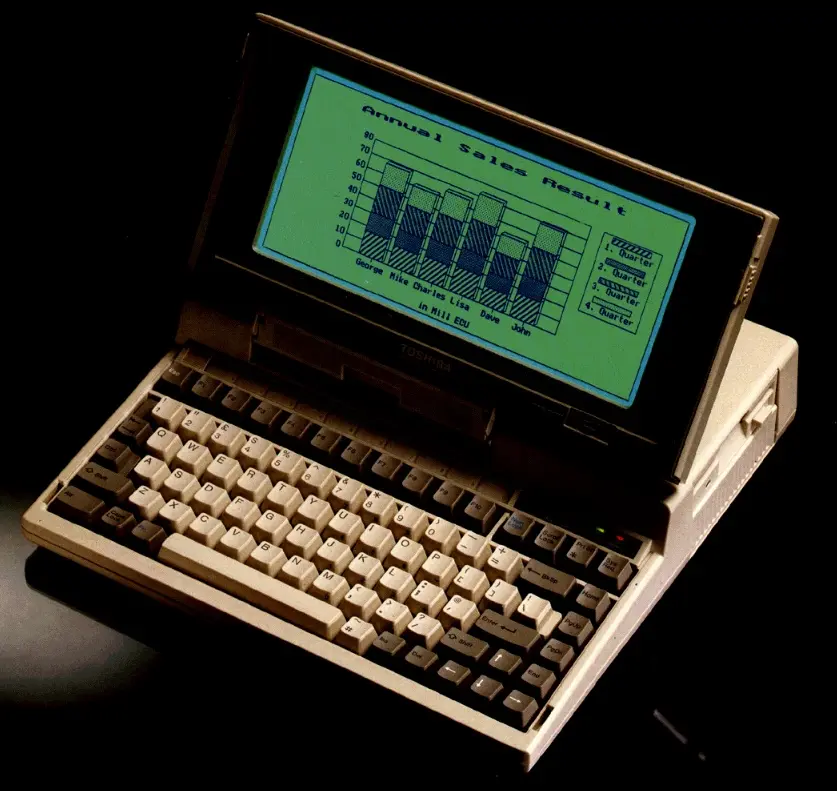

Meet the Toshiba T1200. With a 10 MHz Intel 80C86 CPU and 1 MiB of RAM, it had several revolutionary features for its time. It is believed to be the first laptop with a swappable battery pack - together with the AutoResume function, it allowed to replace the battery without even having to reboot the system (something like today's "hibernation").

When I received the package in February 2019, the laptop was... mostly dead. It would only turn on a green or red LED light near the internal power supply, and sometimes emit odd smells. Long story short - (the long story will end up in a separate post, I promise...) - I was able to bring it back to life by designing and building a custom power supply PCB. It required a lot of work, but right now the computer is mostly fully functional - it even works on battery power, with a brand-new Li-Ion pack!

There was just one small problem - the laptop came without a hard drive.

## Storage

Unfortunately, installing any kind of permanent storage other than a floppy drive wasn't that simple. ATA wasn't yet around in 1987 (well, it was, but it wasn't any popular), so the original hard drive - JD-3824G made by JVC - used a proprietary 26-pin interface. Unsurprisingly, these kind of drives are pretty much unobtainium nowadays.

There were other HDD-less solutions - one of them being XT-IDE, but that would require a special expansion card for (another) proprietary ISA-like bus. To make matters worse, the mating connector for such an expansion card is extremely hard to source.

Another solution was using an SD card connected to the LPT (printer) port - I managed to get it working using Nilquader's NC100 SD driver, but as noted by the author themselves, the read/write speed of such a setup is comparable to a floppy drive.

Because of that, in this post I'll be trying to emulate the original hard drive using a Raspberry Pi Pico (what else?).

## The hard drive

Thankfully, there was at least some information about this HDD available - including an incredible [3-post series by MattInX](https://knm.org.uk/blog/2017/04/the-jvc-26-pin-hard-disk-interface-part-1/), in which he dives into the communication interface of the HDD, trying to decode data coming from a working unit.

This brought a lot of information about a drive I didn't have - such as that the interface was pretty much identical to a standard ST-506 drive (except not differential), as well as how the data was stored logically (C/H/S and encoding). This should be enough to build a working emulator!

Item             | Value
-----------------|------------
Capacity         | 20 MiB
Cylinders/Tracks | 615
Heads            | 2
Sectors          | 34 (or 17?)
Speed            | 2597 RPM
Encoding         | 2,7 RLL
Transfer rate    | 7.5 Mbps
Seek time        | 78 ms

Unlike Matt, however, I wasn't trying to emulate sector data (yet), because I knew next to nothing about how the Toshiba's HDD controller stored data. As you might already know, old hard drives don't communicate using sector data that's normally visible to the OS (MS-DOS in this case).

Instead, they only care about magnetic field transitions on the HDD's platters (N-S to S-N and vice-versa). From the emulation's standpoint, this should actually make things easier, since I would only need to store the transitions in the emulator's memory.

## Building an emulator

But how much memory is actually needed? Because I had no clue about how old drives worked in detail, I asked ChatGPT (I'm sorry), and surprisingly it was actually pretty helpful. The drive normally outputs all transitions on the `/READ` pin, and the specification mentions the transfer rate of 7.5 Mbps. Since the drive rotates at around 2600 RPM, which is ~43 rev/sec, it has to transfer the entire track 43 times every second. If that results in 7.5 Mb being transferred, then `7.5 * 10^6 / 43 = ~174,000 bits`. That is the length of a single track, in bit cells - pretty simple! (or is it?)

To connect the laptop's HDD controller, which runs at 5V, to the Pi Pico, I could use several different approaches:

- CD4050 non-inverting buffer - only for 5V->3.3V, can't reliably convert 3.3V to 5V (and is also pretty slow),
- NPN transistors - I would need a lot of them,
- MOSFET-based level shifters - same: there are many signal lines,
- resistor in series - unsafe, less-reliable,
- 74LS05 inverting buffer - perfect! It's fast and open-collector, so it should work just fine with both level shifting directions.

To summarize, here are all the necessary input signals (PC->HDD) that I needed to take care of:

- 7: `/SELECT` - drive-select: connects the drive to all other signals,
- 10: `/WRITE_GATE` - drives the write head using `/WRITE` line's data,
- 11: `/MOTOR_ON` - always enabled on the T1200,
- 12: `/HEAD_1` - selects head 1 instead of head 0 for reading/writing,
- 13: `/DIR_IN` - makes `/STEP` move the head inwards instead of outwards,
- 14: `/STEP` - moves the drive head by one track.

And here are the output signals (HDD->PC):

- 8: `/SHIP_READY` - I'm not sure what that is, but thankfully it's not used on the T1200,
- 15: `/WRITE_FAULT` - probably not needed for now,
- 16: `/SEEK_COMPLETE` - indicates that the head settled on the track (isn't seeking anymore),
- 17: `/SERVO_GATE` - provides a pulse every sector - not sure how: is the drive hard-sectored?
- 18: `/INDEX` - provides a pulse every revolution,
- 19: `/TRACK_0` - indicates that the head is on track 0,
- 20: `/READY` - indicates that the drive is ready.

Since I'd be using an inverting buffer, all these signals (which are active-low) will have the more "logical" level of being active-high.

## The first prototype

A couple hours of soldering later, I had the first prototype built on a double-sided perfboard. It's a pretty simple board - two DIP sockets for the 74LS05s and some 2.54 mm headers for the Pi Pico and the 26-pin connector.

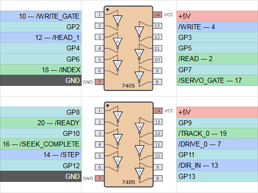
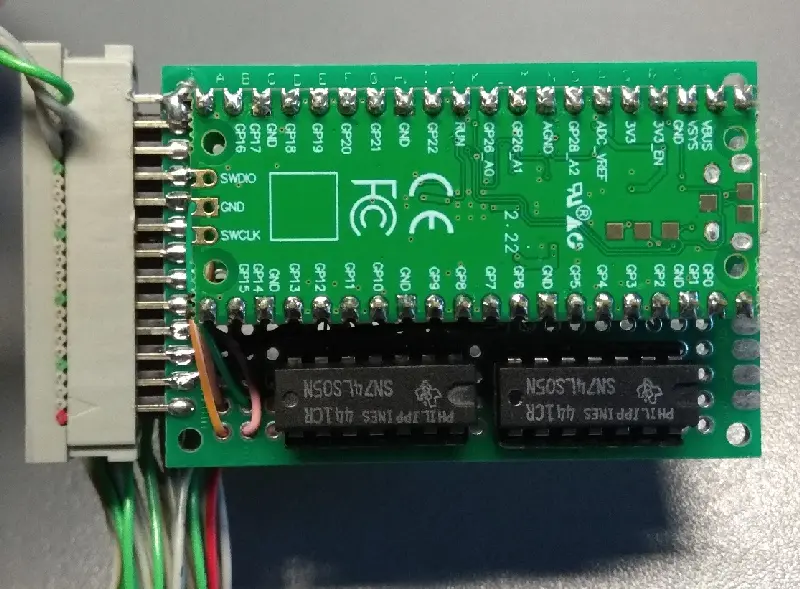

The GPIO assignment might seem random at first, but that's just what was the easiest to route on the perfboard. Who knows, maybe I'll build an actual PCB for this project someday...

A total of 12 open-collector inverters are used, with 5V levels on the PC's side and 3.3V on the Pico's side. The RP2040 will need to have its hardware pull-ups enabled, of course.

So I hooked it up and wrote a simple program, that pretends to be a hard drive by responding to `STEP` commands. The code should also control most output lines properly (I even added the `INDEX` and `SERVO_GATE` pulses). But no matter what I tried... it just didn't work.

Sure, the Pico was able to see the `STEP` pulses. When rebooting the PC, it would first send a couple of `STEP` pulses, then wait a few seconds, and then send more `STEP` pulses... indefinitely. Yeah, it would just hang forever, stepping OUT the whole time.

Well, there was at least *some kind* of communication, since I could make it detect the HDD about once every 10 tries... I even once got it to the low-level formatting screen:

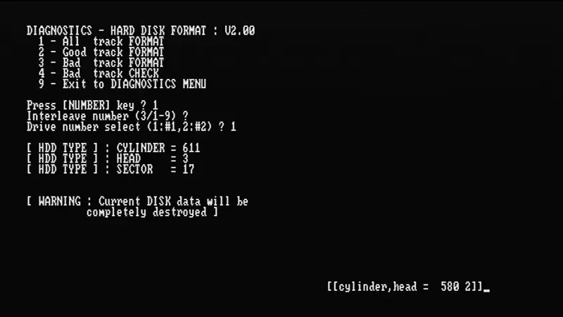

The "seeking OUT infinitely" part was pretty odd - while formatting, I could see "normal" step activity, but then also these OUT steps:

```
I [      0.000] Step IN, Track: 1
I [      0.000] Step OUT, Track: 0
I [      0.000] Step OUT, Track: 0
I [      0.000] Step OUT, Track: 0
I [      0.000] Step IN, Track: 1
I [      0.000] Step OUT, Track: 0
I [      0.000] Step OUT, Track: 0
I [      0.000] Step OUT, Track: 0
I [      0.000] Step IN, Track: 1
I [      0.000] Step OUT, Track: 0
I [      0.000] Step OUT, Track: 0
I [      0.000] Step IN, Track: 1
I [      0.000] Step IN, Track: 2
I [      0.000] Step OUT, Track: 1
I [      0.000] Step OUT, Track: 0
```

To see what was acting up, I connected a second Pi Pico in parallel to use the Logic Analyzer software. Upon closer inspection of the capture, I found several problems:

1. The `INDEX` pulse interval was too long - I didn't account for the duration of the `SERVO_GATE` pulses, so the entire track was about 3 ms longer; fixing this didn't solve any issues.
2. When the controller initializes, there were thousands of `STEP` pulses that I **couldn't even see on the logic analyzer**. Setting a trigger on `STEP` started the capture, but the pulse itself wouldn't appear.
3. Tracing it further revealed that the `STEP` pulses were **shorter than 5 nanoseconds** (that's the fastest my Pico can capture). The analyzer usually wouldn't see such short pulses, so it looked as if it was seeking without the `STEP` pulse altogether.
4. When `SELECT` was unset, the emulator would still output `INDEX` and `SERVO_GATE` signals (but only sometimes). Or perhaps the drive was selected but the logic analyzer couldn't see it properly? Either way, this wasn't normal behavior.

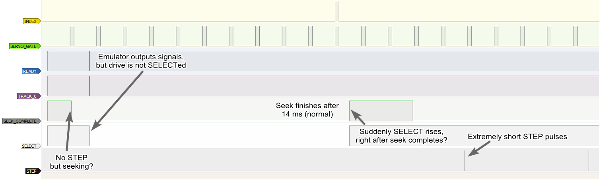

All this indicated that there was *a lot* going on wrong. I was measuring odd voltages with my multimeter, so I started suspecting the 74LS05s, perhaps they aren't suitable for such a level conversion.

Tracing the raw non-inverted `/STEP` confirmed my suspicions - the line had a perfectly normal pulse train, with each being about 4 microseconds long. The level-shifted `STEP` line, however - had nothing on it.


I have no idea why would the inverter not work properly. The nominal On/Off propagation time is about 15 *nanoseconds* - the `/STEP` pulses are like 200x longer than that... Perhaps there was something else I was missing, or maybe my chips were just faulty.

## The second prototype

Knowing that the inverter chip was a no-go, I wanted to try using NPN transistors, since it's probably the simplest solution. It should work similarly to the inverters (but perhaps correctly this time).

To make it easier on a perfboard, I found a couple of ULN2003 ICs in my parts box - these are 7x Darlington drivers in a single package. They have open-collector outputs that can drive up to 500 mA - of course, I didn't need such a high current, but it's easier to wire up than 7 separate transistors.

Then I noticed that the propagation time of ULN2003 is... 0.25 microseconds. Yeah, that's a bit on the high side, but it should be fine if I use standard transistors for the `/READ` and `/WRITE` lines (since only these should go as fast as 7.5 MHz).

After wiring it up, it turned out that... it was even worse than before. Take a look at the `/STEP` line and the inverted `STEP` output:


Nothing. At all. The delay must be high enough to not notice 4 microsecond pulses at all...

Then I remembered that transistor-based shifters work better when the pull-up is strong on both sides - the Pico's internal resistors are about 50 kOhm... After adding a 1 kOhm resistor to the ULN2003, I started seeing valid `STEP` pulses!

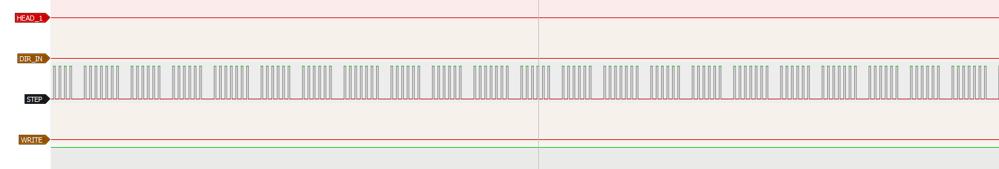

This is, however, when things got pretty annoying. No matter what I tried, the PC would only output `STEP` pulses indefinitely. Nothing was helping - as soon as `READY` was set, it would hang forever trying to seek to track 0 (and `TRACK_0` was already set, by the way...).

Then I stare at the HDD controller PCB for a while, admiring the huge, proprietary controller chip... Toshiba T7518 - a custom gate array with an external ROM, perhaps? No idea, a total mystery nevertheless.

But wait - what if the controller chip wasn't proprietary after all? Well, imagine my surprise when a quick Google search revealed a 50-page datasheet and several forum posts about it. Reading through these confirmed two things: the drive indeed uses ST506 signalling, and that there was another drive with the 26-pin interface - Fujitsu M2227DT.

## The real drive

The next day, I had another idea - probing a real ST506 drive to find out its signaling. I found a NEC D3142 drive that I happen to have for some reason, and figured it would be a good candidate. Its geometry is 642/8/17, so not exactly like the JVC drive, but should be enough for some probing around. In particular, I needed to find out what should happen when asserting `/STEP` when the drive is on track 0, with direction set to OUT.

To interface with the HDD, I used an AVR microcontroller (ATmega8535L) that I had laying around - this allowed me to avoid the 3.3V level conversion altogether. Obviously, the AVR is way too slow to read any data from the HDD, but it should be enough for basic control.

And... well, what can I say... the drive behaved completely as expected. Stepping IN/OUT would correctly move the head, and the drive reported being on track 0 when I expected it to. Just for fun - I decided to capture some data from the old drive. I had no idea where it came from, but after writing a quick and dirty MFM decoder in Python, I was actually able to see some data!

```
00000000  eb 21 90 28 43 29 43 6f 70 79 72 69 67 68 74 20  |.!.(C)Copyright |
00000010  4e 6f 76 65 6c 6c 20 49 6e 63 2e 20 31 39 38 37  |Novell Inc. 1987|
00000020  2e 00 1a bb 3d 7c 90 2e 8a 07 0a c0 74 0b 53 33  |....=|......t.S3|
00000030  db b4 0e cd 10 5b 43 eb ee fb f4 eb fc 59 6f 75  |.....[C......You|
00000040  20 6d 75 73 74 20 62 6f 6f 74 20 44 4f 53 20 62  | must boot DOS b|
00000050  65 66 6f 72 65 20 65 78 65 63 75 74 69 6e 67 20  |efore executing |
00000060  4e 6f 6e 2d 64 65 64 69 63 61 74 65 64 20 4e 65  |Non-dedicated Ne|
00000070  74 57 61 72 65 2e 00 00 00 00 00 00 00 00 00 00  |tWare...........|
00000080  00 00 00 00 00 00 00 00 00 00 00 00 00 00 00 00  |................|
[...]
000000f0  00 00 00 00 00 00 00 00 00 00 00 00 00 00 00 00  |................|
00000100  53 2f 4e 3d 12 23 45 56 00 00 00 00 00 00 00 00  |S/N=.#EV........|
[...]
000001e0  00 00 00 00 00 00 00 00 00 00 00 00 00 00 00 00  |................|
000001f0  00 00 00 00 00 00 00 00 00 00 00 00 00 00 55 aa  |..............U.|
```

That meant my decoder was working, perfect! This will certainly make it easier when approaching the RLL data emulation, later on. Still, curiosity got the best of me and I ended up dumping the entire drive using a brand-new RP2040 PIO program... oh well. In case anybody is curious - the drive was most likely sitting unused for nearly 30 years. It was likely part of a NetWare server, as there were lots of documents created by various people on it. Exploring it was quite interesting, just like the fact that all the data was read without any issues - from a HDD manufactured in 1989.

The PIO dumping program ended up being pretty simple - I had a lot of fun writing it (what, don't believe me?).

<details>

<summary>PIO program (see end of the page for more info)</summary>

```c
.program mfm_dump
.in 32 left auto 32
.fifo rx

setup:
	// wait for +INDEX
	wait 1 pin 1
	// wait for -INDEX
	wait 0 pin 1

.wrap_target
start:
	// loop iterations (set + 3*(jmp+jmp) + 4*jmp + in = 12)
	set x, 2

wait_loop:
	// if pin becomes 1, push immediately
	jmp pin got_high
	// otherwise wait with a timeout
	jmp x-- wait_loop
	// the loop runs less iterations; check input manually a few times
	jmp pin got_high
	jmp pin got_high
	jmp pin got_high
	jmp pin got_high
	// after 100 ns, input the pin value anyway (should be 0)
zero_in:
	in null, 1
	// restart the timing loop from here
.wrap

got_high:
	// input the pin value (1)
	// delay 100 ns in total
	// (-1 cycle for 'in')
	// (-1 cycle for 'jmp')
	in pins, 1 [8]
	// (jump to) input the pin value after delay (should be 0)
	jmp zero_in

% c-sdk {
static inline void mfm_dump_program_init(PIO pio, uint sm, uint offset, uint pin, uint freq) {
	pio_sm_config c = mfm_dump_program_get_default_config(offset);
	sm_config_set_in_pin_base(&c, pin);
	sm_config_set_clkdiv_int_frac8(&c, 1, 0);
	sm_config_set_jmp_pin(&c, pin);
	pio_sm_init(pio, sm, offset, &c);
}
%}
```

</details>

## Any other ideas?

Remember the blog posts I mentioned before? Well, at some point I decided to contact the author. He was kind enough to send me the Logic capture files of his JVC hard drive. I was hoping this would help me replicate the exact timing and signaling of the original HDD.

We talked a bit about the issues I was having with my emulator, and he then shared some interesting details - in particular, that the drive will auto-park whenever it's unused for a certain time, remembering which track it was on. After getting woken up again, it would step back to that track.

There is also a video of the drive in action - [V86P Power Up and JVC Hard Disk](https://youtu.be/ZygIg4Gu8ns). At 0:53 you can see the moment it becomes unused, and after about 4 seconds it moves the head to the parking spot.

Hmmm, that rings a bell... when testing the emulator (both prototypes), the PC would first step a few tracks, then wait a few seconds, then enter the infinite stepping cycle. Could it be testing the drive's auto-park functionality somehow...? Why would it even do that every reboot?

The auto-park also explained something I never understood on Matt's logic analyzer traces - when `/SELECT` is asserted (after being unused for some time, perhaps) `/SEEK_COMPLETE` is **NOT** asserted immediately, but after some time - now I know that during this time it automatically seeks back to the previously used track.


With that in mind, the next idea was to reimplement that auto-park mechanism. I had high hopes for this to work, though the only logical explanation would be if the controller expected a rising edge on `/SEEK_COMPLETE` or `/TRACK_0`, which didn't really make much sense.

But for this, I needed to capture the drive controller's commands over a longer sampling time (say, 10 seconds). I needed a better logic analyzer - don't get me wrong, the [LogicAnalyzer](https://github.com/gusmanb/logicanalyzer) software is really good, but at 8 channels @ 1 MHz it can only capture about 100 milliseconds of signals (131,072 samples).

By counting time between I/O level changes, instead of sampling each and every level at a fixed rate, much more samples could be read. The RP2040 has 8 PIO state machines in total and, conveniently, I only needed about 8 GPIOs to capture most of the control signals. The idea was simple - increment a counter, break when GPIO level is LOW, push counter to ISR. Then, increment another counter, break when GPIO level is HIGH, push counter to ISR.

After around 2 days of work, I had the "logic analyzer" mostly functional. The cool part about it is that it could capture at whatever frequency (up to 100 MHz) for theoretically unlimited time. That is, as long as the signals didn't change more than about 30,000 times per second. This is due to the fact that it captured **time between signal changes** instead of saving samples at a regular interval. There was however an issue with synchronization of multiple channels, but it wasn't that big of a deal.

For instance, this was captured at 8 channels @ 100 MHz (so that I could see even the tiniest signal pulses) - for a duration of 750 milliseconds! Normally, this would require storing `0.750 [s] * 100,000,000 [Hz] * 8 [ch] = 600,000,000 bits = ~71 MiB` of data:

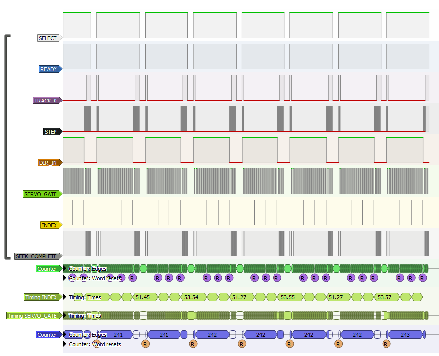

I figured out what needed to be done to make the T1200 detect the emulated HDD - right after rebooting (with ++ctrl+alt+del++), the HDD switch must be turned off. This caused the BIOS to find a hard drive, but skip all the other checks (calibration?). The above capture was made during low-level formatting in the `TESTCE1.EXE` utility. Here's a closeup of the same trace:

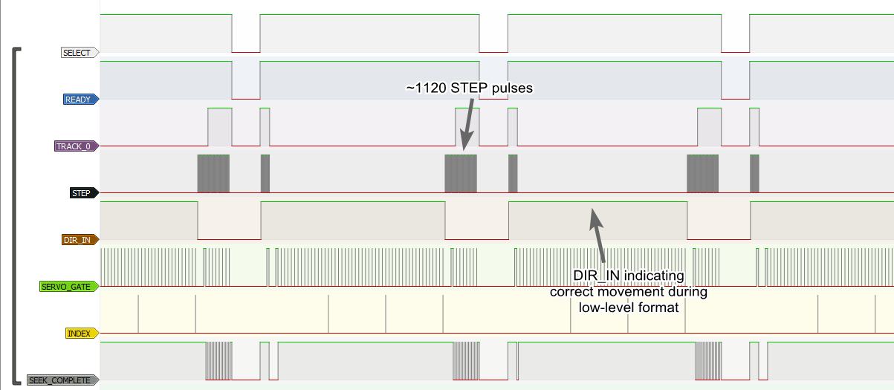

Again, this confirmed that HDC was indeed sending many `STEP` pulses instead of one (thousands of them!). Notice that it did actually try to format the drive, since `DIR_IN` was asserted to move heads to the next track.

Then, using the same `TESTCE1.EXE` program, I tried to manually read track 10 of the drive. This is the very beginning of the resulting control signals:


See how it steps exactly 10 times in order to get to the right track? Of course, about 50 ms after that it started stepping 1000 times again. But this left an important clue in the diagnostic program:


`HDD - BAD ADDRESS MARK ERROR`. This indicated that the HDC was most likely expecting actual RLL-encoded data on the `/READ` line, or at least valid address marks (sector ID headers). Failing to do so caused it to panic and blindly issue a big enough number of step commands, in order to get to the first track (thanks `@baljemmett` for the suggestion!).

## Emulating RLL data - the theory

To fool the HDC into believing there is an actual hard disk attached, I needed to output RLL-encoded sector address marks from the Pi Pico. The problem was, there was no way of knowing what kind of data it expected, or even at what speed should it be sent.

Where do I get the sector address marks from? Oh, right! The controller itself!

The idea was to capture the `WRITE` signal and run a low-level format. Surely, it should re-write the sector headers too, right?

Well, not exactly...


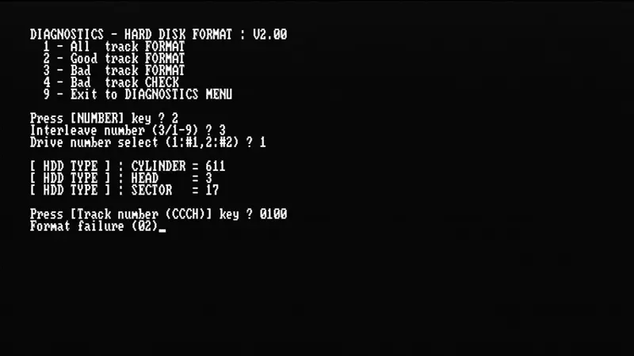

I tried formatting track 10 as a "good track" and got the same error (02). The controller tried to `STEP` 10 times and even tried to write 2 times between every `SERVO_GATE` pulse (two sectors?). It also correctly recognized the start of track (`INDEX`). However, the `WRITE` line just stayed high the whole time.

Oddly, when I tried to format the same track as a "bad track", the exact same trace appeared, but this time it said "Format complete". Still, nothing on `WRITE`.

Since I couldn't get any RLL data from the computer, I went back to Matt's logic analyzer traces - there was one that included the `READ` line, captured at 40 MHz. The capture was far from perfect - there was some jitter, perhaps due to using a cheap Saleae clone - but this was enough for Matt to decode the sector headers (see [The JVC 26-pin Interface – Part 3](https://knm.org.uk/blog/2018/09/the-jvc-26-pin-interface-part-3/)). Hopefully this could be enough to emulate them as well.

Using what I learned while dumping the old MFM hard drive, I actually managed to write an RLL decoder, too! Even better - I was able to decode all sectors from Matt's logic analyzer traces - revealing actual data. As expected, for every `SERVO_GATE` pulse, two 512-byte sectors of data were transmitted.

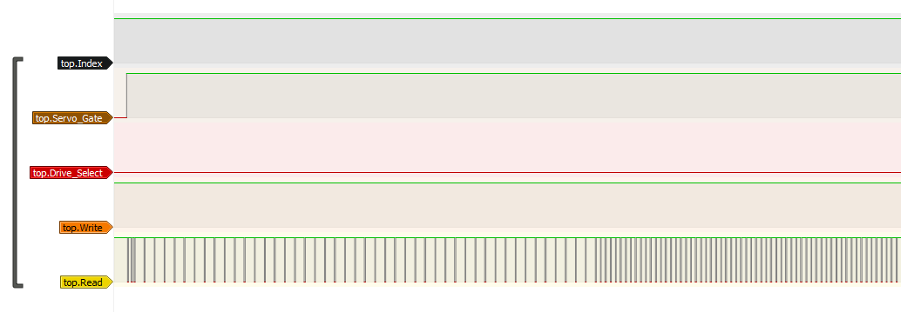
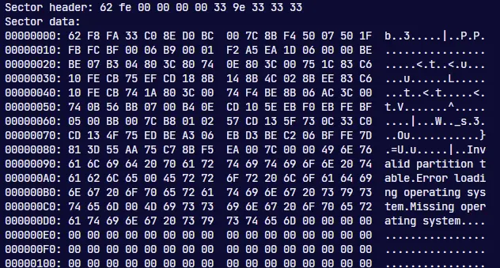

Looking at the traces, it was actually pretty evenly distributed. The two regular patterns visible here are:

- post index gap - filled with 0x33 (00110011), which encodes to `00001000 00001000` - regular `1` pulses with 7 zeroes in between them,
- ID preamble - at least 12 0xFF bytes (11111111), which in RLL is `1000 1000 1000 1000` - regular `1` pulses with 3 zeroes in between them.

As a reminder (to me), here's a standard RLL(2,7) encoding table:

Input (NRZ) | Output (RLL)
------------|-------------
`11`        | `1000`
`011`       | `001000`
`0011`      | `00001000`
`10`        | `0100`
`010`       | `100100`
`0010`      | `00100100`
`000`       | `000100`

Regarding the timing, I noticed that consecutive strings of `10000000` were 525 or 550 nanoseconds apart. This gives about 67.2 nanoseconds per bit, on average. If the drive has a transfer rate of 7.5 Mbps, and the controller is clocked at 15 MHz, then `1 [s] / 15,000,000 [MHz] = 66.67 [ns]`. Close enough!

## Emulating RLL data - the actual work

With all that, I had enough to start writing some PIO code. I first created a state machine to respond to `STEP` pulses, increment/decrement the current track number, and inform the MCU to prepare a new track for readout.

Knowing the exact timings, I could calculate how much memory is exactly needed to store an entire track of data (one head).

`60 [s] / 2597 [rpm] / 66.67 [ns] = ~346,536 [bits] = ~43,317 [bytes]`

The `INDEX` and `SERVO_GATE` pulses were exactly 53.625 microseconds long, which equals about 805 bits. There were a total of 17 pulses every revolution - each with 2 sectors of data. The pulses were spaced about 1,359 microseconds apart:

`60 [s] / 2597 [rpm] / 17 = ~1,359,034 [ns]`

Simply put, I had to create a PIO state machine that would output the following:

```
INDEX         ___/‾‾‾‾‾‾‾‾‾‾‾‾\________________________________________________________
SERVO_GATE    ___/‾‾‾‾‾‾‾‾‾‾‾‾\____________________________________/‾‾‾‾‾‾‾‾‾‾‾‾\_______
READ          .../‾‾‾‾‾‾‾‾‾‾‾‾\....<...data...>....<...data...>..../‾‾‾‾‾‾‾‾‾‾‾‾\....... (repeat 17 times)
                   53,625 ns       652,705 ns      652,705 ns       53,625 ns
                    805 bits       9,790 bits      9,790 bits        805 bits
```

As a sanity check: `(805 [bits] + 9,790 [bits] + 9,790 [bits]) * 66.67 [ns] * 17 * 2597 [rpm] = ~60,001 [ms]`

Writing the PIO program turned out to be easier than I expected, taking just 10 instructions. For testing, I used the [RP2040 PIO Emulator (improved version)](https://github.com/byteit101/pio-debugger-emulator). The generated trace looks promising - this is after setting the `INDEX` pulse length to just 16 (cycles) and data length of 32 (bits).

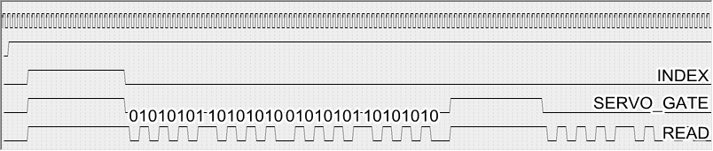

Finally, I also needed some kind of RLL(2,7) encoder, so that I could feed it sector data (dummy 0x00-filled sectors to test emulation) and get back something that the controller would understand. It seemed possible to do in PIO as well - why not! Initially, I used almost all instructions (31 out of 32), but through some careful optimization I was able to reduce it down to 27 instructions.

But then I understood that what I wrote was... essentially useless, since PIO's auto-push feature does not allow pushing more bits than are free in the ISR by breaking them into two parts. The only workable solution would be to rewrite it to always use `in <src>, 2`, as that's the greatest common divisor of all resulting RLL bit lengths. And so I did, managing to shorten it even further down to 26 instructions. At 100 MHz, it should take less than 10 milliseconds to encode a full track of sector data to RLL - sweet!

For the track format I decided on this - based on the real drive readouts and the OMTI RLL decoder chip's datasheet:

Field            | Length    | Data
-----------------|-----------|-----------
POST INDEX GAP   | 24        | `33`
ID PREAMBLE      | >=12 (15) | `FF`
ID SYNC BYTE     | 1         | `62`
ID MARKER BYTE   | 1         | `FE`
ID DATA FIELD    | 4         | C, C, H, S
ID CRC FIELD     | 2         | CRC
ID POSTAMBLE     | 3         | `33`
DATA PREAMBLE    | >=12 (15) | `FF`
DATA SYNC BYTE   | 1         | `62`
DATA MARKER BYTE | 1         | `F8`
USER DATA FIELD  | 512       | -
DATA ECC FIELD   | 6         | ECC
DATA POSTAMBLE   | 3         | `33`
INTER RECORD GAP | 23        | `33`
PRE INDEX GAP    | 1         | `33`

This occupies 612 bytes, which is 4,896 bits. Encoding that to RLL (where each source bit is two RLL bits) gives exactly 9,792 bits, which fits perfectly in the timing requirements.

A couple of days later, I had a complete program - a mixture of C and PIO, that responds to `STEP` signals, generates RLL(2,7) data, and feeds it out on the `READ` line.

## Testing and solving problems

Checking the emulator with a logic analyzer seemed very promising. Of course I had to fix several mistakes, but eventually I got it to a point where it could output valid RLL data. I verified that decoding the captured data worked, using the same decoder I used for Matt's drive. This meant that the emulated data had an identical format to the data from a real drive.

Then I tested it with the T1200 laptop. I won't dive too deep into the details here. Long story short -- it didn't work. Nothing, at all. Same `BAD ADDRESS MARK` errors, over and over again.

There was a surprise, however - trying low-level formatting actually gave some data on the `WRITE` line this time!


This capture shows the emulated `READ` and `SERVO_GATE` signals, as well as the inverted `/READ` signal. Then there's the `/WRITE` signal coming from the laptop's HDD controller. Oddly, the signal is now present even without the `READ` line... how have I not seen it before - remains a mystery.

As for the `/WRITE` data itself... here's where I started to run out of luck. I couldn't decode it with the RLL decoder I used before, no matter what I tried.

But the data wasn't "random" and didn't seem broken - it had some kind of structure to it. The bits were completely different from standard RLL encoding, but they were the same at each readout.

Not knowing the exact encoding, I could still try to split the raw bitstream every 16 bits (1 byte when decoded). Confirming my suspicions, there were exactly 512 identical 16-bit words in every written sector - the laptop must be using a custom RLL encoding scheme.

Unfortunately, it's not trivial to reverse-engineer such a line code. There are no alignment marks to tell where a byte begins, so splitting is not really a posibility. I needed to look for patterns and guess what they encode.

This was even harder, because at that point I didn't even know if a freshly-formatted sector was filled with 0x00, or if the Sector Address Mark format was also non-standard.

## Reverse-engineering a custom RLL encoder

I had a better idea up my sleeve - instead of figuring out *how* it encodes data, let's find *what* data it encodes!

Remember the T7518 chip, present in the T1200's HDD controller? Yeah, the one that had a datasheet available. Looking at section 5.2.2 (page 11), there was a block diagram of the chip. It mentioned that it needs an external MFM encoder chip, but also specified exactly which pins are needed to connect the two.

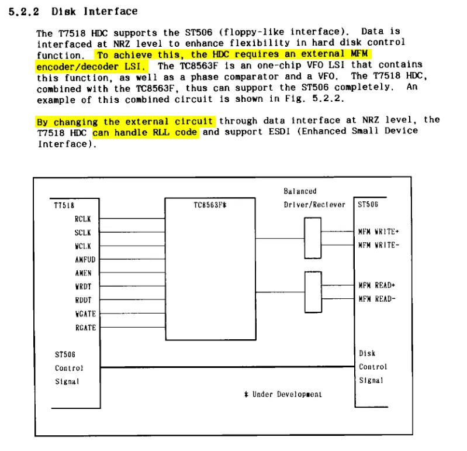

On the T1200, these pins go to a gate array chip - no datasheet for that one. But I could safely assume that this was what handled the (proprietary) RLL encoding.

Since the T7518 outputs NRZ (non-encoded) data, why not just probe it with the logic analyzer, along with that `/WRITE` signal?


It's difficult to show on a screenshot, but the result gave an insight into how the RLL translation is performed, and, more importantly, which raw bytes are actually stored on the disk. I didn't capture the clock signal though, but the constant data rate made it pretty easy to decode anyway. Using a synthesized clock running at 7.5 MHz, I could decode the raw bytes right within PulseView:

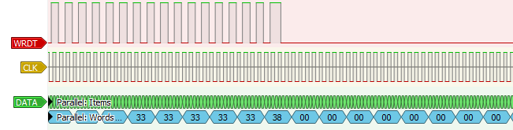
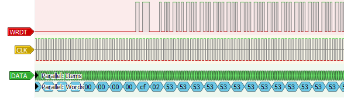

The ID preamble matched the one used by the V86P HDD - filled with 0x33 - but after that, everything was completely different from the "standard". I started by searching for the 0x53 string that the 512-byte sector was filled with. Throughout the bits recorded on the `/WRITE` line, there was a long section with a repeating pattern, exactly 512 times:

```
00010000100000010001000010000001
```

How would 0x53 encode in RLL?

```
HEX 53
BIN 010    10   011
RLL 100100 0100 001000
```

This didn't match the pattern I found. At this point it's worth noting that RLL(2,7) only specifies the minimum and maximum lengths of zeroes - hence it's called Run-Length-Limited. The actual translation of NRZ bits to RLL **can vary from controller to controller**. [A Wikipedia page](https://en.wikipedia.org/wiki/Run-length_limited) on RLL mentions three different encodings: Western Digital, Seagate/IBM and Perstor Systems. The one used by my decoder (and by the V86P drive) was the Seagate one.

What if the T1200 used a different one, such as the WD encoding? The only difference here was in `000` and `010` bit strings:

```
HEX 53
BIN 010    10   011
ST  100100 0100 001000
WD  000100 0100 001000
```

Looking at the repeating string on `/WRITE` made it clear now - it was a match!

```
    00 0100 001000
000100 0100 001000 -> 010 10 011 -> 53
0001
```

Great, so I had the exact RLL encoding scheme at that point. But the track format was still completely different - I needed to find the synchronization byte.

The entire table is as follows:

Input (NRZ) | Output (RLL-WD)
------------|----------------
`11`        | `1000`
`011`       | `001000`
`0011`      | `00001000`
`10`        | `0100`
`010`       | **`000100`**
`0010`      | `00100100`
`000`       | **`100100`**

## Reverse-engineering a custom track format

The synchronization byte, unlike the V86P drive, wasn't 0x62 (it was never observed on the `WRDT` line). Taking a look at the annotated traces above, I could tell that one byte stands out - 0xCF.

It was easily possible to check if this theory was correct - every sync byte, no matter which encoding is used, has a unique feature - a missing or delayed clock pulse. For example, the usual 0x62 in RLL(2,7) encodes as:

```
HEX 62
BIN 011    000    10
ST  001000 000100 0100 <- normal encoding
SYN 001000 000010 0100 <- delayed clock pulse
```

First, I found the synchronization bits by looking at the first 0x53 match in the raw RLL bitstream. Going back from there I found the 0x02 byte (visible on `WRDT`) as well as... something I couldn't fully decode - it was invalid - perhaps a sync byte?

```
1000 000010010000	-> 11001???
100100 100100 0100	-> 00000010 -> 02
000100 0100 001000	-> 01010011 -> 53
000100 0100 001000	-> 01010011 -> 53
```

In the T1200, the sync byte was 0xCF. I tried using the WD encoding, but... no matter which `1` was delayed, the result was still NOT a valid sync sequence:

```
HEX CF
BIN 11   0011     11
WD  1000 00001000 1000 <- normal encoding
SYN 0100 00001000 1000 <- 1st pulse delayed - decodes to 10001111
SYN 1000 00000100 1000 <- 2nd pulse delayed - run length too long (8 zeroes)
SYN 1000 00001000 0100 <- 3rd pulse delayed - decodes to 11001110
```

Instead, the clock pulse was **early** - and that finally gave a valid synchronization byte encoding:

```
HEX CF
BIN 11   0011     11
WD  1000 00001000 1000 <- normal encoding
SYN 1000 00001001 0000 <- *early* clock pulse
```

Modifying my RLL decoder (by changing the sync byte and bit mapping) allowed me to decode a couple of sectors from the `/WRITE` line during low-level formatting - notably:

- formatting C/H 0/0 with interleave 3 (default),
- formatting C/H 1/0 with interleave 3 (default),
- formatting C/H 0/0 with interleave 1.

Overall, this gave pretty consistent results:

```
# C/H - 0/0
Sector header: cf 10 00 00 06 00 14 00 00 00 00
Data header  : cf 02
Sector header: cf 10 00 01 06 86 17 00 00 00 00
Data header  : cf 02
# C/H - 1/0
Sector header: cf 10 00 10 06 e0 17 00 00 00 00
Data header  : cf 02
Sector header: cf 10 00 11 06 66 14 00 00 00 00
Data header  : cf 02
# C/H - 0/0, interleave 1
Sector header: cf 10 00 00 01 80 05 00 00 00 00
Data header  : cf 02
Sector header: cf 10 00 01 01 06 06 00 00 00 00
Data header  : cf 02
```

Now, I had to figure out which bits of the header are constant, and which represent the C/H/S values, as well as what kind of CRC is used (here we go again...). For this, I ran the low-level format utility again and captured several attempts using the logic analyzer, each time trying to format different areas of the drive. It's worth noting that DOS sees the drive as 4 heads, while in reality it only has two heads (and a single head select signal).

Here's what I got - field values from the sector header:

Format C/H | Interleave | Header(s)              | Resulting C/H/S
-----------|------------|------------------------|-----------------
000/0      | 1          | `00 00 01`, `00 01 01` | 0/0/1, 0/1/1
000/0      | 3          | `00 00 06`, `00 01 06` | 0/0/6, 0/1/6
000/1      | 3          | `00 00 06`, `00 01 06` | 0/0/6, 0/1/6
000/2      | 3          | `00 02 06`, `00 03 06` | 0/2/6, 0/3/6
000/3      | 3          | `00 02 06`, `00 03 06` | 0/2/6, 0/3/6
001/0      | 3          | `00 10 06`, `00 11 06` | 1/0/6, 1/1/6
010/0      | 3          | `00 a0 06`, `00 a1 06` | 10/0/6, 10/1/6
600/2      | 1          | `25 82 01`, `25 83 01` | 600/2/1, 600/3/1

These values were obtained with a different interleave parameter. Basically, any value higher than 1 means that consecutive logical sectors are physically spaced apart by that amount. Since I was only able to capture the 2nd sector about to be written on each cylinder/track, that's why it starts at 1 with interleave=1, at 6 with interleave=3, etc. Don't believe me? Take a look:

```
INTERLEAVE 1
0	1	2	3	4	5	6	7	8	9	10	11	12	13	14	15	16

INTERLEAVE 3
0	6	12	1	7	13	2	8	14	3	9	15	4	10	16	5	11

INTERLEAVE 6
0	3	6	9	12	15	1	4	7	10	13	16	2	5	8	11	14

INTERLEAVE 2
0	9	1	10	2	11	3	12	4	13	5	14	6	15	7	16	8

INTERLEAVE 4
0	13	9	5	1	14	10	6	2	15	11	7	3	16	12	8	4
```

Knowing all this, I could work out an updated track format for my emulator:

Field            | Length | Data
-----------------|--------|--------------
POST INDEX GAP   | 24     | `33`
ID PREAMBLE      | 15     | `38 00 00`...
ID SYNC BYTE     | 1      | `CF`
ID MARKER BYTE   | 1      | `10`
ID DATA FIELD    | 3      | C, C&H, S
ID CRC FIELD     | 2      | CRC
ID POSTAMBLE     | 4      | `00`
DATA PREAMBLE    | 15     | `38 00 00`...
DATA SYNC BYTE   | 1      | `CF`
DATA MARKER BYTE | 1      | `02`
USER DATA FIELD  | 512    | -
DATA ECC FIELD   | 6      | ECC
DATA POSTAMBLE   | 4      | `11 00 00 00`
INTER RECORD GAP | 23     | `33`

As a sanity check, after uploading the modified PIO and C code, I captured the resulting `READ` line - my decoder could parse it without problems. What about the laptop's HDC, then?

## A disappointing finale

After over two weeks of trying everything I could, I gave up. Naturally, the updated track format didn't yield any better results. I even got to the point where the emulated signal was 100%, bit-to-bit identical to the one sent by the HDC:

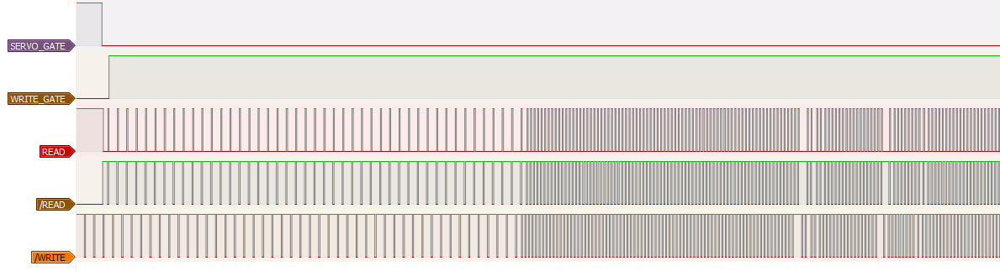

...and the laptop would still do the same thing - seek forever during bootup and report `BAD ADDRESS MARK` errors.

I've been diagnosing this issue deeper for some time, and found that the T7518 controller chip was getting no data at all on its `RDDT` (Read Data, pin 103) line. It was setting the `RDGT` (Read Gate, pin 101) line properly, there was even a `RCLK` signal (Read Clock, pin 104), but the data line was all silent. This was coming from the custom gate array chip (`DC2090P134A`), to which there was no documentation (i.e. no way to debug it at all).

---

I am leaving this post in an unfinished state, because I feel like there's no point in making something "good" out of it anyway. It's just a(nother) failed project that I happen to have described in detail during working on it.

If anyone is interested in any part of this, I'm leaving the source code for the RP2040 programs. Note that these are unfinished at best, so don't expect to simply compile them without changing anything.

- [`mfm_dump.c`](code/mfm_dump.c) / [`mfm_dump.pio`](code/mfm_dump.pio) - MFM dumping firmware I used for the NEC D3142 (ST506-compatible) drive. The PC reader part is not here, because it was a total mess and wouldn't work for any other setup, but the firmware simply outputs parsed MFM bits as 32-bit integers (little-endian).
- [`rll_2of7.pio`](code/rll_2of7.pio) / [`rll_2of7.mon`](code/rll_2of7.mon) - RLL(2,7) encoder in PIO, as well as a script for testing in the [RP2040 PIO Emulator (improved version)](https://github.com/byteit101/pio-debugger-emulator). The C part is embedded within the PIO file.
- [`st506_step.pio`](code/st506_step.pio) / [`st506_step.mon`](code/st506_step.mon) - State machine for parsing `STEP` and `DIR_IN` signals (note: the testing script has an outdated initialization sequence using `exec` calls). Again, the C part is embedded.
- [`st506_data.pio`](code/st506_data.pio) / [`st506_data.mon`](code/st506_data.mon) - State machine for outputting bits on the `READ` line asynchronously. Uses DMA to feed data to PIO's FIFO indefinitely. The first 32-bit word must be a configuration word that specifies `INDEX` pulse presence, the length of that pulse, and the length of data (see main C program for more info).
- [`emu_hdd.c`](code/emu_hdd.c) / [`emu_hdd.h`](code/emu_hdd.h) - Finally, the main C program. It uses the three PIO programs linked above - first encodes a full track worth of sectors as RLL(2,7), then runs the step and data state machines.
- [`utils.c`](code/utils.c) / [`utils.h`](code/utils.h) - Some miscellaneous utilities.

---

## And then!

The following day I started reassembling the T1200, disconnecting the emulator and cleaning my desk from all the wires and components scattered around it.

As the last thing before I assembled it, I wanted to map out the pinout of that proprietary HDD controller - it surely is an ISA bus in there, so perhaps a different controller could be connected to it. To make it easier I decided to check the T1200 Maintenance Manual for the expansion bus connector pinouts - tracing various signals with a multimeter on continuity mode should make it pretty straightforward.

While reading down the document, I stumbled upon this table:

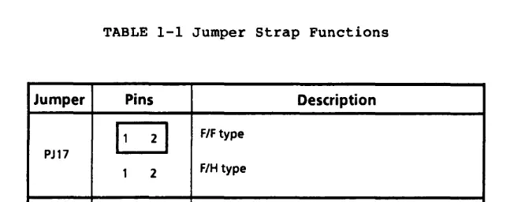

Interesting - so there was a jumper that chooses between FDD/FDD and FDD/HDD types of the Toshiba T1200. Imagine my surprise when I saw that it was actually installed on the motherboard:


This was actually pretty odd, since this particular machine originally came with a HDD installed - but it was removed at some point by the previous owner. That's why I have fitted a second floppy drive in its place, around 4 years before. Since it became a FDD/FDD model, perhaps I simply put this jumper there and forgot about it.

But there was something particularly intriguing about this - notice how unusual the jumper is - different from the ones usually seen in newer PCs. I began to wonder - where have I sourced it from, all these years before? Surely, it must have came from the T1200!

I read further through the manual, and... oh, well...

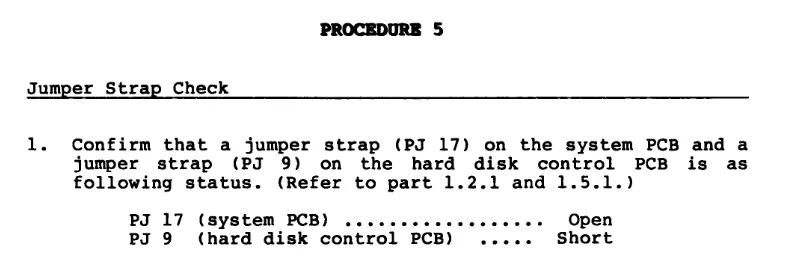

PJ9 was missing from the HDD controller. I must have moved it to PJ17, thinking that I wouldn't use the HDC anyway because of having no hard drive.

Thankfully, I had a way to verify if that was the case. PJ9 was a 2x9 pin header, so there were 9 different ways to fit a jumper - the Maintenance Manual didn't indicate where exactly it should go.

Knowing myself, if I had removed the jumper from that header, I must have taken a photo to remember where it was originally installed. I couldn't believe what I found while browsing through photos from August 2021:

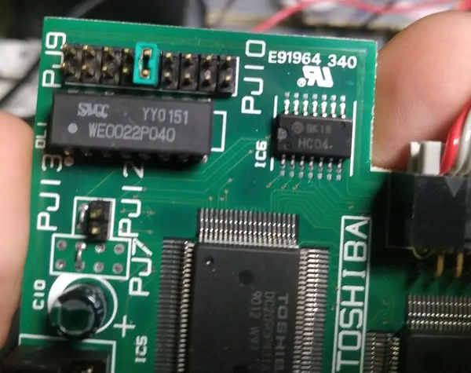

Was that really it? Was this the issue all along? Eager to test it, I moved the jumper where it was supposed to be, reconnected the emulator and turned on the computer.

I'll let the pictures speak for themselves.

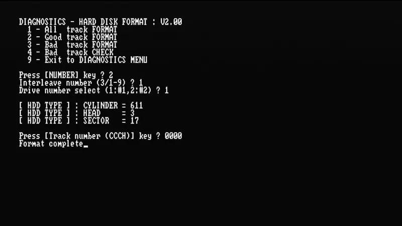
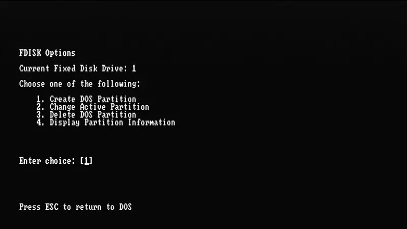
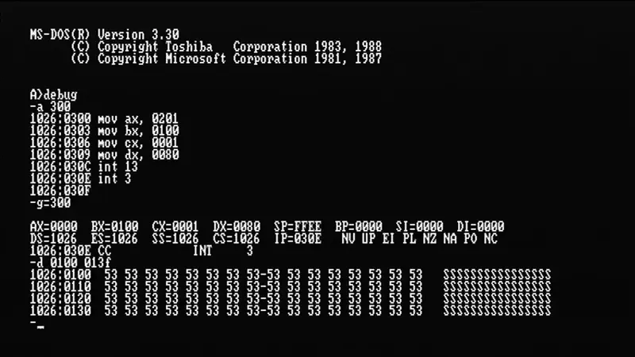
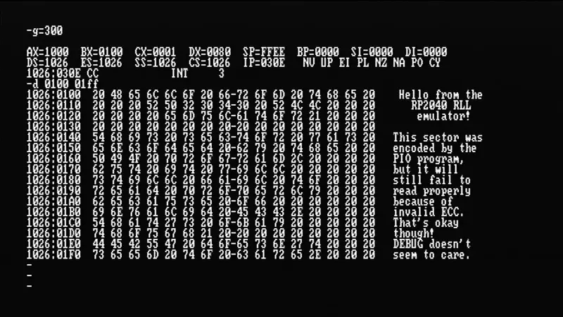

## A successful finale

In the following days I managed to turn this proof-of-concept code into a fully-working ST-506 HDD emulator, with the data image backed by an SD card.

Getting the RLL timings just right was a huge challenge, and I ended up using almost all PIOs, as well as all of the 12 DMA channels that the RP2040 has to offer. But it was definitely worth it!

I was able to install Windows 3.0 on my Toshiba T1200 with no problems, as well as some other programs. I even took some benchmarks of the drive in action.

**Visit the [Pico506 repository on GitHub](https://github.com/kuba2k2/pico506) for more information!**
