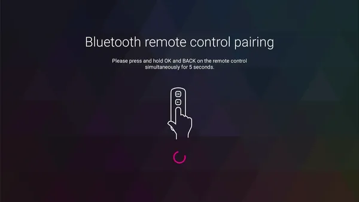
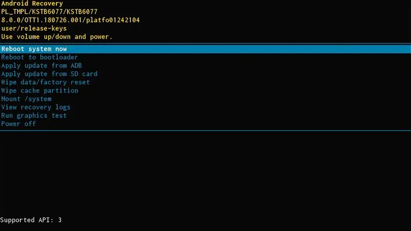
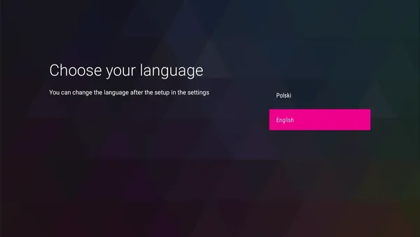

Last week I wanted to try out if a T-Mobile set-top box with Android TV could actually still receive broadcast television (DVB-T2). The device in question is a Kaon KSTB6077, which I [picked up for basically free](../cheap-set-top-boxes/index.md), along with some other devices.

An important point to make is that I didn't have **the original Bluetooth remote control** - so I was using a USB keyboard to navigate the UI. The Settings app couldn't pair any other remote, however - it was probably locked down to just the specific BLE characteristic of the original one (I know next to nothing about BLE, so this is just an educated guess).

Since the device was still logged in to the previous owner's accounts, I decided to run a factory reset.

*That might have been a terrible decision.*

## The Out of Box Experience

The device went through the factory reset process, then rebooted and greeted me with a remote control pairing screen:



There was about *nothing* I could do without having the factory remote. Even when using an external keyboard, the device wouldn't let me out of the pairing screen - pressing ++esc++, ++home++, ++backspace++, even ++alt+tab++ just didn't do anything.

Only a couple of keys had performed any actions, notably:

- ++prtsc++ took a screenshot, but being an Android TV device, the OS didn't have a notification bar (to e.g. share the screenshot in another app),
- volume up/down showed a volume bar - pretty much useless,
- long-pressing ++power++ allowed to reboot the device (no safe mode though),
- and ++ctrl+alt+del++ rebooted the device without any confirmation.

I even tried forcefully pairing my phone to the STB (using `nRF Connect`) after setting it to have the remote's `RC344N` Bluetooth name - it paired successfully, but the RC pairing screen didn't go away.

The device was essentially bricked. Since nobody sells the factory Bluetooth remotes online, it was time to go deeper.

## Hello, I'd like to get a UART shell

Since I have previously disassembled the STB, I knew already that **there was a UART port** with a console output. The device used a BCM7268 chip, with Broadcom's BOLT bootloader. Here's what the boot log looked like, captured a few months back (only the relevant parts):

```
CPU 0123
BCM72680010
PRID72680010

    ,/
  ,'/___, BOLT v1.34 v1.34 LOCAL BUILD
.'__  ,'  (2018-11-29 18:16:23 rajean@rajean-ThinkPad-T440p)
   /,'    arm-linux-gcc (Broadcom stbgcc-4.8-1.6) 4.8.5
  /'      Copyright (C) 2018 Broadcom

Board: KM_SH368AT (7268 of 7268b0 family)
CPU 4x B53 [420f1000] 1656 MHz, SCB 486 MHz, SYSIF 1104 MHz
DDR0 @ 1856MHz

*** CFG_CUSTOM_CODE in custom_early ***
SPLASH: starting
SPLASH BMEM init @ 7defffff
Loaded BMP: W=1920 H=1080
SPLASH: audio not present

*** CFG_CUSTOM_CODE in custom_init ***
AUTOBOOT [waitusb -t=0 -d='USB Disk' && batch usbdisk0:sysinit.txt]
usb: resetting device on bus 0 hub 1 port 1
usb: resetting device on bus 2 hub 1 port 1
USB: New full speed device connected to bus 2 hub 1 port 1
usb: no driver found for 0a5c:2045
USB device matching <USB Disk> not found!
Executing STARTUP...
Loader:elf Filesys:raw Dev:flash0.bsu File:(null) Options:(null)
Starting program at 0x1800000 (DTB @ 0x7614000)

Adding Android commands to BOLT
Done loading Android BSU
Autogen PRODUCTNAME = KSTB6077
Adding Android img loader to BOLT
Checking 'misc' partition and front panel button state...
boot reason = normal
boot_path = legacy, boot_mode = 1
boot_cmd=boot -loader=img -rawfs flash0.boot
Loader:img Filesys:raw Dev:flash0.boot File:(null) Options:(null)
         magic: ANDROID!
   kernel_size: 4898488
   kernel_addr: 0x10000
  ramdisk_size: 1678306
  ramdisk_addr: 0x2208000
[...]
Starting program at 0x80000 (DTB @ 0x7614000)

[    0.000000] Booting Linux on physical CPU 0x0
[    0.000000] Linux version 4.1.45-1-15pre (platform@platform1-kaon) (gcc version 4.8.5 (Broadcom stbgcc-4.8-1.6) ) #1 SMP Wed Jun 3 10:56:28 KST 2020
[    0.000000] CPU: ARMv7 Processor [420f1000] revision 0 (ARMv7), cr=30c5383d
[    0.000000] Machine model: KM_SH368AT
```

Then it proceeded to boot into Android, but unfortunately didn't spawn a shell on the UART console. Naturally, I tried pressing various keys to interrupt auto-booting while still in BOLT (just like what U-Boot usually allows), but there was no response.

Interestingly, I found that it was possible to enter **Android's recovery mode** by pressing the `RESET` button while powering on the device. This menu could be navigated using a USB keyboard as well.



Among the usual options, there was one that stood out - `Reboot to bootloader`. I figured it must have had a Fastboot interface, or something like that. There was a problem, however - the only USB port was a USB-A (host) port, and was already occupied by the keyboard.

Trying out the `bootloader` option did indeed boot the device into a "different" mode - it wouldn't boot into Android, but instead stayed on the T-Mobile splash screen. Trying to connect it using a USB A-A cable didn't enumerate anything on my PC. Same applied for the ADB sideload option - no USB device would show up.

I proceeded to disassemble the device once again, in hope that the recovery mode would have a UART shell enabled. To no avail - the only difference in boot logs was here:

```sh
boot reason = recovery
boot_path = legacy, boot_mode = 0
boot_cmd=boot -loader=img -rawfs flash0.recovery
Loader:img Filesys:raw Dev:flash0.recovery File:(null) Options:(null)
         magic: ANDROID!
[...]
```

Okay then, what would happen if I chose the `Reboot to bootloader` option?

```sh
Adding Android commands to BOLT
Done loading Android BSU
Autogen PRODUCTNAME = KSTB6077
Adding Android img loader to BOLT
boot_path = ab_bl_recovery; boot_reason = 98
boot reason = bootloader
Entering fastboot mode...
android fastboot -transport=usb -device=flash0
Try to open connection to 'usbdev0'...
Error opening usbdev0 for fastboot connection. fd=-6.
Fastboot connection closed.
Exited fastboot mode, but stays in BOLT.
If you have just fastboot-flashed images, then call 'android boot' or 'reboot' now.
*** CFG_CUSTOM_CODE in custom_main ***
BOLT>
```

Bingo! It really was a Fastboot interface, but since no USB host was detected in time, the bootloader would just jump straight into a **working UART shell**.

## Navigating an unknown bootloader

I've had my fair share of experience with U-Boot, but BOLT was completely new to me. Even better, there was zero documentation available, aside from a single page in [U-Boot's documentation](https://docs.u-boot.org/en/latest/board/broadcom/bcm7xxx.html).

As a reminder, the goal of this whole project was to somehow bypass the RC pairing screen. There were a few possible ways, for example:

- figure out what the pairing app was looking for, and emulate such a BLE device,
- write a "OOBE setup complete" flag to the `/data` partition to bypass the entire setup,
- enable ADB and pre-authenticate keys (though no USB access),
- boot Android with root access and skip to the next part of setup.

All of these possibilities required either having write access to the eMMC, or **at least having a firmware dump** to find the pairing app's `.apk`. Since it's usually good to have a full backup before messing with the device, I tried capturing a complete dump of the 8 GiB flash memory.

Normally - in U-Boot - the process looks mostly the same on every device:

1. Attach an SD card or a USB stick.
2. Read part of the flash memory into RAM.
3. Write that part from RAM to the external storage device.
4. Repeat steps 2. and 3. until the whole device is dumped.

Thankfully, BOLT included a `help` command that listed all available commands - the only interesting ones were:

```sh
BOLT> help
Available commands:

boot .............. Load an executable file into memory and execute it
crc ............... Report the CRC32 for a memory range.
d ................. Dump memory.
e ................. Modify contents of memory.
erase ............. Erase flash device or partition
f ................. Fill contents of memory.
flash ............. Update a flash memory device
go ................ Start a previously loaded program.
ifconfig .......... Configure the Ethernet interface
load .............. Load an executable file into memory without
                    executing it
printenv .......... Display the environment variables
save .............. Save a region of memory to a remote file via TFTP
set console ....... Change the active console device
sha ............... Calculate SHA256 of a memory region
show devices ...... Display information about the installed devices.

For more information about a command, enter 'help command-name'
*** command status = 0
BOLT>
```

!!! info "Note"
    You might have noticed the `save` command, which looks like a nice way to get data off the device.

    I also noticed that one -- *while editing the post*. What can I say... let's just assume it didn't exist at the time.

    Back to the story:

Disappointingly, there wasn't any command that allowed to write data anywhere but the internal flash memory. Without getting ahead of myself, I first tried **reading some data into RAM** - using the `load` command:

```sh
BOLT> help load

  SUMMARY

     Load an executable file into memory without executing it

  USAGE

     load [-options] host:filename|dev:filename

     This command loads an executable file into memory, but does not
     execute it.  It can be used for loading data files, overlays or
     other programs needed before the 'boot' command is used.  By
     default, 'load' will load a raw binary at virtual address 0x00080000.

  OPTIONS

     -elf ............. Load the file as an ELF executable
     -srec ............ Load the file as ASCII S-records
     -raw ............. Load the file as a raw binary
     -zimg ............ Load the file as a zImage binary (default)
     -bsu ............. Load a sidecar app
     -z ............... Load gzip-compressed file (default)
     -nz .............. Load uncompressed file
     -splash .......... Load a BMP file and display it
     -loader=* ........ Specify BOLT loader name
     -tftp ............ Load the file using the TFTP protocol
     -fatfs ........... Load the file from a FAT file system
     -rawfs ........... Load the file from an unformatted file system
     -fs=* ............ Specify BOLT file system name
     -offset=* ........ Begin loading at this offset in the file or
                        device
     -max=* ........... Specify the maximum number of bytes to load (raw
                        and zImage)
     -addr=* .......... Specify the load address (hex) (raw and zImage)

*** command status = 0
```

That's a pretty nice help screen - *way better than U-Boot's*!

I had some trouble working out what the correct syntax was - in the end, I found that it was necessary to use `-raw` (to disable GZIP compression and any format parsing) and pass `-max=<length>` (which seems logical, but somehow it took me a while to figure it out).

```sh
BOLT> load -offset=0 flash0
Loader:zimg Filesys:raw Dev:flash0 File:(null) Options:(null)
Loading:
 0 bytes read
Failed.
Could not load (null): Bad executable format

BOLT> load -raw -offset=0 flash0
Loader:raw Filesys:raw Dev:flash0 File:(null) Options:(null)
Loading: Failed.
Could not load (null): Invalid boot block on disk

BOLT> load -raw -offset=0 -max=0x1000 flash0
Loader:raw Filesys:raw Dev:flash0 File:(null) Options:(null)
Loading: .
 4096 bytes read
Entry address is 0x80000

BOLT>
```

To confirm whether the correct data was read, I could use the `d` (dump) command, like so:

```sh
BOLT> d -b 0x80200 0x10
d -b 0x80200 0x10
00080200  45 46 49 20 50 41 52 54 00 00 01 00 5c 00 00 00  EFI PART....\...
*** command status = 0
BOLT>
```

The flash memory was partitioned using GPT, with a protective MBR in the 1st sector and EFI partitions in the following ones.

That's all cool, but *how do I dump it now*?

## Dumping memory, (almost) byte by byte

Having no way of copying the RAM contents anywhere, the only viable option was... using `d` to *hex-dump the entire flash memory*.

This had several massive drawbacks:

- it would have to be automated somehow (the easy one),
- it would be susceptible to corruption on the UART line (the hard one),
- since each line of a 16-byte hexdump occupies 76 characters (760 bits in UART's 8N1), and the flash memory is 8 GiB = 8,589,934,592 bytes = 536,870,912 lines = 408,021,893,120 bits, then at a baud rate of 115200, it would take roughly 3,541,856 seconds, which is **just about 40 full days**.

So yeah, that was a big no-no. Unless -- there was a better way to access the UART console.

Notice the `set console` command - it allowed to map the console to a different device. What is a "device"? The `show devices` command comes in handy here!

```sh
BOLT> help set console

  SUMMARY

     Change the active console device

  USAGE

     set console device-name

     Changes the console device to the specified device name.  The console
     must be a serial-style device.  Be careful not to change the console
     to a device that is not connected!

*** command status = 0
BOLT> show devices
Device Name          Description
-------------------  ---------------------------------------------------------
              uart0  16550 DUART at 0xf040c000 channel 0
               mem0  Memory
             flash0  EMMC flash Data : 0x000000000-0x1D2000000 (7456MB)
                     [... flash partitions ...]
               eth0  GENET Internal Ethernet at 0xf0480000
              mdio0  GENET MDIO at 0xf0480800
       tcpfastboot0  TCP Fastboot (port 5554)
        tcpconsole0  TCP Console (port 23)
*** command status = 0
BOLT>
```

TCP console - now that's a cool feature. After configuring network access with `ifconfig eth0 -auto` and issuing `set console tcpconsole0`, I could access the BOLT console over TCP (`telnet`/`nc`):

```sh
BOLT> ifconfig eth0 -auto
100 Mbps Full-Duplex
Device eth0:  hwaddr AA-BB-CC-DD-EE-FF, ipaddr 192.168.0.63, mask 255.255.255.0
        gateway 192.168.0.1, nameserver 192.168.0.1, domain local
        DHCP server 192.168.0.1, DHCP server MAC AA-BB-CC-DD-EE-FF
BOLT> set console tcpconsole0

[... then, on my PC: ...]

~ λ telnet 192.168.0.63

BOLT>
```

**That was almost too easy**. To automate the dumping process, I wrote a Python script that:

- connected to the TCP console,
- went through a range of flash offsets specified as a parameter,
- figured out which partition to dump from (since there was a limit of 2 GiB, so using just `flash0` didn't allow to access anything past that),
- ran a `load -raw -offset=<offset in partition> -max=0x1000 -addr=0x80000 <partition>` command,
- ran a `d -b 0x80000 0x1000` command,
- captured the hexdump output, converted it to raw bytes, saved to a binary file.

*Why just 0x1000 (4096) bytes*, you might wonder? Since BOLT's TCP stack is probably very limited, at any larger number it would show TX DMA errors and eventually get completely stuck, probably because of "too much" data to print at once.

After many, many corrections, the script was mostly stable. I ran it on my home server, because... it was going to take *a lot of time*.

```sh
(venv) fingbox [/media/AE54598B545956E5]$ python boltdump.py flash0 0x0 0x1C7FF0000
Connected

---- Progress: at 0x0, in flash0+0x0, 0 B/7.1 GiB, 0.00%, 0.00 KB/s, ETA: ? ----
load -raw -offset=0x0 -max=0x1000 -addr=0x80000 flash0
Loader:raw Filesys:raw Dev:flash0 File:(null) Options:(null)
Loading: 4096 bytes read
BOLT> d -b 0x80000 0x1000
Saved 4096 bytes

---- Progress: at 0x1000, in flash0+0x1000, 4 KiB/7.1 GiB, 0.00%, 22.46 KB/s, ETA: 92:22:53 ----
load -raw -offset=0x1000 -max=0x1000 -addr=0x80000 flash0
Loader:raw Filesys:raw Dev:flash0 File:(null) Options:(null)
Loading: 4096 bytes read
BOLT> d -b 0x80000 0x1000
Saved 4096 bytes
```

After the dumping speed stabilized a bit, it took **almost 3 days** to dump just 5 GiB of data.

*Why 5 GiB and not 8*? Since the last partition was `userdata`, and it started at offset `0x0B7F00000` (about 3 GiB), and there was a limit of 2 GiB for partition offset... you get the point.

## Verifying the backup

I modified the dumping script slightly, so that it used `load` and `sha` commands to read chunks of the flash memory, then display their SHA-256 hashes. The script then automatically compared the result with the previously dumped `flash0.img` file.

Since this didn't require to send too much data over network anymore, I could increase the chunk size to, say, 1 MiB - and managed to validate 3 GiB of data in **just about 5 minutes**:

```sh
---- Progress: at 0xA300000, in flash0.cache+0x7C00000, 163 MiB/2.9 GiB, 5.54%, 8580.09 KB/s, ETA: 00:05:31 ----
load -raw -offset=0x7c00000 -max=0x100000 -addr=0x80000 flash0.cache
Loader:raw Filesys:raw Dev:flash0.cache File:(null) Options:(null)
Loading: ........... 1048576 bytes read
BOLT> sha -addr=0x80000 -size=0x100000
SHA256 of 1048576 bytes is OK!

[...]
```

The only differences found by the script were in the `cache` partition - it's EXT4, so each time I booted into Android's recovery mode, the superblock was updated. Everything else was bit for bit identical! That meant the **flash dump was complete**.

All partitions were fully copied off of the device, except for `userdata` (which I couldn't copy because of offset limitations).

After padding the resulting image file with zeroes (to match the expected device size), I could list all partitions using `fdisk`:

```sh
f:\ λ fdisk -l -o start,end,sectors,size,name flash0.img
The backup GPT table is corrupt, but the primary appears OK, so that will be used.
Disk flash0.img: 7.13 GiB, 7650410496 bytes, 14942208 sectors
Units: sectors of 1 * 512 = 512 bytes
Sector size (logical/physical): 512 bytes / 512 bytes
I/O size (minimum/optimal): 512 bytes / 512 bytes
Disklabel type: gpt
Disk identifier: C49E0ACB-1B38-95E5-548A-2B7260E704A4

  Start      End Sectors  Size Name
     34       34       1  512B macadr
     35      162     128   64K nvram
    163     2046    1884  942K bsu
   2048     4095    2048    1M misc
   4096     6143    2048    1M hwcfg
   6144    38911   32768   16M factory_settings
  38912    63487   24576   12M splash
  63488    79871   16384    8M metadata
  79872  2177023 2097152    1G cache
2177024  2308095  131072   64M recovery
2308096  2439167  131072   64M boot
2439168  5568511 3129344  1.5G system
5568512  6027263  458752  224M vendor
6027264 14942174 8914911  4.3G userdata
```

Mounting the `system` partition allowed me to **browse the filesystem** and extract the firmware!

```sh
G:\ λ ls -l
total 11988
drwxr-xr-x 32 Kuba None        0 Dec 31  2008 app/
drwxr-xr-x  3 Kuba None        0 Dec 31  2008 bin/
-rw-r--r--  1 Kuba None     1855 Dec 31  2008 build.prop
-rw-r--r--  1 Kuba None    10310 Dec 31  2008 compatibility_matrix.xml
drwxr-xr-x 11 Kuba None        0 Dec 31  2008 etc/
drwxr-xr-x  2 Kuba None        0 Dec 31  2008 fake-libs/
drwxr-xr-x  2 Kuba None        0 Dec 31  2008 fonts/
drwxr-xr-x  4 Kuba None        0 Dec 31  2008 framework/
drwxr-xr-x  5 Kuba None        0 Dec 31  2008 lib/
drwxr-xr-x  2 Kuba None        0 Jan  1  1970 lost+found/
-rw-r--r--  1 Kuba None     2544 Dec 31  2008 manifest.xml
drwxr-xr-x  3 Kuba None        0 Dec 31  2008 media/
drwxr-xr-x 47 Kuba None        0 Dec 31  2008 priv-app/
-rw-r--r--  1 Kuba None 12249124 Dec 31  2008 recovery-from-boot.p
drwxr-xr-x  3 Kuba None        0 Dec 31  2008 tts/
drwxr-xr-x  8 Kuba None        0 Dec 31  2008 usr/
lrwxrwxrwx  1 Kuba None        9 Dec 31  2008 vendor -> /g/vendor
```

The goal here was to find the setup wizard (or the app responsible for remote pairing) and figure out how to bypass it. Before doing that, I decided to take a little detour.

## Obtaining root access

Having the `boot.img` it shouldn't be too difficult to get root access. Fastboot would make it easier - fortunately, USB was not the only way it could be used. The BOLT bootloader also supported using Fastboot over TCP:

```sh
BOLT> ifconfig eth0 -auto
100 Mbps Full-Duplex
Device eth0:  hwaddr AA-BB-CC-DD-EE-FF, ipaddr 192.168.0.65, mask 255.255.255.0
*** command status = 0

BOLT> android fastboot -transport=tcp -device=flash0
Try to open connection to 'tcpfastboot0'...
Connection to 'tcpfastboot0' is OK.
Checking GPT table from 'flash0'...
Ready to accept fastboot cmd

[... then, on my PC: ...]

λ fastboot -s tcp:192.168.0.65 boot boot.img
Sending 'boot.img' (6431 KB)                       OKAY [  0.571s]
Booting                                            OKAY [  0.008s]
Finished. Total time: 0.596s
```

The stock `boot.img` didn't come equipped with `/bin/sh` in its initial ramdisk, so simply changing the kernel command line to include `init=/bin/sh` wasn't possible. I tried adding `console=ttyS0`, but that didn't make a shell available either. And yes, the kernel's boot log confirmed that my modified arguments were correctly passed:

```sh
[    0.000000] Kernel command line: [...] rootwait init=/bin/sh ro [...] buildvariant=user console=ttyS0 [...]
```

Since this ramdisk wasn't going to be useful, I went with the obvious solution - *using Alpine Linux's ramdisk instead*. I modified the `boot.img` with `abootimg -u`, passing the new ramdisk as a parameter (and enlarging the boot image to 16 MiB in the config file).

Next, I prepared a USB stick with Alpine's `apks` as the boot repository - the initrd only has an init system, and expects to find a filesystem with packages to install.

I started Fastboot again, unplugged the keyboard to plug the USB stick instead, and booted it up.

```sh
Alpine Init 3.13.0-r0
 * Loading boot drivers: ok.
 * Mounting boot media: ok.
 * Installing packages to root filesystem: ok.

   OpenRC 0.63 is starting up Linux 4.1.45-1-15pre (armv7l)

 * Mounting /run ... [ ok ]
 [...]
 * Starting firstboot ... [ ok ]

Welcome to Alpine Linux 3.23
Kernel 4.1.45-1-15pre on armv7l (/dev/ttyS0)

localhost login: root
Welcome to Alpine!

localhost:~# setup-interfaces -r
localhost:~# setup-ntp busybox
localhost:~# date
Tue May 19 14:37:33 UTC 2026
localhost:~# setup-apkrepos -c -1
localhost:~# apk add fastfetch
OK: 9.9 MiB in 30 packages
localhost:~# fastfetch
       .hddddddddddddddddddddddh.           root@localhost
      :dddddddddddddddddddddddddd:          --------------
     /dddddddddddddddddddddddddddd/         OS: Alpine Linux v3.23 armv7l
    +dddddddddddddddddddddddddddddd+        Host: KM_SH368AT
  `sdddddddddddddddddddddddddddddddds`      Kernel: Linux 4.1.45-1-15pre
 `ydddddddddddd++hdddddddddddddddddddy`     Uptime: 2 mins
.hddddddddddd+`  `+ddddh:-sdddddddddddh.    Packages: 30 (apk)
hdddddddddd+`      `+y:    .sddddddddddh    Shell: sh
ddddddddh+`   `//`   `.`     -sddddddddd    Terminal: vt100
ddddddh+`   `/hddh/`   `:s-    -sddddddd    CPU: BRCMSTB (4)
ddddh+`   `/+/dddddh/`   `+s-    -sddddd    Memory: 42.89 MiB / 1.60 GiB (3%)
ddd+`   `/o` :dddddddh/`   `oy-    .yddd    Swap: Disabled
hdddyo+ohddyosdddddddddho+oydddy++ohdddh    Disk (/): 14.20 MiB / 821.22 MiB (2%) - tmpfs
.hddddddddddddddddddddddddddddddddddddh.    Disk (/media/usb): 979.05 MiB / 1.96 GiB (49%) - vfat [External, Read-only]
 `yddddddddddddddddddddddddddddddddddy`     Local IP (eth0): 192.168.0.65/24
  `sdddddddddddddddddddddddddddddddds`      Locale: C.UTF-8
    +dddddddddddddddddddddddddddddd+
     /dddddddddddddddddddddddddddd/
      :dddddddddddddddddddddddddd:
       .hddddddddddddddddddddddh.
localhost:~#
```

## Enabling ADB access

Having Alpine Linux running as root was cool and all, but didn't let me bypass the OOBE on its own. But what it did allow, however, was reading and writing to the `/data` partition that Android uses to store everything.

```sh
localhost:~# lsblk
NAME         MAJ:MIN RM  SIZE RO TYPE MOUNTPOINTS
sda            8:0    1    2G  0 disk
└─sda1         8:1    1    2G  0 part /media/usb
mmcblk0      179:0    0  7.3G  0 disk
[...]
├─mmcblk0p12 179:12   0  1.5G  0 part
├─mmcblk0p13 179:13   0  224M  0 part
└─mmcblk0p14 179:14   0  4.3G  0 part
mmcblk0boot0 179:16   0    4M  1 disk
mmcblk0boot1 179:32   0    4M  1 disk
mmcblk0rpmb  179:48   0  512K  0 disk
zram0        253:0    0    0B  0 disk
localhost:~# mkdir /data
localhost:~# mount /dev/mmcblk0p14 /data
localhost:~# ls -l /data
total 140
drwx------  2 root root 4096 Jun  3  2020 adb
drwxrwxr-x  2 1000 1000 4096 Jun  3  2020 anr
drwxrwx--x  2 1000 1000 4096 Jun  3  2020 app
drwx------  2 root root 4096 Jun  3  2020 app-asec
drwxrwx--x  2 1000 1000 4096 Jun  3  2020 app-ephemeral
drwxrwx--x  2 1000 1000 4096 Jun  3  2020 app-lib
drwxrwx--x  2 1000 1000 4096 Jun  3  2020 app-private
drwx------  4 1000 1000 4096 May 19 14:22 backup
drwxr-xr-x  2 2000 2000 4096 Jun  3  2020 bootchart
drwxrwx---  5 1000 2001 4096 Jun  3  2020 cache
drwxrwx--x  3 root root 4096 Jun  3  2020 dalvik-cache
drwxrwx--x 81 1000 1000 4096 Jun  3  2020 data
[...]
```

Having full access to `/data`, I tried manually setting the properties responsible for starting the ADB service. The system settings databases must also be updated, and finally my ADB keys had to be pre-authorized.

```sh
localhost:~# cd /data/property/
localhost:/data/property# echo 1 > persist.service.adb.enable
localhost:/data/property# echo 1 > persist.service.debuggable
localhost:/data/property# echo mtp,adb > persist.sys.usb.config
localhost:/data/property# chmod 600 persist.*
localhost:/data/property# cd /data/system/users/0/
localhost:/data/system/users/0# sed -i 's/name="adb_enabled" value="0"/name="adb_enabled" value="1"/' settings_global.xml
localhost:/data/system/users/0# cat settings_global.xml | grep adb_enabled
  <setting id="53" name="adb_enabled" value="1" package="android" defaultValue="0" defaultSysSet="true" />
localhost:/data/system/users/0# cd /data/misc/adb
localhost:/data/misc/adb# tee adb_keys
[... my ADB public key ...]
localhost:/data/misc/adb# chown 1000:2000 adb_keys
localhost:/data/misc/adb# chmod 640 adb_keys
```

However, even after setting the correct file permissions, **the ADB service didn't start**. There was no network ADB running on port :5555, and the USB port didn't enumerate any devices either.

Judging by the boot logs, USB gadget support was just not enabled in the kernel, so there was indeed no way this could possibly work.

## If not ADB, then what?

Having access to the initial ramdisk, I could simply modify it to spawn another program on bootup, as root - for example, Dropbear.

I attempted to do just that -- unpacked the ramdisk, downloaded Dropbear armv7 from my [Linux Static Binaries](../../tools/linux-static-binaries/index.md) page, and started digging through the `init.rc` files.

That's when I noticed an *interesting* piece of code:

```conf
service console /system/bin/sh
    class core
    console
    disabled
    user shell
    group shell log readproc
    seclabel u:r:shell:s0

on property:ro.debuggable=1
    start console
```

So the Android console *existed*, at least - but it was only enabled on debuggable builds. By default, it didn't give root access, but `shell` user only.

Naturally, I replaced the code with an *improved version*:

```conf
service console /system/bin/sh
    class core
    console
    #disabled
    user root
    group root log readproc
    seclabel u:r:shell:s0

on property:ro.debuggable=0
    # [...]
    start console
```

Looks way better, doesn't it?

Did it work? Hell yeah it did!

```sh
[   12.627383] init: processing action (ro.debuggable=0)
[...]
KSTB6077:/ #
KSTB6077:/ # id
uid=0(root) gid=0(root) groups=0(root),1007(log),3009(readproc) context=u:r:shell:s0
```

...or so I thought. It turned out that SELinux can be a real PITA, and even if you seemingly have `uid=0(root)`, the context you're in won't let you do pretty much anything a normal root user could do - in this case - `u:r:shell:s0`.

I tried changing the context to `u:r:init:s0` in that `/init.rc` script, but that failed to spawn the shell altogether - permission denied errors, of course. Even adding `androidboot.selinux=permissive` to the kernel command line didn't help at all.

**The rescue came from Magisk** - in the past, I have used the "patch boot image" option several times. It really comes in handy if a device doesn't have a custom recovery (like TWRP) and isn't rooted yet.

I copied that already-modified `boot.img` to an ARMv7 device, patched it using the Magisk app, then booted it up on the STB. On the UART shell I was still `root`, but using `su` I could then **switch to a "real" root console** - without any SELinux restrictions.

```sh
KSTB6077:/ # id
uid=0(root) gid=0(root) groups=0(root),1007(log),3009(readproc) context=u:r:shell:s0
KSTB6077:/ # su
KSTB6077:/ # id
uid=0(root) gid=0(root) groups=0(root) context=u:r:magisk:s0
KSTB6077:/ #
```

A couple commands later I had ADB-over-TCP access, just like I would after enabling it in Developer Options.

```sh
KSTB6077:/ # setenforce 0
[   42.270667] type=1404 audit(1779213780.819:23): enforcing=0 old_enforcing=1 auid=4294967295 ses=4294967295
KSTB6077:/ #
KSTB6077:/ # getenforce
Permissive
KSTB6077:/ #
KSTB6077:/ # setprop persist.service.adb.enable 1
KSTB6077:/ # setprop persist.sys.usb.config mtp,adb
KSTB6077:/ # setprop service.adb.tcp.port 5555
KSTB6077:/ # stop adbd; start adbd
KSTB6077:/ # netstat -tlnp | grep 5555
tcp6       0      0 :::5555                 :::*                    LISTEN      5991/adbd
KSTB6077:/ #

[... then, on my PC: ...]

~ λ adb connect 192.168.0.65:5555
connected to 192.168.0.65:5555

~ λ adb devices
List of devices attached
192.168.0.65:5555       device
```

## Bypassing remote control pairing

At last! I could inspect the topmost activity that was presenting the RC pairing screen:

```sh
KSTB6077:/ $ dumpsys window windows | grep mCurrentFocus
  mCurrentFocus=Window{22f5630 u0 com.android.tv.settings/com.android.tv.settings.accessories.AddBluetoothRemoteActivity}
KSTB6077:/ $
```

After killing that app (`TvSettings`), a grey screen showed up and I couldn't do anything. This time another app was on the foreground - **`KaonSetupCustomizer`**:

```sh
KSTB6077:/ $ dumpsys window windows | grep mCurrentFocus
  mCurrentFocus=Window{cb17f41 u0 com.kaonmedia.setupcustomizer/com.kaonmedia.setupcustomizer.KaonPreCoreSetupActivity}
KSTB6077:/ $
```

This was the main entrypoint to the OOBE setup wizard. It was responsible for launching the pairing window from the Settings app.

I copied the `KaonSetupCustomizer.apk`, along with its `.odex` and `.vdex` files - I had to use [vdexExtractor](https://github.com/anestisb/vdexExtractor) to convert them back to a normal `.dex` file. After putting the resulting `classes.dex` into the APK, I could simply **decompile the whole app** using [APK Studio](https://github.com/vaibhavpandeyvpz/apkstudio).

Inside the decompilation outputs of that `KaonPreCoreSetupActivity` class, I found the offending piece of code:

```java
private void startProcedure() {
    if (!isAutoPairEnabled() || getBtPairedDeviceCheck())
        OpenLanguageSelection();
    else
        AddAccessoryStart();
}

private boolean isAutoPairEnabled() {
    if (OEM_PROPERTY.equals("ST_TMCZ"))
        return false;
    if (!OEM_PROPERTY.equals("ATV00100019PL_TMPL") && !OEM_PROPERTY.equals("GR_COSMOTE"))
        return false;
    return true;
}

private boolean getBtPairedDeviceCheck() {
    return getSharedPreferences("bt_pair_status", 0).getBoolean("bt_paired_val", false);
}
```

The pairing wizard was skipped depending on the ISP/vendor/branding of the STB. After successful pairing, a SharedPreferences property was set, which would avoid running the pairing wizard again. I simply had to **set the property manually** now.

```sh
KSTB6077:/data/data/com.kaonmedia.setupcustomizer/shared_prefs # ls -Z
u:object_r:app_data_file:s0:c512,c768 bt_pair_status.xml
KSTB6077:/data/data/com.kaonmedia.setupcustomizer/shared_prefs # cat bt_pair_status.xml
<?xml version='1.0' encoding='utf-8' standalone='yes' ?>
<map>
    <boolean name="bt_paired_val" value="false" />
</map>
KSTB6077:/data/data/com.kaonmedia.setupcustomizer/shared_prefs # sed -i s/false/true/g bt_pair_status.xml
KSTB6077:/data/data/com.kaonmedia.setupcustomizer/shared_prefs # chcon u:object_r:app_data_file:s0:c512,c768 bt_pair_status.xml
KSTB6077:/data/data/com.kaonmedia.setupcustomizer/shared_prefs # ls -Z
u:object_r:app_data_file:s0:c512,c768 bt_pair_status.xml
KSTB6077:/data/data/com.kaonmedia.setupcustomizer/shared_prefs # cat bt_pair_status.xml
<?xml version='1.0' encoding='utf-8' standalone='yes' ?>
<map>
    <boolean name="bt_paired_val" value="true" />
</map>
KSTB6077:/data/data/com.kaonmedia.setupcustomizer/shared_prefs #
```

After rebooting for the final time, I was greeted with the following screen:



**Success!** The device was now usable again, without needing the factory remote control.

---

PS. I found that the pairing application didn't care about BLE services, but was indeed looking for an input device with a specific name (`RC344N`) or MAC address. So if I created a fake input device with that name... it probably would have worked.

---

Also, remember these lines from bootloader logs?

```
*** CFG_CUSTOM_CODE in custom_init ***
AUTOBOOT [waitusb -t=0 -d='USB Disk' && batch usbdisk0:sysinit.txt]
```

If you just put a `sysinit.txt` file on a USB stick, the bootloader will happily execute whatever commands are in this file. I used this method to automate entering the Fastboot mode, without having to go through Recovery->Bootloader->manually typing commands.

The same method could, obviously, be used to boot a Magisk-patched, pre-rooted `boot.img`, without ever having to touch UART or Fastboot. Pretty neat - I wonder if it applies to other Broadcom STBs as well...

---

Oh, and about the `save` command... that would have made the entire dump take probably 30 minutes instead of 60 hours. And yes, I tested it, and it can transfer data to a TFTP server with no issues.

## Update: May 21, 2026

Since the stock T-Mobile launcher turned out to be absolutely horrible, I decided to install Google's [Android TV Home](https://play.google.com/store/apps/details?id=com.google.android.tvlauncher) instead.

When installed as a user app, the launcher just crashed upon starting. Logcat confirmed that the necessary permissions were missing. Using `pm grant <package> <permission>` didn't work, as these permissions weren't changeable.

The launcher had to be installed as a system app. As I had Magisk working already, I just remounted the `/system` partition as writable and copied the APK there:

```sh
mount -o rw,remount /system
mkdir /system/priv-app/TvLauncher/
cp /sdcard/tvlauncher.apk /system/priv-app/TvLauncher/TvLauncher.apk
chmod 644 /system/priv-app/TvLauncher/TvLauncher.apk
```

After rebooting, the app was installed, but was disabled for some reason. Re-enabling it and disabling the T-Mobile launcher showed a working Android TV Home screen:

```sh
su
pm enable com.google.android.tvlauncher
pm disable tv.accedo.paytv.tmpl
```


Oddly, after another reboot - there was just a black screen, and the Android TV launcher was once again disabled. Checking `pm dump com.google.android.tvlauncher` I found these lines:

```
User 0: ceDataInode=-4294870878 installed=true hidden=false suspended=false stopped=false notLaunched=false enabled=2 instant=false
        lastDisabledCaller: android
```

Disabled by... `android` itself? Like the system framework kind of `android`?

Yep, that turned out to be absolutely true. By decompiling `/system/framework/oat/arm/services.vdex` I found the following code (simplified for brevity):

```java
boolean useGoogleLauncher = true;
PackageManager pm = this.mContext.getPackageManager();
try {
    PackageInfo packageInfo = pm.getPackageInfo("tv.accedo.paytv.tmpl", 128);
    useGoogleLauncher = false;
} catch (PackageManager.NameNotFoundException e2) {
    // keep as 'true'
}
pm.setApplicationEnabledSetting("com.google.android.tvlauncher", useGoogleLauncher ? 0 : 2, 3);
pm.setUpdateAvailable("com.google.android.tvlauncher", useGoogleLauncher);
```

If the stock launcher is installed - disable the Google one. What a terrible feature.

A quick `rm -rf /system/priv-app/Accedo` later, I had a working Android TV launcher - booting up just fine without Magisk.
